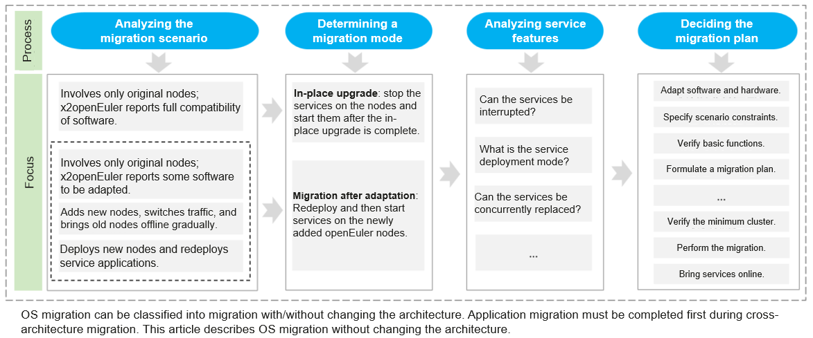
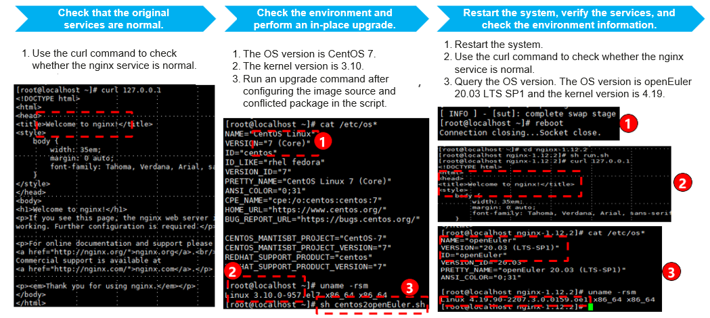
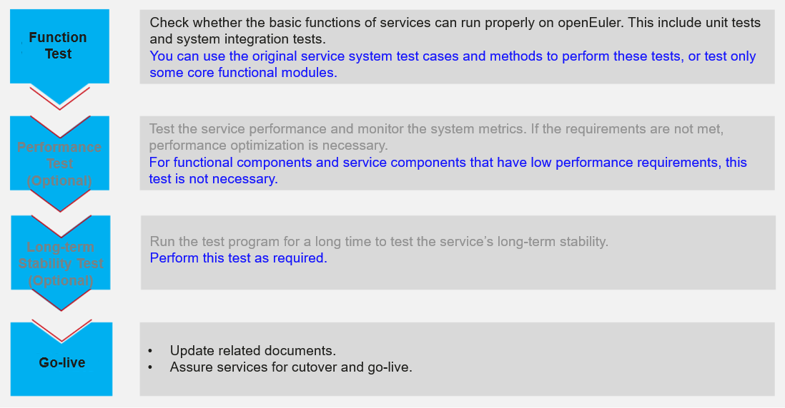

## Overview

 With the deepening of digital transformation, operating systems are evolving towards supporting diversified computing and various scenarios. During digital transformation, enterprises face rigid demands for OS migration. Due to differences between OSs, enterprises face three problems when migrating OSs: how to handle software and hardware compatibility issues, how to quickly restore the system environment, and how to maximize the system performance. To meet enterprises' requirements for OS migration, we write this migration guide to help enterprises migrate OSs in a simple, stable, and efficient manner.  

OS and application migration consists of the following six steps.  

## Step 1: Setting Up a Support Team

Before OS migration, your service departments and IT maintenance departments, OSVs, and ISVs need to set up a support team to provide technical and organizational support.  

## Step 2: Analyzing the Migration Project

 After the support team is set up, your company needs to collect the names of services to be migrated, migration requirements, software stacks, service deployment modes, and server hardware information to form a migration project overview.  

Based on the overview, filter services by service provider, OS, and hardware environment, and specify the service migration priority.  

Finally, use the x2openEuler tool to evaluate the compatibility of the hardware, software, and configuration of the OS. Supplement or replace incompatible software packages based on the generated compatibility report.  

Download x2openEuler at:
[https://repo.oepkgs.net/openEuler/rpm/openEuler-20.03-LTS-SP1/contrib/x2openEuler/](https://repo.oepkgs.net/openEuler/rpm/openEuler-20.03-LTS-SP1/contrib/x2openEuler/)  

## Step 3: Designing a Migration Plan

 Formulate a migration policy for each service node based on the compatibility report and service migration priority. Customize an overall migration plan based on the service deployment mode, whether services can be concurrently replaced, and whether services can be interrupted.  

## Step 4: Adapting Software Before Migration  

Adapt incompatible software according to the x2openEuler compatibility report and redeploy it on the new system after migration.  

## Step 5: Performing the Migration  

We provide two migration paths, as shown in the following figure.  

Two paths for OS migration  

You are advised to use x2openEuler to evaluate software compatibility and select a migration mode based on service requirements.  

After formulating the overall migration plan, you can start service migration. According to the x2openEuler compatibility report, fully compatible services can be directly upgraded using the x2openEuler tool, retaining the original services and configurations to the maximum extent.  

In-place upgrade example

## Step 6: Testing and Bring Services Online

After the service system migration is complete, you can use the original service system test cases and methods to perform unit tests and system integration tests on services. You can also select core functional modules for quick tests and determine whether performance optimization is necessary based on the performance data obtained through these tests. We provide the performance optimization tool A-Tune to help enterprises quickly optimize performance.  

Test process
