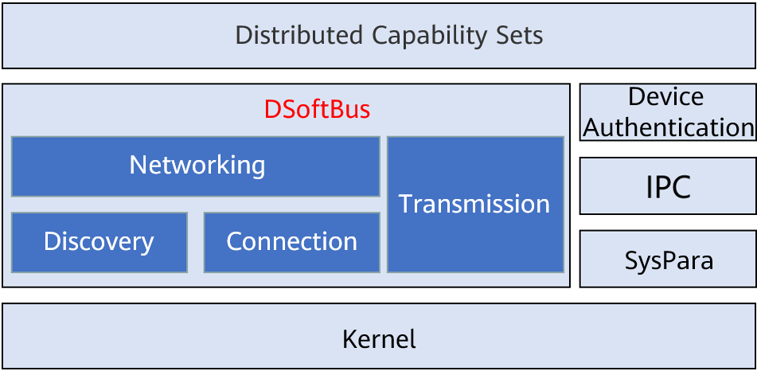

## 1. Introduction

### 1.1 Background

Adhering to the vision of building an "operating system for digital infrastructure", openEuler introduces the distributed soft bus (DSoftBus) to the embedded field to promote cooperation and interoperability with the OpenHarmony ecosystem, implementing device-edge interoperability and collaboration.  

DSoftBus is an open source device communication base of the OpenHarmony community. It powers devices with distributed collaboration capabilities, allowing for auto discovery and efficient transmission among devices.  

OpenHarmony is designed for smart devices, IoT devices, and industrial devices that require strong interaction, while openEuler is for servers, edge computing, cloud, and embedded devices that require high reliability and performance. Technologies such as DSoftBus combine them to maximize the value of cooperation and help community users to expand the industry.  

### 1.2 Architecture

The main architecture of DSoftBus is as follows.  

  

DSoftBus has four basic modules, i.e. discovery, networking, connection, and transmission, to implement the following functions:  

- **Plug-and-play**: Quickly and conveniently discover peripheral devices.
- **Free communication**: Devices form a network and establish service connections to implement free communication.  
- **Efficient transmission**: Software and hardware collaborate by using Wi-Fi and Bluetooth devices to maximize hardware transmission performance.  

DSoftBus supports Ethernet for southbound communication. Other communication methods such as Wi-Fi and Bluetooth will be supported in the future. It also provides unified northbound APIs for distributed applications and shields the underlying communication mechanism.  

DSoftBus needs peripheral modules to manage device authentication, IPC, logs, and system parameters (SNs). These dependent modules are built in the embedded system as templates to implement the basic functions of DSoftBus. Users can enrich or replace the peripheral modules to expand the DSoftBus capabilities.  

## 2. Application Guide

### 2.1 Deployment Diagram

DSoftBus supports the deployment of multiple devices in the LAN. The devices communicate with each other through the Ethernet. Each device consists of a server and a client, which interact with each other through the IPC module.  

  

> **Note**:
>
> Currently, openEuler Embedded provides only reference templates for the IPC module and system parameters such as the SN, and does not support multi-node and multi-client deployment. Users can enrich the functions of the IPC module and SN system parameters to expand the DSoftBus deployment capability.  

### **2.2 Starting the Server**

To start the server, users can run the main program `softbus_server_main`.  

```bash
openeuler ~ # softbus_server_main >log.file &
```

When the server is started, it broadcasts CoAP packets through the network device named ethX. If the peer device is detected, a self-organizing network is built.  

### **2.3 Client API**s

The header files are stored in `/usr/include/dsoftbus/` in the SDK and initrd.  

1. `discovery\_service.h`: header file of the discovery module. The following APIs support proactive detection and release of applications:  

    |API        | Function|
    | --- | ---|
    |PublishService        | Releases a specific service capability.|
    |UnPublishService      |Cancels the release of a specific service capability.|
    |StartDiscovery        |Subscribes to or detects a specific service capability.|
    |StopDiscovery         |Unsubscribes from a specific service capability.|

    The service capability is defined by the `g\_capabilityMap` array. To add a capability, users need to modify the array and rebuild DSoftBus server and client programs for the modification to take effect.  

2. `softbus\_bus\_center.h`: header file of the networking module. The following APIs can be used to obtain information about devices on the network:  

    |API | Function|
    | --- | ---|
    |GetAllNodeDeviceInfo  |Obtains information about all nodes on the current network.|

3. `session.h`: header file of the connection/transmission module. The following APIs are used to create sessions and transmit data:  

    |API        | Function|
    | --- | ---|
    |CreateSessionServer   |Creates a session server.|
    |RemoveSessionServer   |Removes a session server.|
    |OpenSession           |Creates a transmission connection to the peer end (depending on the SessionServer created on the local and peer ends).|
    |CloseSession          |Disconnects the transmission connection.|
    |SendBytes             |Transmits data based on the created connection ID.|

For details about API parameters, see the header file description.  

## 3. Application Example

Use QEMU to deploy DSoftBus and write a client program that enables DSoftBus to list information about all discovered devices.  

Step 1: Build the client program.  

    Prepare the openEuler Embedded SDK environment.  
    
    1. Instal the SDK.  
    
        Run the self-extracting installation script of the SDK.
    
        ```bash
        sh openeuler-glibc-x86_64-openeuler-image-aarch64-qemu-aarch64-toolchain-22.03.sh
        ```
    
        Enter the installation path of the toolchain as prompted. The default path is /opt/openeuler/<openeuler version>/. You can also set the path to a relative or absolute path.
    
        Example:
    
        ```bash
        sh ./openeuler-glibc-x86_64-openeuler-image-armv7a-qemu-arm-toolchain-22.03.sh``
        openEuler embedded(openEuler Embedded Reference Distro) SDK installer version 22.03
        ================================================================
        Enter target directory for SDK (default: /opt/openeuler/22.03): sdk
        You are about to install the SDK to "/usr1/openeuler/sdk". Proceed [Y/n]? y
        Extracting SDK...............................................done
        Setting it up...SDK has been successfully set up and is ready to be used.
        Each time you wish to use the SDK in a new shell session, you need to source the environment setup script e.g.
        . /usr1/openeuler/sdk/environment-setup-armv7a-openeuler-linux-gnueabi
        ```
    
    2. Set the environment variable of the SDK.
    
        Run the source command printed in the last step.
    
        ```bash
        . /usr1/openeuler/myfiles/sdk/environment-setup-armv7a-openeuler-linux-gnueabi
        ```
    
    3. Check whether the SDK is successfully installed.
    
        Run the following command to check whether the installation and environment configuration are successful:
    
         ```bash
        arm-openeuler-linux-gnueabi-gcc -v
         ```
    
    Build the client program.
    
    Create a main.c file. The source code is as follows:
    
    ```c
    #include "dsoftbus/softbus_bus_center.h"
    #include <stdio.h>
    #include <stdlib.h>
    int main(void)
    {
        int32_t infoNum = 10;
        NodeBasicInfo **testInfo = malloc(sizeof(NodeBasicInfo *) * infoNum);
        int ret = GetAllNodeDeviceInfo("testClient", testInfo, &infoNum);
        if (ret != 0) {
            printf("Get node device info fail.\n");
            return 0;
        }
        printf("Get node num: %d\n", infoNum);
        for (int i = 0; i < infoNum; i++) {
            printf("\t networkId: %s, deviceName: %s, deviceTypeId: %d\n",
            testInfo[i]->networkId,
            testInfo[i]->deviceName,
            testInfo[i]->deviceTypeId);
        }
        for (int i = 0; i < infoNum; i++) {
            FreeNodeInfo(testInfo[i]);
        }
        free(testInfo);
        testInfo = NULL;
    
        return 0;
    }
    ```
    
    Create a CMakeLists.txt file. The source code is as follows:
    
    ```bash
    project(dsoftbus_hello C)
    add_executable(dsoftbus_hello main.c)
    target_link_libraries(dsoftbus_hello dsoftbus_bus_center_service_sdk.z)
    ```
    
    Build the client.
    
    ```bash
    mkdir build
    cd build
    cmake ..
    make
    ```
    
    After the build is complete, dsoftbus_hello is generated.

Step 2: Build the QEMU networking environment.

    Create bridge br0 on the host.
    
    ```bash
    brctl addbr br0
    ```
    
    Start QEMU 1.
    
    ```bash
    qemu-system-aarch64 -M virt-4.0 -m 1G -cpu cortex-a57 -nographic -kernel zImage -initrd <openeuler-image-qemu-xxx.cpio.gz> -device virtio-net-device,netdev=tap0,mac=52:54:00:12:34:56 -netdev bridge,id=tap0
    ```
    
    > **Note**:
    >
    > If the following error message is displayed during the first running:
    >
    > ```bash
    > failed to parse default acl file `/usr/local/libexec/../etc/qemu/bridge.conf'
    > qemu-system-aarch64: bridge helper failed
    > ```
    >
    > Add "allow br0" to the specified file.
    >
    > ```bash
    > echo "allow br0" > /usr/local/libexec/../etc/qemu/bridge.conf
    >```
    
    Start QEMU 2.
    
    ```bash
    qemu-system-aarch64 -M virt-4.0 -m 1G -cpu cortex-a57 -nographic -kernel zImage -initrd openeuler-image-qemu-aarch64-20220331025547.rootfs.cpio.gz  -device virtio-net-device,netdev=tap1,mac=52:54:00:12:34:78 -netdev bridge,id=tap1
    ```
    
    > **Note**:
    >
    > The MAC addresses of QEMU 1 and QEMU 2 must be different.
    
    Configure the IP address.
    
    Configure the bridge address of the host.
    
    ```bash
    ifconfig br0 192.168.10.1 up
    ```
    
    Configure the network address of QEMU 1.
    
    ```bash
    ifconfig eth0 192.168.10.2
    ```
    
    Configure the network address of QEMU 2.
    
    ```bash
    ifconfig eth0 192.168.10.3
    ```
    
    Run the ping command on the host, QEMU 1, and QEMU 2 to ensure that QEMU 1 can ping through QEMU 2.

Step 3: Start DSoftBus.

    Start the DSoftBus servers in QEMU 1 and QEMU 2.
    
    ```bash
    softbus_server_main >log.file &
    ```
    
    Distribute the built client to the root directories of QEMU 1 and QEMU 2.
    
    ```bash
    scp dsoftbus_hello root@192.168.10.2:/
    scp dsoftbus_hello root@192.168.10.3:/
    ```
    
    Run dsoftbus_hello in the root directories of QEMU 1 and QEMU 2. The following information is displayed:
    
    qemu1
    
    ```bash
    [LNN]NodeStateCbCount is 10
    [LNN]BusCenterClientInit init OK!
    [DISC]Init success
    [TRAN]init tcp direct channel success.
    [TRAN]init succ
    [COMM]softbus server register service success!
    
    [COMM]softbus sdk frame init success.
    Get node num: 1
            networkId: 714373d691265f9a736442c01459ba39236642c743a71750bb63eb73cde24f5f, deviceName: UNKNOWN, deviceTypeId: 0
    
    ```
    
    qemu2
    
    ```bash
    [LNN]NodeStateCbCount is 10
    [LNN]BusCenterClientInit init OK!
    [DISC]Init success
    [TRAN]init tcp direct channel success.
    [TRAN]init succ
    [COMM]softbus server register service success!
    
    [COMM]softbus sdk frame init success.
    Get node num: 1
            networkId: eaf591f64bab3c20304ed3d3ff4fe1d878a0fd60bf8c85c96e8a8430d81e4076,deviceName: UNKNOWN, deviceTypeId: 0
    ```
    
    QEMU 1 and QEMU 2 output basic information about the discovered peer device.

## 4. Build Guide

Prepare the container environment by referring to [Container Build Guide](https://docs.openeuler.org/en/docs/22.03_LTS/docs/Embedded/container-build-guide.html).  

1. Clone the repository where the script is located (for example, download the repository to the `src/yocto-meta-openeuler` directory).  

   ```bash
   git clone https://gitee.com/openeuler/yocto-meta-openeuler.git -b openEuler-22.03-LTS -v src/yocto-meta-openeuler
   ```

2. Run the download script.

    Download the latest DSoftBus code:

    ```bash
    sh src/yocto-meta-openeuler/scripts/download_code.sh dsoftbus
   ```

   By default, the code is downloaded to the path at the same level as `yocto-meta-openeuler`. To modify DSoftBus or the dependent module code, go to the `dsoftbus/_standard` and `yocto-embedded-tools` repositories.

3. Build the script.

    Build the latest DSoftBus code.

    ```bash
    sh src/yocto-meta-openeuler/scripts/compile.sh dsoftbus
    ```

    The build directory is `dsoftbus/_build`, and the directory of the generated build file is `dsoftbus/_output`. By default, the two directories are at the same level as `yocto-meta-openeuler`. 

## 5. Restrictions

1. CoAP discovery is supported only on LANs. Wi-Fi and BLE will be supported in later versions.

2. Currently, the dependent modules are only examples and can be deployed only on a dual-device node in client-server mode. We look forward to working with community partners to instantiate these dependent modules.

### Follow Us

openEuler Embedded has been open sourced in the openEuler community. You are welcome to join us at 

<https://gitee.com/openeuler/yocto-meta-openeuler>  

### Communication Group

Scan the QR code below to join the group chat.  


