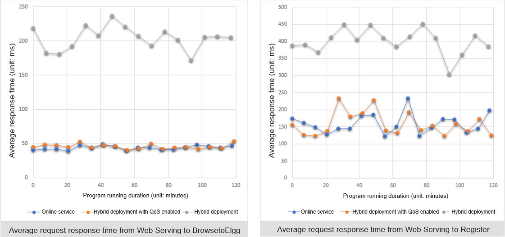
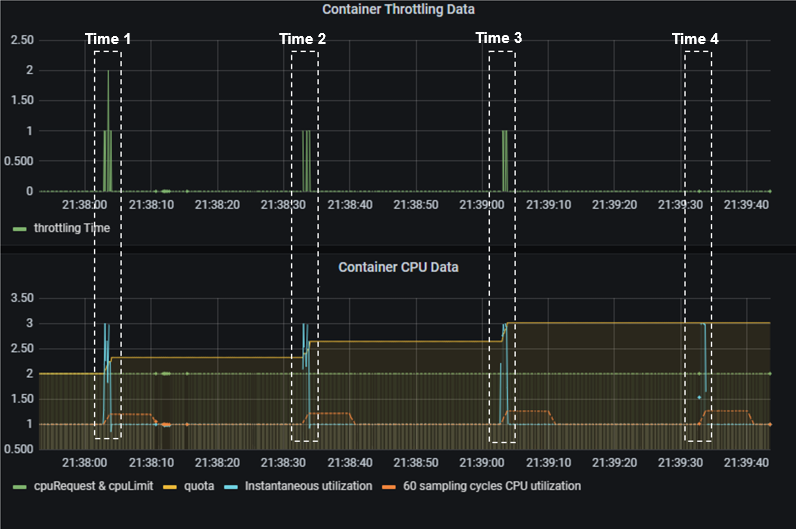
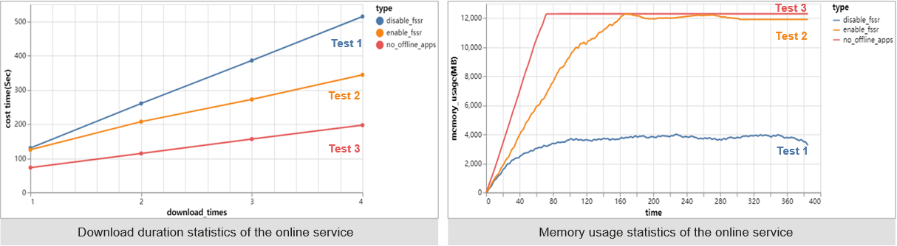
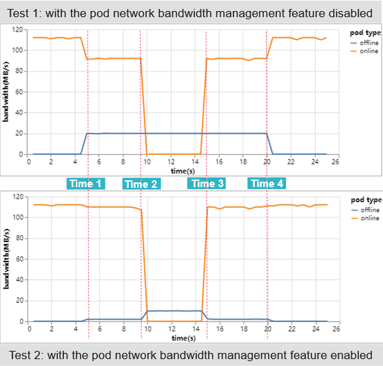

The previous article\[1\] describes the background and solutions of resource utilization optimization, as well as the overall resource utilization solutions and technologies of openEuler.  

In this article, we have tested typical applications (CPU-sensitive, memory-sensitive, and network I/O-sensitive applications) of containers in offline scenarios in the x86 environment where the openEuler hybrid deployment QoS solution is used.  

## Case 1: CPU Scheduling-Sensitive Applications

For CPU scheduling-sensitive applications, two test suites of CloudSuite\[2\] are selected for hybrid deployment of online and offline services.  

-   For online services, the **Web Serving** test suite\[3\] is used. It simulates a scenario where users send different requests to a social networking server. The server is implemented based on the social networking engine (Elgg), and the client is implemented based on the Faban workload generator. Service performance metrics are the average number of operations per second and response time.  
-   For offline services, the **In-Memory Analytics** test suite\[4\] is used. Apache Spark runs the collaborative filtering algorithm in the memory to train a movie rating model and generate a list of recommended movies. The service performance metric is the time (in seconds) for computing recommended movies.  

Web Serving is a CPU-sensitive application that is real-time and sensitive to response time, which meets the features of online services. In-Memory Analytics is a CPU-intensive application that consumes a large number of computing resources, which meets the features of offline services. The hybrid deployment of the two applications can effectively use the CPU resources when Web Serving is idle, thus improving the resource utilization. However, conventional hybrid deployment will cause the online service to be greatly interfered by the CPU-intensive offline service. To solve this problem, the QoS solution can be used to implement CPU preemption for online services, ensuring the performance of online services.  

The test focuses on the performance data of the online service in the following conditions:  

1.  The online service Web Serving runs separately;  
2.  Both online and offline services are deployed and the QoS solution is disabled;  
3.  Both online and offline services are deployed and the QoS solution is enabled.  

The following results are obtained by putting the three groups of test data together:  

  

In the two-hour test period, when the QoS solution is disabled (test condition 2), the online service is greatly affected. The average response time of requests from Web Serving to BrowsetoElgg and Register increases by three times. That is, the performance of the online service decreases by three times after being interfered by the offline service. In test condition 3 where the QoS solution is enabled, the performance of the online service is basically the same as that in test condition 1 where only the online service is running.  

The preceding test results show that when CPU contention occurs between services, online services with the QoS solution enabled obtain key CPU resources. The absolute CPU preemption technology of openEuler plays an important role.  

## Case 2: CPU Traffic-Sensitive Applications 

Generally, when deploying a service in a Kubernetes cluster, you need to limit the number of CPU cores that can be used by a container. However, fixed resources cannot meet the running requirements of CPU traffic-sensitive services (that is, applications sensitive to short-time burst traffic). For example:  

1.  The CPU specifications of a single application instance are small, the usage is low, and the CPU usage spikes regularly.  
2.  The application runs stably for a long time, and the CPU usage increases sharply during running.  
3.  The overall CPU usage of the application is low, but the usage is high during application startup.  

Compared with CPU scheduling-sensitive applications mentioned in case 1, these applications are classified as CPU traffic-sensitive applications.  

To facilitate the test, we simulate a test service that runs stably for a long time but the CPU usage increases regularly and abruptly based on the preceding three conditions. This service:  

-   Uses the Stress tool to simulate a scenario where the service traffic surges in a short period of time. Occupies only one CPU core when it is running stably. The peak traffic bursts for 1 ms every 30 seconds. During peak periods, three CPU cores are occupied.  
-   Is deployed in a Kubernetes cluster with limited CPUs available. The maximum number of CPUs for the service is 2.  

In the test, enable the QoS solution of openEuler and run the preceding test cases. During the test, observe the throttling times to observe the running status of the container when dealing with burst traffic.  

The following figure shows the application running status during the test. The upper part displays the number of container throttling times, and the lower part displays the CPU usage during container running. At time 1 to time 4, the service container generates burst traffic. In this case, the CPU usage of the container increases from 1 core to 3 cores. As the QoS solution proactively adjusts the CPU quota of the throttled container, the throttling is gradually alleviated until the container is no longer throttled.  

  

As shown in the preceding figure, the QoS solution of openEuler can effectively improve the performance of CPU traffic-sensitive applications. In this process, the quotaTurbo feature of openEuler is also used. This feature continuously monitors the throttling status of containers during service running and adjusts the CPU time slices used by containers based on the current CPU load. On the premise that the load watermark of the entire system is secure and stable and other services are not affected, the CPU limit of the service container is dynamically adjusted on demand. In this way, the service throttling rate is reduced, and the overall service running performance is improved.  

## Case 3: Memory-Sensitive Applications

Next, let's look at the problems that memory-sensitive applications may encounter when both online and offline services are deployed in containers. For example, when a memory-consuming offline service is deployed and occupies too much memory, no memory can be allocated to the online service when required. As a result, the QoS of the online service decreases.  

In this case, the memory usage of the offline application needs to be throttled and the memory used by the offline application needs to be released in a timely manner. Therefore, we developed a cgroup-based fast suppression and slow recovery (FSSR) feature for memory management based on the QoS solution of openEuler.  

The following uses a test case to verify the effect of the FSSR feature. See the following test model:  

  

In this test, the processes marked in yellow play the following roles:  

-   Online service (**nginx**): **nginx** is sensitive to latency and thus functions as an online service. During the test, **nginx** downloads a specified file and transfers the file continuously.  
-   Offline service (**stress**): **stress** is insensitive to latency but uses a large amount of memory. During the test, **stress** writes data to the memory and drive at the same time, and occupies a certain amount of anonymous memory and page cache.  
-   Client (**siege**): **siege** simulates user behavior and sends HTTP requests to the online service **nginx**.  

The focus of the test is the QoS of the online service (by measuring the download duration of the service). The following test cases are designed:  

1.  Both online and offline services are deployed, and the FSSR feature of QoS is disabled.  
2.  Both online and offline services are deployed, and the FSSR feature of QoS is enabled.  
3.  Only the online service is running.  

After the test is complete, the following results are obtained:  

  

In the preceding figure:  

-   As shown in the left part, the download duration increases as the number of consecutive downloads increases during the test, indicating a decrease in the QoS of the online service. Compared with test 1 where the FSSR feature is disabled, the QoS of the online service in test 2 with the FSSR feature enabled is significantly improved. This means that when the number of downloads increases and the FSSR feature is enabled, the upper memory limit of the online service increases as the usage increases. A large number of read files are cached in the page cache, reducing the number of drive read/write times and ensuring the QoS of the online service.  
-   As shown in the right part, when the FSSR feature is enabled (test 2), the memory usage of the online service is close to that of the online service in test 3 when only the online service is running. This means that the online service uses memory resources as much as possible to compete with the offline service.  

The preceding tests show that the FSSR feature that dynamically adjusts the memory allocated to the online and offline services preferentially guarantees the memory usage of the online service and improves the QoS of the online service when both online and offline services are deployed.  

## Case 4: Network I/O–Sensitive Applications

Finally, let's see some scenarios of network I/O-sensitive applications. When both online and offline services are deployed, if the network I/O requirements of offline services increase in a certain period, online and offline services compete for network resources. In this case, if online services cannot obtain key network resources in time, the QoS deteriorates. To solve this problem, the container pod bandwidth management feature is developed for the QoS solution of openEuler.  

The following test case is designed to verify the effect of this feature. To facilitate observation of network bandwidth changes, iperf3\[5\] is used to simulate service processes for online and offline services in this test. The following figure shows the network topology:  

  

The test procedure is as follows:  

1.  On node 1:  
    (1) Use rubik to enable the pod bandwidth management feature and set the total bandwidth of the offline service and the traffic limiting watermark of the online service.  
    (2) Set different QoS levels for the cgroups to which the service containers belong to distinguish online and offline services.  

2.  On node 2, start the iperf3 client tool to send requests to the offline service so that the offline service can initiate network traffic on demand. Set four time points at the same time.  
    (1) At the beginning of the test, the online service occupies as much network bandwidth as possible, and the offline service is not started.  
    (2) At time 1 (the fifth second), the offline service is started, and the online and offline services start to compete for network resources.  
    (3) At time 2 (the tenth second), the online service stops, and only the offline service keeps running.  
    (4) At time 3 (the 15th second), the online service is started, and the online and offline services start to compete for network resources again.  
    (5) At time 4 (the 20th second), the offline service stops, and only the online service keeps running.  

3.  During the test, continuously observe the network bandwidth usage of the service containers on node 1.  

The following results are obtained after collecting the test data of two rounds of tests (with the pod network bandwidth management feature disabled and then enabled). We can see:  

-   At time 1, the offline service starts to compete for network resources. In test 1, the bandwidth of the online service is affected. In test 2, however, the bandwidth of the online service is almost not affected.  
-   At time 2, the online service stops processing requests. In test 2, the offline service that was throttled previously obtains more network bandwidth.  
-   At time 3, the online service resumes processing requests. The online service in test 2 immediately obtains as much network bandwidth as possible, and the bandwidth of the offline service is throttled. In contrast, the online service in test 1 cannot obtain sufficient network bandwidth.  
-   At time 4, the offline service stops competing for network resources. In this case, the online service in test 1 obtains sufficient network bandwidth.  

  

According to the preceding test results, the pod network bandwidth management feature of the QoS solution of openEuler enables the online service to preempt bandwidth resources within 100 ms when the online and offline services compete for network resources. In this way, the QoS of the online service is ensured.  

## Summary

Based on the preceding four cases, we have demonstrated the benefits that the openEuler resource utilization optimization solution can bring to online services. That is, when the node resource utilization is optimized, multi-dimensional resource isolation based on the priority and automatic interference control are used to ensure the quality of key online services.  

In following articles, we will introduce the technologies of key features one by one.  

## References

1.  openEuler Resource Utilization Optimization (1): Overview: [https://www.openeuler.org/zh/blog/20220705-01ziyuanliyonglv/openeuler-01ziyuanliyonglv.html](https://www.openeuler.org/zh/blog/20220705-01ziyuanliyonglv/openeuler-01ziyuanliyonglv.html)

1.  CloudSuite | A Benchmark Suite for Cloud Services: [https://www.cloudsuite.ch/](https://www.cloudsuite.ch/)
2.  Web Serving: [https://github.com/parsa-epfl/cloudsuite/blob/main/docs/benchmarks/web-serving.md](https://github.com/parsa-epfl/cloudsuite/blob/main/docs/benchmarks/web-serving.md)
3.  In-Memory Analytics: [https://github.com/parsa-epfl/cloudsuite/blob/main/docs/benchmarks/in-memory-analytics.md](https://github.com/parsa-epfl/cloudsuite/blob/main/docs/benchmarks/in-memory-analytics.md)
4.  iPerf - The TCP, UDP and SCTP network bandwidth measurement tool: [https://iperf.fr/](https://iperf.fr/)

## Related Articles

openEuler Resource Utilization Optimization (1): Overview: [https://www.openeuler.org/zh/blog/20220705-01ziyuanliyonglv/openeuler-01ziyuanliyonglv.html](https://www.openeuler.org/zh/blog/20220705-01ziyuanliyonglv/openeuler-01ziyuanliyonglv.html)

## Join Us

The resource utilization optimization technologies described in this article are jointly developed by the Cloud Native SIG, High Performance Network SIG, Kernel SIG, OpenStack SIG, and Virt SIG. The source code will be gradually open-sourced in the openEuler community. If you are interested in related technologies, you are welcome to join us by scanning the following QR code to join the WeChat groups of SIGs you are interested in.

