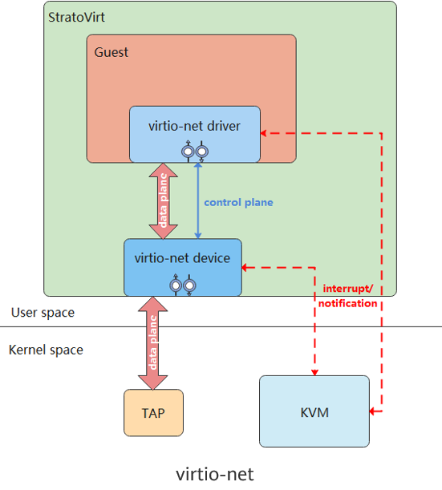
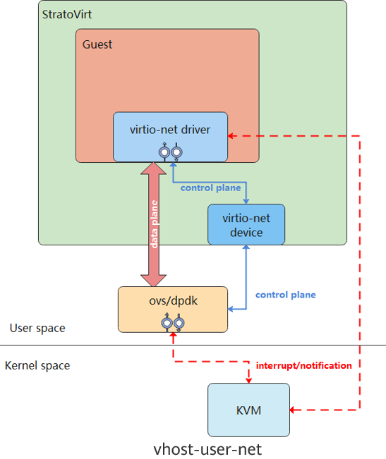

---
Currently, StratoVirt supports three types of virtual NICs: virtio-net, vhost-net, and vhost-user-net, which implement the data plane based on the virtio protocol. The virtio-net data plane has a layer switching from the user mode to the kernel mode. vhost-net solves this problem by offloading the data plane to the kernel. However, the guest still needs to be trapped to notify the backend. This problem is solved by vhost-user-net, which offloads the data plane to the user-mode process, binds a fixed core, and continuously performs polling operations on the shared ring. The following describes how these vNICs are implemented.  

## virtio-net

virtio-net is a para-virtualization solution that uses the virtio protocol and tap devices to implement front-end and back-end communication. The virtio protocol is an I/O transmission protocol used in para-virtualization scenarios. It solves the performance overhead problem caused by emulated instructions in full virtualization scenarios. The following figure shows the overall framework of virtio-net.  

  

The guest must support the virtio-net driver. The guest and StratoVirt process I/O requests through shared memory based on the virtio protocol.  

**Packet sending process:**

(1) The guest uses the virtio-net driver to store the I/O request in the sending queue and triggers the trap to notify the backend.  

(2) After the trap is triggered, KVM notifies StratoVirt through eventfd that data in the shared ring needs to be processed.  

(3) StratoVirt obtains data from the ring and sends the data to the tap device. Then, the tap device automatically sends the data to the physical NIC.  

**Packet receiving process:**

(1) When the physical NIC sends data to the tap device, StratoVirt listens to the sending.  

(2) StratoVirt fetches the I/O request from the tap device and stores it in the receiving queue of the shared ring.  

(3) StratoVirt notifies the KVM through irqfd. The KVM injects an interrupt to instruct the guest to receive data.  

## virtio-net Implementation

The NetIoHandler structure is used as the body for processing virtio-net events. It contains the RX/TX structures RxVirtio (rx) and TxVirtio (tx), tap devices, and file descriptors. Both RxVirtio and TxVirtio contain the queue and event descriptor `queue_evt`. The queue is protected by the Mutex lock to ensure data security during multi-thread sharing. The code is stored in `virtio/src/net.rs`  

```cpp
struct TxVirtio {
    queue: Arc<Mutex<Queue>>,
    queue_evt: EventFd,
}

struct RxVirtio {
    queue: Arc<Mutex<Queue>>,
    queue_evt: EventFd,
    ...
}

struct NetIoHandler {
    // Packet receiving structure
    rx: RxVirtio,
    // Packet sending structure
    tx: TxVirtio,
    // Tap device
    tap: Option<Tap>,
    // File descriptor corresponding to the tap device
    tap_fd: RawFd,
    ...
}
```

## Implementation of Receiving and Sending Packets

When the VM receives packets, StratoVirt reads data from the tap device to the avail ring. Then, the index is added to the used ring, and an interrupt is sent to the VM to instruct the VM to receive data. The VM packet sending process is similar to the VM packet receiving process and will not be described repeatedly. The core code (`virtio/src/net.rs`) for receiving packets is as follows:  

```cpp
fn handle_rx(&mut self) -> Result<()> {
    let mut queue = self.rx.queue.lock().unwrap();
    while let Some(tap) = self.tap.as_mut() {
        ...
        // Obtain the elem in the avail ring to save the package sent to the guest.
        let elem = queue
            .vring
            .pop_avail(&self.mem_space, self.driver_features)
            .chain_err(|| "Failed to pop avail ring for net rx")?;
        let mut iovecs = Vec::new();
        for elem_iov in elem.in_iovec.iter() {
            // Translate the guest address to the host virtual address.
            let host_addr = queue
                .vring
                .get_host_address_from_cache(elem_iov.addr, &self.mem_space);
            if host_addr != 0 {
                let iovec = libc::iovec {
                    iov_base: host_addr as *mut libc::c_void,
                    iov_len: elem_iov.len as libc::size_t,
                };
                iovecs.push(iovec);
            } else {
                error!("Failed to get host address for {}", elem_iov.addr.0);
            }
        }
        // Read data from the tap device.
        let write_count = unsafe {
            libc::readv(
                tap.as_raw_fd() as libc::c_int,
                iovecs.as_ptr() as *const libc::iovec,
                iovecs.len() as libc::c_int,
            )
        };
        ...
        queue
            .vring
            .add_used(&self.mem_space, elem.index, write_count as u32)
            .chain_err(|| {
                format!(
                    "Failed to add used ring for net rx, index: {}, len: {}",
                    elem.index, write_count
                )
            })?;
        self.rx.need_irqs = true;
    }

    if self.rx.need_irqs {
        self.rx.need_irqs = false;
        // Notify the guest through an interrupt.
        (self.interrupt_cb)(&VirtioInterruptType::Vring, Some(&queue))
            .chain_err(|| ErrorKind::InterruptTrigger("net", VirtioInterruptType::Vring))?;
    }

    Ok(())
}
```
##  vhost-net

vhost-net offloads the data plane in virtio-net to the kernel. The kernel starts a thread to process I/O requests, bypassing StratoVirt. This reduces the switchover between the user mode and kernel mode and improves network performance. The following figure shows the overall framework of vhost-net.  

  

The control plane of the vhost-net sends information such as vring and eventfd to the vhost-net driver based on the vhost protocol. The vhost-net driver accesses the vring information in the kernel to receive and send packets. The user mode and kernel mode do not need to be switched, effectively improving network performance.  

**Packet sending process:**

(1) The guest uses the virtio-net driver to store the I/O request in the sending queue and triggers the trap to notify the backend.  

(2) After the trap is triggered, KVM notifies vhost-net through eventfd that data in the shared ring needs to be processed.  

(3) vhost-net obtains data from the ring and sends the data to the tap device. Then, the tap device automatically sends the data to the physical NIC.  

**Packet receiving process:**

(1) When the physical NIC sends data to the tap device, vhost-net is notified.  

(2) vhost-net fetches the I/O request from the tap device and stores it in the receiving queue of the shared ring.  

(3) vhost-net notifies the KVM through irqfd. The KVM injects an interrupt to instruct the guest to receive data.  

## vhost-net Implementation

When the VM is started and the virtio-net driver in the VM is available, StratoVirt invokes the activate function to enable the virtio device. Based on the vhost protocol, this function sends the features negotiated between the frontend and backend, VM memory information, vring information, and tap information to the vhost-net driver, and offloads the virtio data plane to an independent process for processing, improving network performance. The core code (`virtio/src/vhost/kernel/net.rs`) for enabling device is implemented as follows:  

```bash
fn activate(
    &mut self,
    _mem_space: Arc<AddressSpace>,
    interrupt_cb: Arc<VirtioInterrupt>,
    queues: &[Arc<Mutex<Queue>>],
    queue_evts: Vec<EventFd>,
) -> Result<()> {
    let backend = match &self.backend {
        None => return Err("Failed to get backend for vhost net".into()),
        Some(backend_) => backend_,
    };

    // Send the features negotiated between the frontend and backend to vhost-net.
    backend
        .set_features(self.vhost_features)
        .chain_err(|| "Failed to set features for vhost net")?;

    // Send the memory information of the VM to vhost-net.
    backend
        .set_mem_table()
        .chain_err(|| "Failed to set mem table for vhost net")?;

    for (queue_index, queue_mutex) in queues.iter().enumerate() {
        let queue = queue_mutex.lock().unwrap();
        let actual_size = queue.vring.actual_size();
        let queue_config = queue.vring.get_queue_config();

        // Send the vring size to vhost-net.
        backend
            .set_vring_num(queue_index, actual_size)
            .chain_err(...)?;
        // Send the vring address to vhost-net.
        backend
            .set_vring_addr(&queue_config, queue_index, 0)
            .chain_err(...)?;
        // Send the start location of the vring to vhost-net.
        backend.set_vring_base(queue_index, 0).chain_err(...)?;
        // Send the eventfd used for polling the vring to vhost-net.
        backend
            .set_vring_kick(queue_index, &queue_evts[queue_index])
            .chain_err(...)?;
        ...
        // Send callfd to vhost-net. This parameter is used to notify the KVM after the request is processed.
        backend
            .set_vring_call(queue_index, &host_notify.notify_evt)
            .chain_err(...)?;

        let tap = match &self.tap {
            None => bail!("Failed to get tap for vhost net"),
            Some(tap_) => tap_,
        };
        // Send the tap information to vhost-net.
        backend.set_backend(queue_index, &tap.file).chain_err(...)?;
    }
    ...
}
```

## vhost-user-net

vhost-user-net offloads the data plane of virtio-net to the user-mode process Ovs-dpdk based on the vhost protocol. The data plane is taken over by Ovs-dpdk, which is bound to a fixed core and continuously performs polling operations on the shared ring to check whether the vring data needs to be processed. This polling mechanism enables VMs to send data without trapping. Compared with vhost-net, this mechanism reduces trapping overhead and further improves network performance. The following figure shows the overall framework of vhost-user-net.  

  

Similar to vhost-net, the control plane of vhost-user-net is based on the vhost protocol implemented in user mode. When the activate function is invoked in StratoVirt to activate the virtio device, the memory information of the VM, vring-related information, and eventfd are sent to Ovs-dpdk for receiving and sending packets.  

**Packet sending process:**

(1) The guest uses the virtio-net driver to store the I/O request in the sending queue.  

(2) Ovs-dpdk keeps polling the shared ring until the request in step 1 is polled.  

(3) Ovs-dpdk fetches the I/O request and sends it to the NIC.  

**Packet receiving process:**

(1) Ovs-dpdk receives I/O requests from the NIC.  

(2) Ovs-dpdk stores the I/O requests into a receiving queue of the shared ring.  

(3) Ovs-dpdk notifies the KVM through irqfd. The KVM injects an interrupt to instruct the guest to receive data.  

The code implementation is similar to that of vhost-net and will not be described repeatedly.  

## Summary

virtio-net, vhost-net, and vhost-user-net have their own advantages and disadvantages. Users can select different vNICs for different scenarios. virtio-net is the most commonly used. vhost-net can be used when the host supports vhost and there are certain requirements on performance. vhost-use-net can be used when the host has sufficient CPU resources and there are relatively high requirements on performance.  

---

StratoVirt has been open sourced in the openEuler community.  

To learn more about virtualization technology or StratoVirt, please scan the following QR code and reply StratoVirt to join the SIG.  

Project address: <https://gitee.com/openeuler/stratovirt>

Project discussion: <https://gitee.com/openeuler/stratovirt/issues>


