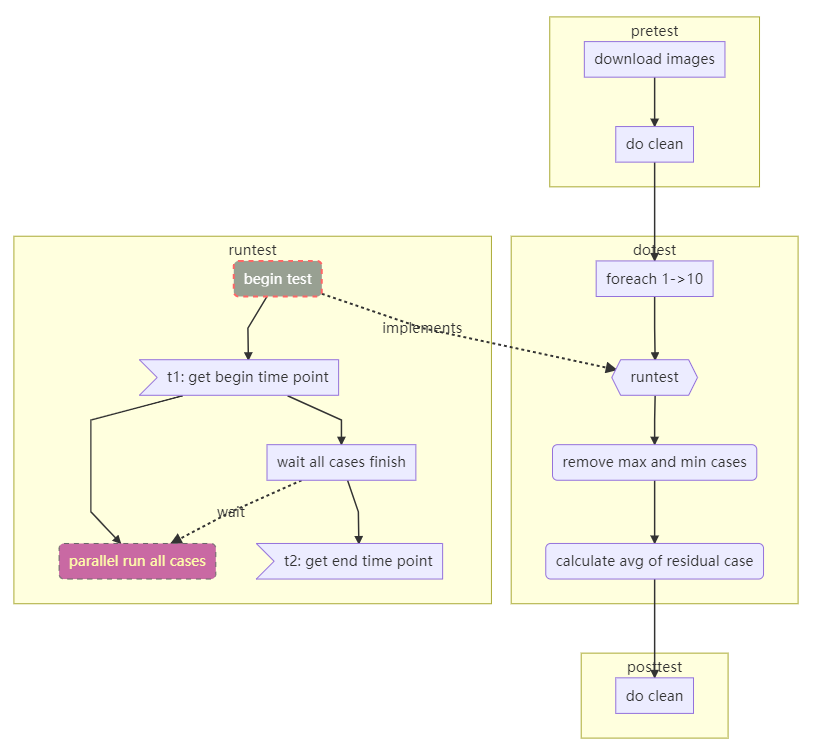
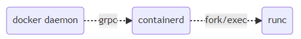

The iSulad container engine has many advantages, such as light weight and fast speed. This article focuses on how fast the iSulad container engine is. To prove that iSulad is fast, I choose some other leading container engines as reference, for example, Docker, Podman of Red Hat, and CRI-O.  

After setting the reference objects, we need to specify the comparison scope.  

## Test Scope

A container engine can be used in the following modes:  

- Client mode: This mode is commonly used in personal development, test, and some production scenarios.  
- CRI mode for PaaS: In typical cloud computing scenarios, the container runtime interface (CRI) is used to invoke container engine capabilities and manage pod clusters.  

To improve the accuracy of the test result, both the client mode and the CRI mode need to be covered.  

### Client Mode

CRI-O does not support the client mode. Therefore, only the following three are tested in this mode.  

- Docker  
- Podman  
- iSulad  

### CRI Mode

The CRI needs to be tested using `cri-tools`.  

In CRI mode, the following three are selected as the test objects:  

- Docker  
- CRI-O  
- iSulad  

## Environment Setup

### Machine Environment

#### x86

| Item| Configuration                                |
| ------ | ---------------------------------------- |
| OS     | Fedora 32 x86_64                         |
| Kernel  | Linux 5.7.10-201.fc32.x86_64            |
| CPU    | 48 cores, Intel Xeon processor E5-2695 v2 @ 2.4 GHz|
| Memory  | 132 GB                                   |

#### ARM

| Item| Configuration     |
| ------ | ------------- |
| OS     | openEuler  |
| Kernel  | Linux 4.19.90|
| CPU    | 64 cores         |
| Memory  | 196 GB        |

### Installing iSulad

For details, see the [official document](https://gitee.com/openeuler/iSulad/blob/master/docs/build_guide/build_guide.md).

```bash
$ isula version

Client:
  Version:	2.0.3
  Git commit:	3bb24761f07cc0ac399e1cb783053db8b33b263d
  Built:	2020-08-01T09:40:06.568848951+08:00

Server:
  Version:	2.0.3
  Git commit:	3bb24761f07cc0ac399e1cb783053db8b33b263d
  Built:	2020-08-01T09:40:06.568848951+08:00

OCI config:
  Version:	1.0.1
  Default file:	/etc/default/isulad/config.json
```

### Installing cri-tools

Use the unified client tool to perform the CRI test. Choose `V1.15.0` for Kubernetes.

```bash
$ git clone https://github.com/kubernetes-sigs/cri-tools
$ cd cri-tools
$ git checkout v1.15.0
$ make
$ export PATH=$PATH:$GOPATH/bin
```

### Installing Docker

For details, see the [official document](https://docs.docker.com/engine/install/fedora/).

```bash
$ docker version

Client:
 Version:           19.03.11
 API version:       1.40
 Go version:        go1.14.3
 Git commit:        42e35e6
 Built:             Sun Jun 7 21:16:58 2020
 OS/Arch:           linux/amd64
 Experimental:      false

Server: Docker Engine - Community
 Engine:
  Version:          19.03.11
  API version:      1.40 (minimum version 1.12)
  Go version:       go1.14.3
  Git commit:       42e35e6
  Built:            Sun Jun 7 00:00:00 2020
  OS/Arch:          linux/amd64
  Experimental:     false
 containerd:
  Version:          1.3.3
  GitCommit:        
 runc:
  Version:          1.0.0-rc10+dev
  GitCommit:        fbdbaf85ecbc0e077f336c03062710435607dbf1
 docker-init:
  Version:          0.18.0
  GitCommit:
```

### Installing kubelet

`V1.15.0` is selected as the test version. Clone the source code at [https://github.com/kubernetes/kubernetes](https://github.com/kubernetes/kubernetes).

#### Obtaining Source Code

Download the source code.

```bash
$ cd $GOPATH/src/k8s.io
$ git clone https://github.com/kubernetes/kubernetes.git
$ cd kubernetes
$ git checkout v1.15.0
$ go mod tidy
```

#### Compiling kubelet

```bash
$ make all WHAT=cmd/kubelet
```

Note:

- Kubernetes has requirements on the Go version. For example, Kubernetes V1.15.0 requires Go 1.12.
- The `go mod tidy` command can be used to download dependencies. If a repository fails to be authenticated, run the `go get -v -insecure` command.

#### Installing kubelet

```bash
$ cp _output/bin/kubelet /usr/local/bin/kubelet
$ kubelet --version
  Kubernetes v1.15.0
```

#### Starting kubelet

```bash
$ kubelet --network-plugin=cni --runtime-cgroups=/systemd/system.slice --kubelet-cgroups=/systemd/system.slice --cgroup-driver="systemd"  --fail-swap-on=false  -v 5 --enable-controller-attach-detach=false --experimental-dockershim
```

Note: **cgroup** is managed by **systemd**.

### Installing CRI-O

CRI-O v1.15.4 installed using `dnf` cannot run properly. Therefore, we need to install it by compiling source code.

```bash
$ dnf install glib-2.0 glibc-devel glibc-static container-common
$ git clone https://github.com/cri-o/cri-o.git
$ cd crio
$ make
$ make install
$ mkdir -p /etc/crio && cp crio.conf /etc/crio/
```

### Installing Podman

Use `dnf` for installation.

```bash
$ dnf install -y podman

$ podman --version
  podman version 2.0.3
```

## Test Scheme

This article focuses on the container lifecycle performance of the container engines. The test points are as follows:

- Performance of operations such as **create**, **start**, **stop**, **rm**, and **run** of a single container;  
- Performance of concurrent **create**, **start**, **stop**, **rm**, and **run** operations of 100 containers;  
- Performance of **runp**, **stopp**, and **rmp** operations of a single pod;  
- Performance of **run**, **stop**, and **rm** operations of a single pod containing a single container;  
- Performance of concurrent **runp**, **stopp**, and **rmp** operations of 100 pods;  
- Performance of concurrent **run**, **stop**, and **rm** operations of 100 pods, each pod containing a single container;  

Note: The **linux** field must be specified in the pod configuration. Otherwise, Docker creates a default NIC for the pod. As a result, the CNI plugin fails to be executed.  

```json
{
    "metadata": {
        "name": "nginx-sandbox",
        "namespace": "default",
        "attempt": 1,
        "uid": "hdishd83djaidwnduwk28bcsb"
    },
    // The linux field must be set.
    "linux": {
    }
}

```

### Detailed Design  

Although a single test and a concurrent test are two test scenarios, a single test can be regarded as a special case of concurrent tests. When designing test cases, we can control the number of concurrent operations to distinguish the two scenarios. The following figure shows the detailed design:  

  

### Client Mode  

#### Test Result in the x86 Environment  

Operation performance comparison of a single container  

| Operation Duration (ms)| Docker (avg)| Podman (avg) | iSulad (avg) | vs. Docker | vs. Podman |
| ------------- | ------------- | ------------ | ----------- | --------- | --------- |
| create        | 287           | 180          | 131         | -54.36%   | -27.22%   |
| start         | 675           | 916          | 315         | -53.33%   | -65.61%   |
| stop          | 349           | 513          | 274         | -21.49%   | -46.59%   |
| rm            | 72            | 187          | 60          | -16.67%   | -67.91%   |
| run           | 866           | 454          | 359         | -58.55%   | -20.93%   |

Operation performance comparison of 100 containers

| Operation Duration (ms)| Docker (avg)| Podman (avg) | iSulad (avg) | vs.  Docker | vs.  Podman |
| ------------- | ------------- | ------------ | ----------- | --------- | --------- |
| 100 * create  | 4995          | 3993         | 1911        | -61.74%   | -52.14%   |
| 100 * start   | 10126         | 5537         | 3861        | -61.87%   | -30.27%   |
| 100 * stop    | 8066          | 11100        | 4268        | -47.09%   | -61.55%   |
| 100 * rm      | 3220          | 4319         | 1967        | -38.91%   | -54.46%   |
| 100 * run     | 9822          | 5979         | 4392        | -55.28%   | -26.54%   |

#### Test Result in the ARM Environment

Operation performance comparison of a single container

| Operation Duration (ms)| Docker (avg)| Podman (avg) | iSulad (avg) | vs. Docker | vs. Podman |
| ------------- | ------------- | ------------ | ----------- | --------- | --------- |
| create        | 401           | 361          | 177         | -55.86%   | -50.97%   |
| start         | 1160          | 1143         | 523         | -54.91%   | -54.24%   |
| stop          | 634           | 576          | 395         | -37.70%   | -31.42%   |
| rm            | 105           | 398          | 89          | -15.24%   | -77.64%   |
| run           | 1261          | 1071         | 634         | -49.72%   | -40.80%   |

Operation performance comparison of 100 containers

| Operation Duration (ms)| Docker (avg)| Podman (avg) | iSulad (avg) | vs.  Docker | vs. Podman |
| ------------- | ------------- | ------------ | ----------- | --------- | --------- |
| 100 * create  | 14563         | 12081        | 4172        | -71.35%   | -65.47%   |
| 100 * start   | 23420         | 15370        | 5294        | -77.40%   | -65.56%   |
| 100 * stop    | 22234         | 16973        | 8619        | -61.24%   | -49.22%   |
| 100 * rm      | 937           | 10943        | 926         | -1.17%    | -92.33%   |
| 100 * run     | 28091         | 16280        | 9015        | -67.91%   | -44.63%   |

### CRI Mode

#### Test Result in the x86 Environment

Operation performance comparison of a single pod

| Operation Duration (ms)| Docker (avg)| CRIO (avg) | iSulad (avg) | vs. Docker | vs. CRIO |
| ------------- | ------------- | ---------- | ----------- | --------- | ------- |
| runp          | 681           | 321        | 239         | -64.90%   | -25.55% |
| stopp         | 400           | 356        | 272         | -32.00%   | -23.60% |

Operation performance comparison of a single pod containing a single container

| Operation Duration (ms)| Docker (avg)| CRIO (avg) | iSulad (avg) | vs. Docker | vs. CRIO |
| ------------- | ------------- | ---------- | ----------- | --------- | ------- |
| run           | 1249          | 525        | 382         | -69.42%   | -27.24% |
| stop          | 554           | 759        | 564         | +1.81%    | -25.69% |

Operation performance comparison of 100 pods

| Operation Duration (ms)| Docker (avg)| CRIO (avg) | iSulad (avg) | vs. Docker | vs. CRIO |
| ------------- | ------------- | ---------- | ----------- | --------- | ------- |
| 100 * runp    | 13998         | 4946       | 3887        | -72.23%   | -21.41% |
| 100 * stopp   | 8402          | 4834       | 4631        | -44.88%   | -4.20%  |
| 100 * rmp     | 2076          | 1388       | 1073        | -48.31%   | -22.69% |

Operation performance comparison of 100 pods (each containing a single container)

| Operation Duration (ms)| Docker (avg)| CRIO (avg) | iSulad (avg) | vs. Docker | vs. CRIO |
| ------------- | ------------- | ---------- | ----------- | --------- | ------- |
| 100 * run     | 28158         | 9077       | 5630        | -80.01%   | -37.98% |
| 100 * stop    | 9395          | 8443       | 8196        | -12.76%   | -2.93%  |
| 100 * rm      | 4415          | 3739       | 1524        | -65.48%   | -59.24% |

#### Test Result in the ARM Environment

Operation performance comparison of a single pod

| Operation Duration (ms)| Docker (avg)| CRIO (avg) | iSulad (avg) | vs. Docker | vs. CRIO |
| ------------- | ------------- | ---------- | ----------- | --------- | ------- |
| runp          | 1339          | 2366       | 536         | -59.97%   | -77.35% |
| stopp         | 443           | 419        | 255         | -42.44%   | -39.14% |

Operation performance comparison of a single pod containing a single container

| Operation Duration (ms)| Docker (avg)| CRIO (avg) | iSulad (avg) | vs. Docker | vs. CRIO |
| ------------- | ------------- | ---------- | ----------- | --------- | ------- |
| run           | 2069          | 3039       | 338         | -83.66%   | -88.88% |
| stop          | 684           | 688        | 214         | -68.71%   | -68.90% |

Operation performance comparison of 100 pods

| Operation Duration (ms)| Docker (avg)| CRIO (avg) | iSulad (avg) | vs. Docker | vs. CRIO |
| ------------- | ------------- | ---------- | ----------- | --------- | ------- |
| 100 * runp    | 27802         | 29197      | 9827        | -64.65%   | -66.34% |
| 100 * stopp   | 14429         | 11173      | 6394        | -55.69%   | -42.77% |
| 100 * rmp     | 771           | 9007       | 1790        | +132.17%  | -80.13% |

Operation performance comparison of 100 pods (each containing a single container)

| Operation Duration (ms)| Docker (avg)| CRIO (avg) | iSulad (avg) | vs. Docker | vs. CRIO |
| ------------- | ------------- | ---------- | ----------- | --------- | ------- |
| 100 * run     | 54087         | 43521      | 5284        | -90.23%   | -87.86% |
| 100 * stop    | 18317         | 19108      | 2641        | -85.58%   | -86.18% |
| 100 * rm      | 1592          | 18390      | 2162        | +35.80%   | -88.24% |

## Summary

According to the test result, iSulad excels in container lifecycle operations and concurrent operations. Especially on ARM, its concurrency performance is close to that on x86, whereas the performance of other container engines is not satisfactory, which deteriorates by more than 50%.

So, why does iSulad have such a big advantage? In my opinion, the main reasons are as follows:

- iSulad is written in C/C++, while Docker/Podman/CRI-O is written in Go. C/C++ has advantages in speed.  
- Compared with Docker, iSulad has a simpler architecture and shorter call chain. Podman is serverless and lags behind in concurrent scenarios.  
- In the container creation process, reduced lock granularity and container dependencies (for example, an image management module) improve concurrency performance.  

### Architecture Comparison

The following figure shows the iSulad architecture design:
  
  

The following figure shows the architecture design of Docker:  

  

This figure does not describe the containerd and runc process involved in Docker daemon, which can be roughly presented as follows:  

  

In the architecture, the Docker container lifecycle process involves the following: RESTful communication from the client to Docker daemon, gRPC communication from daemon to containerd, and `runc` execution in a forked process. The iSulad process only involves gRPC communication from the client to the server and `lxc-start` execution in a forked process.  

## References

- [https://stackoverflow.com/questions/46726216/kubelet-fails-to-get-cgroup-stats-for-docker-and-kubelet-services](https://stackoverflow.com/questions/46726216/kubelet-fails-to-get-cgroup-stats-for-docker-and-kubelet-services)
- [https://github.com/cri-o/cri-o](https://github.com/cri-o/cri-o)
- [https://gitee.com/openeuler/iSulad/blob/master/docs/build_guide/build_guide.md](https://gitee.com/openeuler/iSulad/blob/master/docs/build_guide/build_guide.md)
