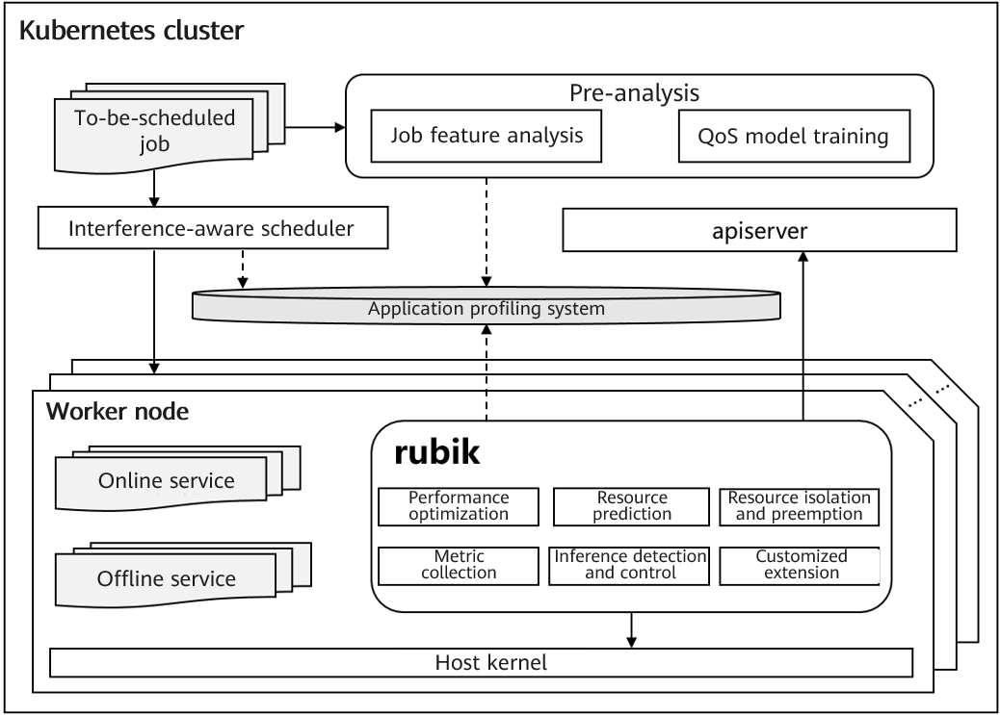
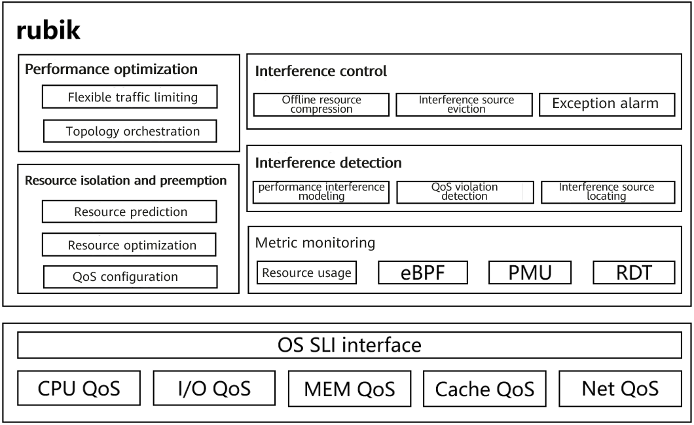

## Overview

 As cloud services and hardware resources become increasingly diversified, higher management requirements are imposed on cloud native systems, such as resource utilization optimization (see "openEuler Resource Utilization Optimization (1): Overview"<sup>[1]</sup>), service quality assurance, black-box optimization, and heterogeneous computing efficiency improvement. The Rubik hybrid deployment solution is developed to help run a hybrid deployment system of diversified services and computing powers in the optimal state. This solution includes multi-layer optimization technologies such as cluster-aware scheduling, single-node hybrid deployment engine (Rubik), and kernel isolation. This article briefly introduces the Rubik hybrid deployment engine.  

 The engine name Rubik comes from Rubik's cube, which was invented by Rubik in 1974. In this solution, Rubik is a symbol of the ability to manage tasks and computing resources in an orderly manner.  

 The vision of Rubik is to provide a set of adaptive single-node computing power optimization and service quality assurance services. It aims to provide the following capabilities:  

- Compatible with the native Kubernetes system: Capabilities are extended based on extended APIs of native Kubernetes.  
- Compatible with the openEuler system: Enhanced features (such as hierarchical kernel resource isolation) provided by openEuler are automatically enabled. For other Linux distributions, only limited management capabilities are provided because some kernel features are missing.  
- Application profiling: Services are profiled through automatic interference injection to realize interference identification and control during scheduling and runtime.  
- Node and service feature collection: Node and service feature information is used to facilitate cluster resource planning and scheduling policy optimization, implementing cluster load balancing and off-peak and complementary use of node resources.  
- Interference identification and control during system running: Real-time interference identification and quick interference locating and control capabilities are provided for mission-critical services.  
- Adaptive dynamic optimization: The performance of mission-critical services is optimized to ensure efficient and stable running, and the ratio of online and offline resources is dynamically adjusted to reduce QoS violations of mission-critical services.  
- Customized extension: Advanced users can develop customized extensions for specific service scenarios.  



 Figure 1 Rubik in the cluster system

## Feature Description

 The design objective of online and offline service hybrid deployment is to maximize resource utilization while ensuring the quality of online services. As a node management component, Rubik plays an important role in the entire hybrid deployment solution. It focuses on resource utilization improvement and QoS assurance.  

 In terms of resource utilization improvement, Rubik provides the following mechanisms to facilitate cluster resource scheduling, balance cluster node resources in various dimensions, implement off-peak and complementary use of node resources, and disperse interference.  

- Job scheduling and rescheduling mechanism based on application profiling

 In this mechanism, to-be-scheduled jobs are marked after services are profiled through automatic interference injection, and the resource sensitivity and pressure of workloads are analyzed. In the scheduling phase, the usage of node resources (such as CPU, memory bandwidth, cache bandwidth, disk bandwidth, and network bandwidth) is predicted to facilitate unified management and scheduling of cluster node resources. Services with different resource densities are staggered to balance the resource usage in each dimension and promote secondary job scheduling.  

- Node resource oversubscription mechanism based on online service resource prediction

 By sampling resources of online services in each dimension, the system predicts and reports the usage of compressible and incompressible resources. In addition to accurately reserving resources for online services to ensure QoS, the system allocates unused resources as much as possible to offline services to improve node resource utilization.  

 During the running of jobs in hybrid deployment scenarios, online and offline jobs compete for shared resources such as CPU, cache bandwidth, memory bandwidth, network bandwidth, and disk bandwidth, and processes frequently switch between different CPUs. As a result, load traffic bursts, and service performance is affected. To ensure the quality of online services and prevent QoS violations of mission-critical services, Rubik plans multiple mechanisms to improve the running efficiency and stability of workloads.  

- First line of defense - resource isolation and preemption mechanism based on kernel features

 To adapt to hybrid deployment scenarios of cloud native resources, the openEuler kernel plans hierarchical preemption of resources such as CPU, cache, block I/O, disk I/O, and Network I/O. As a user-mode component, Rubik configures QoS priorities for online and offline services so that when the online service traffic increases, the kernel layer can quickly preempt required resources to ensure the quality of online services. When the traffic of online services decreases, the restriction on offline service resource usage is loosened to improve the throughput of offline services.  

- Second line of defense - prevention mechanism for online and offline resource ratio optimization based on resource prediction

 By monitoring and collecting resources related to online services, the system predicts the usage of each resource by online services and plans resources in advance based on the usage of node resources to reduce QoS violation risks of online services. When it is predicted that resources required by online services increase, the system determines whether to adjust the ratio of offline service resources based on the remaining node resources.  

- Third line of defense - adaptive performance optimization mechanism based on resource orchestration and flexible traffic limiting

 Topology balancing and CPU affinity-based orchestration are provided to reduce performance jitter caused by frequent process switchover between different CPUs, process migration, and remote NUMA access and cope with burst traffic of mission-critical services. On the premise that the load watermark of the entire system is secure and stable, temporary limit breaking is allowed and adaptive resource adjustment is implemented to quickly resolve or alleviate resource bottlenecks, ensuring the quality of mission-critical services.  

- Fourth line of defense - feedback mechanism for performance interference detection and control based on metric monitoring

 In terms of existing computer hardware architectures, in addition to resources such as CPU, memory, drive and network, there are key resources such as memory bus, system I/O bus, DMA bus and MMU TLB. These resources have no corresponding resource isolation mechanisms for software and hardware collaboration, and application-level isolation cannot be implemented. Isolation and preemption of resources such as CPUs cannot completely solve the QoS violation problem caused by resource contention. Therefore, the node management component needs to analyze the performance interference of mission-critical services. However, in the production environment, the QoS status of services cannot be directly obtained. To solve this problem, in the pre-analysis phase, the bottom-layer performance metrics and upper-layer application QoS are modeled. During runtime, QoS violations are detected and evaluated in real time based on the model. When a QoS violation occurs, the interference source is located based on abnormal metrics, and the interference source is suppressed or even evicted to ensure the quality of online services.  



 Figure 2 Features of Rubik

## Deployment

 Prepare a Kubernetes cluster running openEuler 22.03, and then prepare the Rubik YAML deployment file on the control plane node. You can download the file from the Rubik source code repository. Example:

```bash
wget -O rubik-daemonset.yaml https://gitee.com/openeuler/rubik/raw/master/hack/rubik-daemonset.yaml
```

 After the download is successful, correctly configure the image path in the YAML file so that the Rubik image can be downloaded.  

> Note:
>
> 1. The address of the Rubik container image must be correctly configured in the YAML file. If the example repository address is used, change `image: rubik_image_name_and_tag` in the YAML file to `image: hub.oepkgs.net/cloudnative/rubik:latest`.  
> 2. The YAML file contains four parts: ClusterRole, ClusterRoleBinding, ConfigMap and DaemonSet. The Rubik startup parameters can be configured in ConfigMap. For details, see [Rubik Configuration Description](https://gitee.com/openeuler/rubik/blob/master/docs/config.md).  

 Then, deploy Rubik daemonset.

```bash
kubectl apply -f rubik-daemonset.yaml
```

 After the deployment is complete, you can use kubectl to query the pod named **rubik-agent**.

```bash
# kubectl get pods -A
NAMESPACE     NAME                                            READY   STATUS    RESTARTS   AGE
kube-system   rubik-agent-jhjdg                               1/1     Running   0          4d
```

## Example

 The following shows how to start an Nginx pod and set it as an online service. Rubik enables the kernel resource QoS assurance mechanism for the service.  

 First, enable the memory QoS feature on the worker node.  

```bash
echo 1 > /proc/sys/vm/memcg_qos_enable
```

 Add the annotation of **volcano.sh/preemptable** to the YAML file to identify the service attribute.

```bash
# cat nginx-online.yaml
apiVersion: v1
kind: Pod
metadata:
  name: nginx-online
  annotations:
    volcano.sh/preemptable: "false"   # If volcano.sh/preemptable is set to true, the service is an offline service. If it is set to false, the service is an online service. The default value is false.
spec:
  containers:
  - name: nginx
    image: nginx
    resources:
      limits:
        memory: "200Mi"
        cpu: "1"
      requests:
        memory: "200Mi"
        cpu: "1"
```

 Deploy the Nginx service.

```bash
# kubectl apply -f nginx-online.yaml
# kubectl get pods
NAME            READY   STATUS    RESTARTS   AGE
nginx-online    1/1     Running   0          4d
```

 Go to the **cgroup** corresponding to the **nginx-online** pod and check whether `cpu.qos_level` takes effect (**0** as online service and **-1** as offline service). For details about the running effect, see case 1 in "openEuler Resource Utilization Optimization (2): Effect in Typical Applications<sup>[2]</sup>".  

```bash
# cat /sys/fs/cgroup/cpu/kubepods/pod59f1cdfa-a0ad-4208-9e95-efbef3519c00/cpu.qos_level
0
```

## Outlook

 As an important means to improve data center resource utilization, hybrid deployment of online and offline services has attracted attention from academia and industry and has become a hot research field. Meanwhile, it also faces many technical challenges that need to be resolved urgently, such as hybrid deployment of black-box services and heterogeneous resources, and breakthroughs need to be made in fields such as job-aware scheduling, performance interference modeling, and resource isolation and preemption. To achieve the goal of generic hybrid deployment and integrated deployment, the node management layer needs to perform performance interference modeling for mission-critical services and provide accurate QoS quantitative models to help real-time interference detection and location, based on which we can implement more accurate dynamic resource ratio control and obtain more accurate and pervasive dynamic monitoring metrics for application profiling and service-aware scheduling. These aspects play an important role and are the focus of subsequent research of Rubik.  

 This article briefly describes the vision, objectives, design principles, and features of Rubik. The performance optimization, resource isolation and preemption, and interference detection and control technologies will be described in following articles.  

## Join Us

The resource utilization optimization technologies described in this article are jointly developed by the Cloud Native SIG and Kernel SIG. The source code will be gradually open-sourced in the openEuler community. If you are interested in related technologies, you are welcome to join us by scanning the following QR code to join the WeChat groups of SIGs you are interested in.  


## Related Articles

[1] [openEuler Resource Utilization Optimization (1): Overview](https://www.openeuler.org/zh/blog/20220705-01ziyuanliyonglv/openeuler-01ziyuanliyonglv.html)  

[2] [openEuler Resource Utilization Optimization (2): Effect in Typical Applications](https://www.openeuler.org/en/blog/20220806-02ziyuanliyong/openEulerziyuanliyong.html)  
