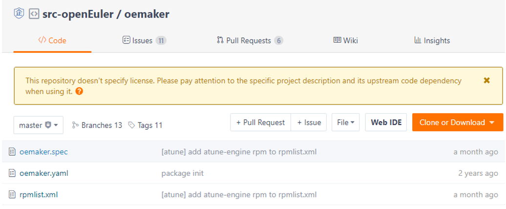

#### 1. Introduction

The `.yaml` file contains the upstream community information of the software packages in the `openEuler` repository, facilitating unified verification and management.  

#### 2. Requirements of File Naming and Storage Path

The `.yaml` file name must be the same as the repository name and be in the same directory as that of the `.spec` file. Generally, the `yaml` file is stored in the root directory. For example, the name of the `.yaml` file in the `oemaker` code repository is `oemaker.yaml` and the file is stored in the root directory.  

  

#### 3. Fields in the YAML File  

In the `.yaml` file, the `version_control`, `src_repo`, `tag_prefix`, and `separator` fields need to be manually set.  

| Field           | Description                                              | Remarks                                                      |
| --------------- | -------------------------------------------------------- | ------------------------------------------------------------ |
| version_control | Version control protocol used by the upstream repository | Currently, svn, git, hg, github, gnome, metacpan, pypi, and gitee are supported. |
| src_repo        | Actual address of the upstream repository                | You can use **version_control** and **src_repo** to download the corresponding code. |
| tag_prefix      | Version prefix in the tag of the upstream repository     | For example, If the tag provided by the upstream is **v1_0_1**, **tag_prefix** must be set to **^v**. |
| separator       | Version separator in the tag                             | For example, if the tag provided by the upstream is **v1_0_1**, **separator** must be set to **_**. |

#### 4. Examples of YAML Files

<table>
<tr>
<th>Version Control Protocol</th>
<th>Example (Link)</th>
</tr>
<tr>
<td>svn</td>
<td><a href="https://gitee.com/src-openeuler/amanda/blob/master/amanda.yaml">amanda.yaml</a></td>
</tr>
<tr>
<td>git</td>
<td><a href="https://gitee.com/src-openeuler/mdadm/blob/master/mdadm.yaml">mdadm.yaml</a></td>
</tr>
<tr>
<td>hg</td>
<td><a href="https://gitee.com/openeuler/openEuler-Advisor/blob/master/upstream-info/nginx.yaml">nginx.yaml</a></td>
</tr>
<tr>
<td>github</td>
<td><a href="https://gitee.com/src-openeuler/asciidoc/blob/master/asciidoc.yaml">asciidoc.yaml</a></td>
</tr>
<tr>
<td>gnome</td>
<td><a href="https://gitee.com/src-openeuler/gnome-terminal/blob/master/gnome-terminal.yaml">gnome-terminal.yaml</a></td>
</tr>
<tr>
<td>metacpan</td>
<td><a href="https://gitee.com/src-openeuler/perl-Authen-SASL/blob/master/perl-Authen-SASL.yaml">perl-Authen-SASL.yaml</a></td>
</tr>
<tr>
<td>pypi</td>
<td><a href="https://gitee.com/src-openeuler/python-apipkg/blob/master/python-apipkg.yaml">python-apipkg.yaml</a></td>
</tr>
<tr>
<td>gitee</td>
<td><a href="https://gitee.com/src-openeuler/oemaker/blob/master/oemaker.yaml">oemaker.yaml</a></td>
</tr>
</table>
