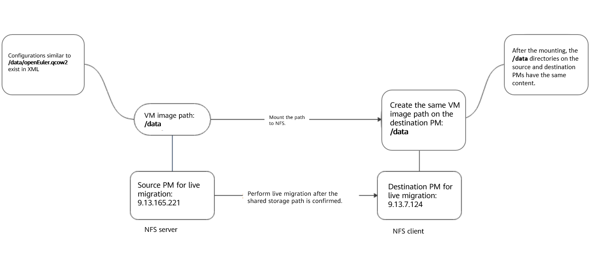
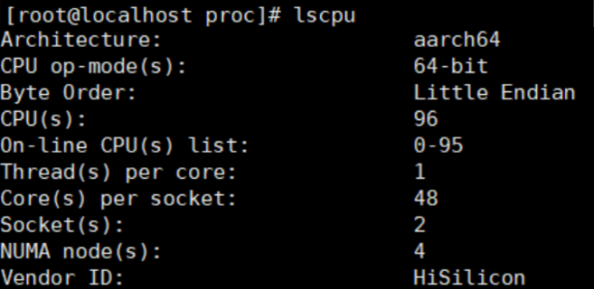

# VM Live Migration

 In previous blogs, I've introduced basic operations on a virtual machine (VM) and concepts of openEuler virtualization. In this blog, I'll introduce an advanced technology - VM live migration.  

## Why Live Migration Required

 Before learning how to use this technology, we need to know how it emerges. VMs run on physical machines (PMs), but problems such as overload may occur to and operations such as hardware replacement, software upgrade, networking adjustment, and troubleshooting may be performed on PMs. In this case, to perform these operations while ensuring that VMs can run properly, the VM live migration technology is required.  

## What Is Live Migration

 VM live migration, or dynamic VM migration, is a process of moving a VM to another hardware platform without damaging its running status. After the VM is migrated to aother hardware platforms, it can run smoothly without affecting user experience. Similarly, a VM can also be statically migrated, which refers to VM cold migration. To use this technology, the VM needs to be powered off. In this blog, VM cold migration will not be introduced.  

In essence, VM migration is data migration. There are two types of data:  

1.  Static data, which refers to image files.  

2.  Dynamic data, which refers to data that dynamically changes in the memory when the VM is running.  

## When to Use Live Migration

Scenario 1 (hardware update): When the hardware of a PM needs to be upgraded or a device needs to be added, the VM cannot be stopped, because important services are running on the VM.  

Scenario 2 (software update): The software system of a PM needs to be patched or updated.    

Scenario 3 (overload; faulty server): When some PMs are overloaded or faulty, VMs need to be migrated to other servers.    

 Scenario 4 (resource integration): In a cross-domain environment, most physical machines are underloaded. In this case, migrating and integrating VMs can reduce the number of physical machines and improve resource utilization.    

For more scenarios, see the community documents.  

## Where to Perform Live Migration

 As mentioned above, live migration is performed on different hardware platforms. But note that there are two storage modes for VM migration.  

 Shared storage: The VM data is stored on shared drives. In this way, only memory data needs to be migrated.  

 Non-shared storage: The VM data is stored on local drives. In this case, image files and memory data need to be migrated at the same time.  

## How to Use Live Migration

## Map



## Environment Setup  

 In this part, two PMs are used as the source and destination PMs to introduce how to perform VM live migration.  

Basic information about the two PMs:  

Source IP address: 9.13.165.221

Version information:  

  

Destination IP address: 9.13.7.124  

Version information:  

  

Check the following items before live migration:  

### 1. Checking the Permission

> Check whether the current user has the permission to perform live migration.  

### 2. Checking the Network

> Check whether the network between the source and destination PMs is normal and ensure that both PMs are in the same network segment. Otherwise, the network will be abnormal after the VM migration.  
>
>   

### 3. Checking Storage Resources  

> Check whether the two PMs can access the same storage resources.  

Perform health checks on both PMs and ensure that the destination PM has sufficient CPU, memory, and storage resources.  

### 4. Checking CPU Resources

> CPU check: Both PMs have 96 CPUs.  
>
>   
>
>   
>
> Memory check:  
>
>   
>
>   
>
> Storage check:  
>
>   
>
>   

### 5. Checking the VM Status  

> Check whether the VM to be migrated is in the running state.  
>
> **vm11** is used as an example.  
>
>   

### 6. (Optional) Setting Live Migration Parameters  

> 1) Setting the maximum tolerable downtime during VM live migration  
>
> Run the following command to set the maximum downtime of **vm11** to 500 ms.  
>
> ```shell
> virsh migrate-setmaxdowntime vm11 500
> ```
>
> Then run **virsh migrate-getmaxdowntime vm11** to check the maximum downtime of **vm11**.  
>
>   
>
> 2) Setting the maximum bandwidth during VM live migration  
>
> Run the following command to set the maximum bandwidth of **vm11** to 1000 Mbit/s.  
>
> ```shell
> virsh migrate-setspeed vm11 --bandwidth 1000
> ```
>
> Then run **virsh migrate-getspeed vm11** to check the maximum bandwidth of **vm11** during live migration.  
>
>   

​     3) Setting the storage mode  

>   
>
> Run **sdb** to query the storage mode (non-storage mode in this example). However, you can configure the NFS to make the two PMs share the directory.  

## NFS Configuration  

This part briefly introduces how to configure the NFS.  

1. **Installing the NFS Over Yum on the Source PM**

> ```shell
> yum -y install nfs-utils rpcbind
> ```
>
> The NFS configuration file **/etc/exports** is left blank by default.  
>
> ```shell
> vi /etc/exports
> ```
>
> **9.13.7.124** indicates the IP address segment of the destination PM. The following configurations are written in **exports**.  
>
> /data 9.13.7.124(rw,no_root_squash,no_all_squash,sync,anonuid=501,anongid=501)
>
> **/home/migrate-test** (**/data**) is the directory to be shared.  
>
> 
>
> The configuration file is described as follows:  
>
> **/data**: shared directory  
>
> **9.13.7.124**: a network segment, an IP address, or a domain name. The domain name supports wildcards, for example, \*.abc.com.  
>
> **rw**: read-write  
>
> **ro**: read-only  
>
> **sync**: Files are written to the drive and memory at the same time.  
>
> **async**: Files are temporarily stored in the memory instead of being directly written to the memory.  
>
> **no_root_squash**: If the **root** user is used when the NFS client connects to the server, the NFS client also has the **root** permission on the directory shared by the server. Note that enabling this option causes security risks.  
>
> **root_squash**: If the **root** user is used when the NFS client connects to the server, the NFS client has the anonymous user permission on the directory shared by the server. Generally, the NFS client uses the **nobody** or **nfsnobody** user.  
>
> **all_squash**: No matter what user is used by the NFS client to connect to the server, the NFS client has the anonymous user permission on the directory shared by the server.  
>
> **anonuid**: UID of an anonymous user, which is customizable.  
>
> **anongid**: GID of an anonymous user.  
>
> 2. **Making the Configuration Take Effect**  
>
> ```shell
> exportfs –r
> ```
>
> To cancel the configuration:
>
> Run **exportfs -u 9.13.7.124:/data** to cancel the setting that allows the specific IP address and network segment to share a local directory.  
>
> 3. **Starting the NFS**
>
> ```shell
> systemctl start rpcbind
> systemctl start nfs
> ```
>
> 1) Query the NFS status.  
>
> ```shell
> systemctl status nfs
> ```
>
>   
>
> 2) Query the rpcbind status.  
>
> ```shell
> systemctl status rpcbind
> ```
>
>   
>
> Note:  
>
> Check the iptables settings and the permission on the NFS path.  
>
> ```shell
> # Clear iptables rules.
> iptables -F
> iptables -X
> chmod -R 755 /data
> ```
>
> 4. **Mounting a Directory to the Destination PM**  
>
> ```shell
> showmount -e 9.13.165.221
> ```
>
>   
>
> mkdir /data # **/data** indicates the directory to be mounted to the destination PM.  
>
> ```shell
> mount -t nfs 9.13.165.221:/data /data
> ```
>
> Example:
>
> ```shell
> mount -t nfs 9.13.165.221: /home/migrate-test /home/migrate-test
> ```
>
> Run **df –h** to check whether the operation is successful.  
>
> In addition to the NFS, there are other methods for configuring shared storage mode, which are not described here.  

## Performing Live Migration  

> Run **virsh migrate --live --unsafe vm11 qemu+ssh://9.13.7.124/system tcp://9.13.7.124** to perform live migration.  

If non-shared storage mode is used,  

> we need to find the image directory in XML configuration.  
>
>   
>
> Before performing live migration, create a virtual drive file in the same drive directory on the destination PM. Ensure that the drive format and size are the same.  
>
> ```shell
> qemu-img create -f qcow2 /home/data1 /openEuler011.qcow2 40G
> ```
>
> Run the following command to perform live migration:  
>
> ```shell
> virsh migrate --live --unsafe --copy-storage-all --migrate-disks sda \\vm11 qemu+ssh://9.13.7.124 /system tcp://9.13.7.124
> ```
