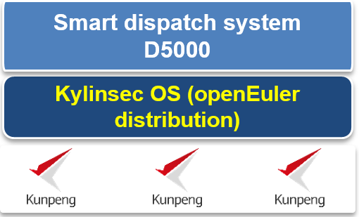

## **Scenarios**

The power dispatch system is a Classified Protection of Cybersecurity Level 4 system, which cannot bear any loss. (Under Classified Protection, network systems are graded from Level 1 to Level 5. A higher level means that the system has more requirements to comply with.) In 2009, State Grid Corporation of China (SGCC) started the In-depth Defense Demonstration Project for Classified Protection of Power Grid Information Security and proposed the smart grid development plan. The goal was to build a unified, "strong, smart grid."

Since 2009, SGCC started to migrate the D5000 dispatch system to the Kylinsec OS and gradually completed the OS porting on the x86 platform. Since 2019, SGCC started to migrate the core dispatch system to the Huawei Kunpeng platform and deploy the Kylinsec OS (openEuler distribution) for better platform security.

## **Solution**

- OS: Kylinsec OS (openEuler distribution)

- Hardware platform: TaiShan 200 with Kunpeng 920 processors

- Service system: smart dispatch system D5000

- Core metrics: identity authentication, separation of roles, security probe, tailoring, cluster HA, and storage multipathing

## **Benefits**

- Successful migration of the D5000 system to the Kylinsec OS (openEuler distribution)

- Efficient operation of the dispatch system powered by Kunpeng servers and the Kylinsec OS (openEuler distribution)

- Sufficient technical preparation for the porting of the D5000 system's base software and hardware

## **Partner** 

