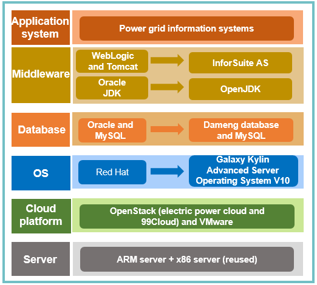

## **Scenarios** 

China Southern Power Grid (CSG) is a large enterprise that manages power transmission, transformation, and distribution across many areas. Its widely distributed information systems make maintenance costly, and put pressure on IT infrastructure security. Minimizing IT costs and maintaining security without compromising IT and O&M quality is a major challenge for the company. CSG plans to gradually implement innovative server systems and deploy an advanced server OS to improve the reliability, security, and stability of the information systems.

## **Solution**

- Most of the original information systems run on x86 servers and some Power and Itanium midrange computers.

- Use Red Hat, Oracle, and WebLogic as well as open source software MySQL and Tomcat. Use Galaxy Kylin Advanced Server Operating System V10, Dameng databases, and InforSuite AS for the upgrade. Replace Oracle JDK with OpenJDK.

- Adapt and optimize the software for different virtualization environments, and harden the system for security based on Galaxy Kylin Advanced Server Operating System V10.

## **Benefits**

- Nearly 2,000 secure and reliable server systems in subsidiaries in five southern provinces in China, EHV power transmission companies, peak-load modulation and frequency modulation power generation companies, the Guangzhou Power Supply Bureau, and the Shenzhen Power Supply Bureau

- The same performance standard before and after porting

## **Partner** 

