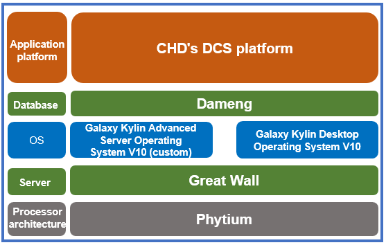

## **Scenarios**

China Huadian Corporation (CHD) focuses on the security of core information infrastructure in the industrial control field, and works towards and promotes key technological breakthroughs in power generation. By gathering scientific research resources, it has successfully built a next-generation Distributed Control System (DCS) and applied it at the CHD Wuhu Power Plant.

## **Solution**

- Use Phytium processors, China Great Wall servers, and Galaxy Kylin Advanced Server Operating System V10 (workstation).

- Use Dameng databases and CHD DCS platform software.

## **Benefits**

- **Strategic cooperation**: The Guodian Nanjing Automation DCS project is a project demonstrating the cooperation between China Electronics Information Industry Group and CHD.

- **Industry benchmark**: This project is the first innovative core control system in the high-parameter and large-capacity power generation field in China.

- **Standard system**: The Galaxy Kylin Advanced Server Operating System V10 (workstation) has been developed to provide a standard system version for industrial control and production in the electric power industry.

## **Partner** 

