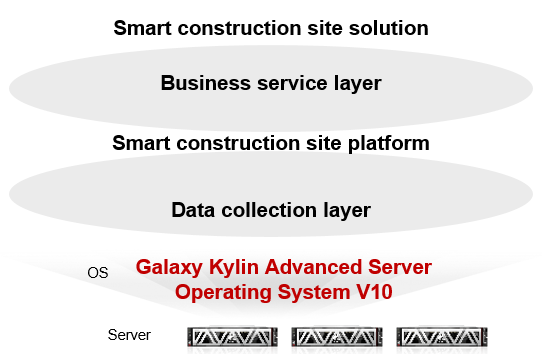

## **Scenarios**

The Bowei smart construction site has been running stably for more than 6 months at the Hebei smart substation. The smart construction site has a service management platform and an IoT sensing platform. The service management platform runs through the entire lifecycle of the project, covering security, quality, progress, team, material, and BIM. The IoT sensing platform provides up to 23 types of hardware access and related applications, such as access control, temperature monitoring, and positioning.

## **Solution**

- Kylin and Bowei successfully migrated the smart construction site solution to Galaxy Kylin Advanced Server Operating System V10 in two months. Recently, the solution was upgraded and rolled out in the Hebei smart substation project.

## **Benefits**

- **Industry benchmark**: It is an innovative e-Government cloud product application project in Hebei.

- **Smart migration**: Big data, video-based temperature measurement, behavior identification, and 5G are all applied in the solution.

- **BIM**: The BIM developed by Bowei has been adapted to the Galaxy Kylin Advanced Server Operating System V10, which has huge market presence in the engineering field.

## **Partner** 

