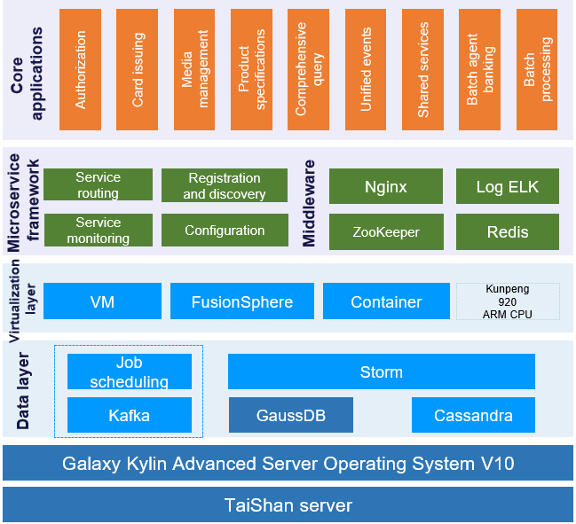

## **Scenarios**

As a state-owned banking institution in China, the credit card core banking system of China Construction Bank (CCB) serves many customers and handles credit on a tremendous scale. Given its large customer base, diversified samples, and complex service forms, CCB requires high service consistency, availability, reliability, elastic scalability, and agile delivery for its banking system. In the meantime, it is important to also consider secure and digital development during infrastructure upgrade.

## **Solution**

- Upgrade the original infrastructure (x86+Red Hat+Oracle) by leveraging the Galaxy Kylin Advanced Server Operating System V10, GaussDB (data foundation), and TaiShan 200 servers (computing power base).

- Use Galaxy Kylin Advanced Server Operating System V10 to implement in-depth adaptation and optimization of the system's bottom layer, build a distributed credit card core banking system, migrate data from the host system to a distributed system, and enable the new system to run on both ARM and x86 platforms, in order to support the microservice-based agile processing framework at the application layer and the massive data processing platform for distributed jobs at the data layer.

## **Benefits**

- Transformed CCB's credit card core banking system based on the Kunpeng server and Galaxy Kylin Advanced Server Operating System V10

- Cost-effectiveness, quick response, high processing efficiency, scalability, and strong error tolerance

- Overall security and reliability in terms of the kernel, services, and applications

## **Partner** 

