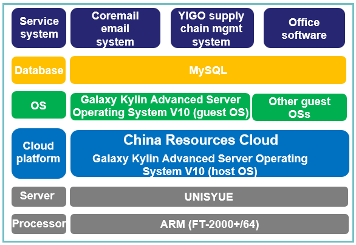

## **Scenarios**

Software and hardware devices were purchased and the full-stack independent innovation platform was deployed to ensure stable operating of the business systems.

## **Solution**

- **Processor**: ARM (FT-2000+/64)

- **Server**: UNISYUE server

- **OS**: Galaxy Kylin Advanced Server Operating System V10

- **Cloud platform**: China Resources Cloud

- **Database**: MySQL

- **Service system**: Coremail email system, YIGO supply chain management system, and office software

## **Benefits**

- **Industry benchmark**: This project was China Resources Group's pilot project for independent innovation. Through this project, China Resources Group completed the porting of the China Resources Cloud, service systems, and terminal applications, and accumulated valuable technical innovation and O&M experience, laying the groundwork for the group to use other products such as the Kylin OS on a larger scale.

## **Partner** 

