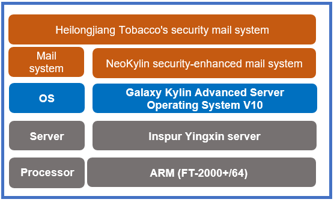

## **Scenarios**

To filter out junk and infected mail and thereby improve the security and stability of the mail system, Heilongjiang Tobacco Industry Co. Ltd. (or Heilongjiang Tobacco) deployed the NeoKylin security-enhanced mail system V6.0 on servers to transmit mail through mail webs and clients, and meet mail transmission and storage requirements.

## **Solution**

- **Processor**: ARM (FT-2000+/64)

- **Server**: Inspur Yingxin server

- **OS**: Galaxy Kylin Advanced Server Operating System V10

- **Service system**: Heilongjiang Tobacco's security mail system

## **Benefits**

- **Industry benchmark**: The successful implementation of the NeoKylin security-enhanced mail system set a precedent for the deployment of security mail systems in Heilongjiang. The number of mail system users surpassed 7,000, and this experience has been helping to build towards large-scale application in the future.

- **Secure and reliable**: The NeoKylin security-enhanced mail system uses a proxy to isolate the intranet zone from other zones, ensuring that mail is highly secure.

## **Partner** 

