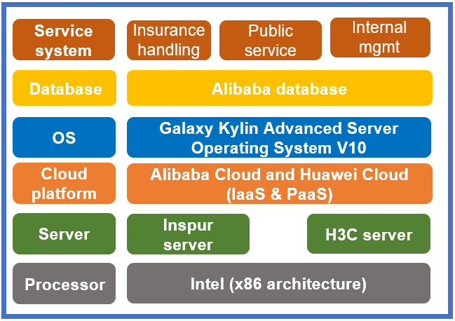

## **Scenarios**

Jiangxi Province Healthcare Security Administration deployed Galaxy Kylin Advanced Server Operating System V10 on Alibaba Cloud and Huawei Cloud to improve independent innovation capabilities.

## **Solution**

- **Processor**: Intel (x86 architecture)

- **Server**: Inspur/H3C server

- **Cloud platform**: Alibaba Cloud and Huawei Cloud (IaaS&PaaS)

- **OS**: Galaxy Kylin Advanced Server Operating System V10

- **Database**: Alibaba database

- **Service system**: insurance handling subsystem, public service subsystem, and internal management subsystem

## **Benefits**

- **System reconstruction**: 1,000 servers were purchased and Galaxy Kylin Advanced Server Operating System V10 was deployed to support the stable operation of medical insurance systems including the insurance handling subsystem and the public service subsystem. As a system-level software and hardware support platform for industry applications, big data, cloud computing, and distributed storage, the cloud platform supports the strategic goals of medical insurance clouds and applications in the healthcare industry, and this is a huge step forward for China's healthcare industry.

## **Partner** 

