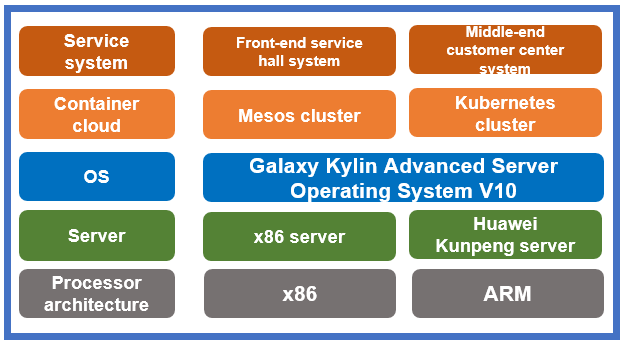

## **Scenarios**

As a leading provincial mobile company in China, China Mobile (Zhejiang) needs to be able to offer many complex services, so it has some seemingly unusual and stringent requirements for the support system. Migrating the service system without affecting user experience is a major concern. In August 2021, China Mobile (Zhejiang) completed a core system adaptation test, smoothly migrated the OS, and pioneered the use of Galaxy Kylin Advanced Server Operating System V10 in core systems in the telecom industry.

## **Solution**

- Server: x86 and Huawei Kunpeng servers
- OS: Galaxy Kylin Advanced Server Operating System V10
- Container cloud: Mesos and Kubernetes clusters
- Service system: front-end service hall system and middle-end customer center system
- IT architecture: microservice-based, container-based, dual-plane running, and unified service release

## **Benefits** 

- Improved operational stability: After a week of tracking an annual campus marketing activity, it has been shown that core systems run stably after the migration.

- Migration of core systems: China Mobile (Zhejiang) was the first in the telecom industry to migrate their core systems to the Kylin OS.

- Large-scale promotion: Valuable experience can be leveraged to promote Galaxy Kylin Advanced Server Operating System V10 at scale.

## **Partner** 

