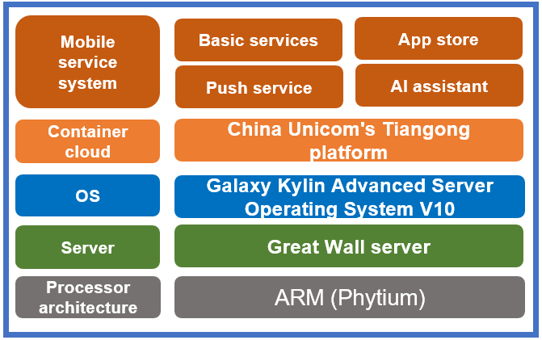

## **Scenarios**

China Unicom's internal mobile service system is used on a daily basis by more than 400,000 China Unicom employees in a wide range of scenarios. The innovative OS upgrade covers four service modules: push service, AI assistant, basic services, and app store.

## **Solution**

- Server: Great Wall server (Phytium)

- OS: Galaxy Kylin Advanced Server Operating System V10

- Container cloud: China Unicom's Tiangong platform

- Service system: Suiwoxing mobile service system

- IT architecture: microservice-based, container-based, and unified service release

## **Benefits**

- Deployment in microservice and container mode reduces dependency on the host status and meets requirements for functionality, usability, and compatibility.

- Innovative deployment ensures the stable running of core service systems.

## **Partner** 

