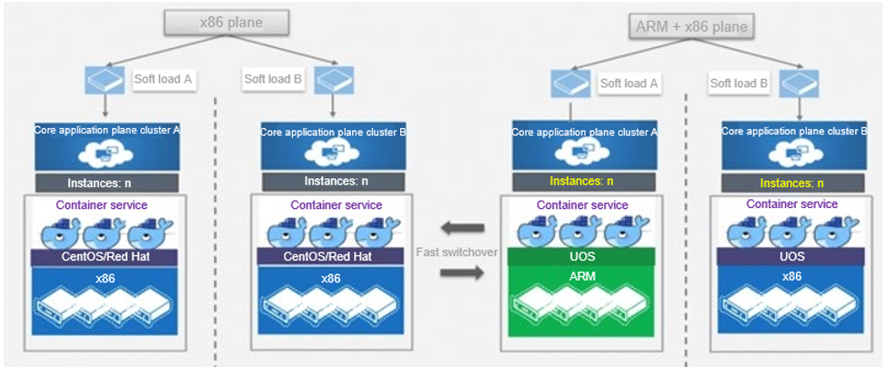
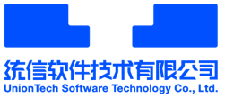

## **Scenarios**

The solution aims to complete joint commissioning and adaptation between service systems (including the service hall and customer center) and OSs, Mesos and Kubernetes container clusters, and servers. Independent and controllable clusters are built based on OSs and servers, and the label constraint and isolation technology are used to route service systems to the clusters.

## **Solution**

## **Benefits**

- In August 2021, China Mobile (Zhejiang) completed joint commissioning and adaptation between service systems and UnionTech OS Server 20, Mesos and Kubernetes container clusters, and servers. They are the first communications company to use fully independent and controllable technologies. Their IT system now has the independent and controllable capabilities to run core service systems on homegrown OSs.

- Processors and OSs were seamlessly replaced without changing the service code.

- The success of the adaptation proves that in future, similar architectures can be migrated on a large scale without reconstruction.

## **Partner** 

