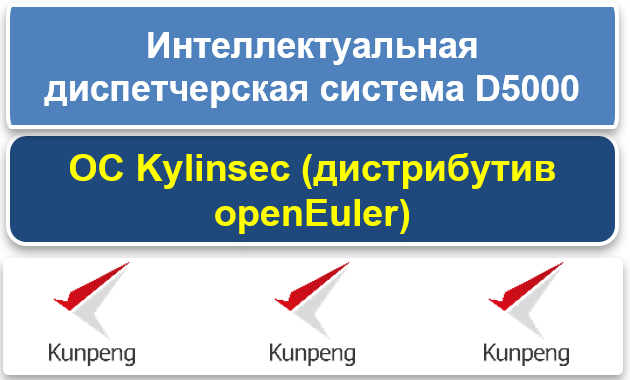

## **Сценарий**

Диспетчерская система электроэнергии представляет собой систему классифицированной защиты кибербезопасности уровня 4, которая не может мириться с никакой потерей. (В рамках классифицированной защиты сетевые системы классифицируются от уровня 1 до уровня 5. Более высокий уровень означает, что к системе предъявляется больше требований. ) В 2009 году State Grid Corporation of China (SGCC) начала работу «углубленный оборонный демонстрационный проект по классифицированной защите информационной безопасности электросетей» и предложила план развития интеллектуальной сети. Целью было создание единой, «сильной, умной сети».

С 2009 года SGCC приступила к миграции диспетчерской системы D5000 на ОС Kylinsec и постепенно завершила перенос ОС на платформе x86. С 2019 года SGCC приступила к переносу основной диспетчерской системы на платформу Huawei Kunpeng и развертыванию ОС Kylinsec (дистрибутив openEuler) для повышения безопасности платформы.

## **Решение**

- ОС: OC Kylinsec (дистрибутив openEuler)

- Аппаратная платформа: TaiShan 200 с процессорами Kunpeng 920

- Система обслуживания: интеллектуальная диспетчерская система D5000

- Основные метрики: аутентификация личности, разделение ролей, зонд безопасности, адаптация, кластер HA и система хранения по нескольким путям

## **Преимущества**

- Успешная миграция системы D5000 на ОС Kylinsec (дистрибутив openEuler)

- Эффективная работа диспетчерской системы на базе серверов Kunpeng и ОС Kylinsec (дистрибутив openEuler)

- Sufficient technical preparation for the porting of the D5000 system's base software and hardware•Достаточная техническая подготовка к переносу базового программного и аппаратного обеспечения системы D5000

## **Партнер**

