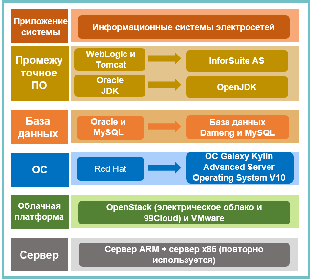

## **Сценарий**

China Southern Power Grid (CSG) — это крупное предприятие, которое управляет передачей, преобразованием и распределением электроэнергии во многих областях. Широко распределенные информационные системы делают обслуживание дорогостоящим и оказывают давление на безопасность ИТ-инфраструктуры. Минимизация затрат на ИТ и обеспечение безопасности без ущерба для качества ИТ и эксплуатации и техобслуживания являются одной из основных задач компании. CSG планирует постепенно внедрять инновационные серверные системы и развертывать передовую серверную ОС для повышения надежности, безопасности и стабильности информационных систем.

## **Решение**

- Большинство исходных информационных систем работают на серверах x86 и на некоторых компьютерах среднего уровня Power и Itanium.

- Использование Red Hat, Oracle и WebLogic, а также программного обеспечения с открытым исходным кодом MySQL и Tomcat. Использование Galaxy Kylin Advanced Server Operating System V10, базы данных Dameng и InforSuite AS для обновления. Замена Oracle JDK на OpenJDK.

- Адаптирование и оптимизирование программного обеспечения для различных сред виртуализации, а также усиление безопасности системы на основе Galaxy Kylin Advanced Server Operating System V10.

## **Преимущества**

- Почти 2,000 безопасные и надежные серверные системы в дочерних компаниях в пяти южных провинциях Китая, компаниях по передаче электроэнергии EHV, компаниях по производству электроэнергии с модуляцией пиковой нагрузки и частотной модуляцией, Бюро электроснабжения Гуанчжоу и Бюро электроснабжения Шэньчжэня

- Одинаковый стандарт производительности до и после переноса

## **Партнер**

