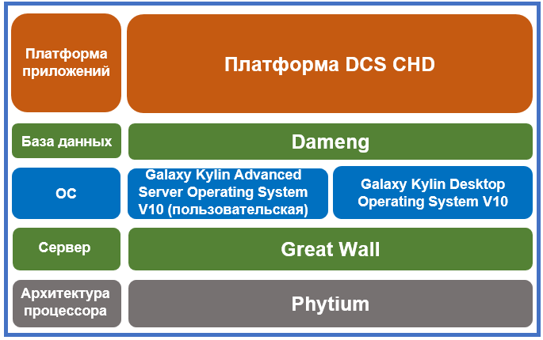

## **Сценарий**

China Huadian Corporation (CHD) фокусируется на безопасности основной информационной инфраструктуры в области промышленного управления, и работает в направлении продвижения ключевых технологических прорывов в производстве электроэнергии. Собирая научно-исследовательские ресурсы, компания успешно построила распределенную систему управления (DCS) следующего поколения и применила ее на электростанции CHD Wuhu.

## **Решение**

- Использование процессора Phytium, китайских серверов Great Wall и Galaxy Kylin Advanced Server Operating System V10 (рабочая станция).

- Использование базы данных Dameng и программного обеспечения платформы CHD DCS.

## **Преимущества**

- **Стратегическое сотрудничество**: проект Guodian Nanjing Automation DCS — это проект, демонстрирующий сотрудничество между China Electronics Information Industry Group и CHD.

- **Эталонный проект в отрасли**: этот проект является первой инновационной основной системой управления в области производства электроэнергии с высокими параметрами и большой мощностью в Китае.

- **Стандартная система**: операционная система Galaxy Kylin Advanced Server Operating System V10 (рабочая станция) была разработана для обеспечения стандартной версии системы для промышленного управления и производства в электроэнергетике.

## **Партнер**

