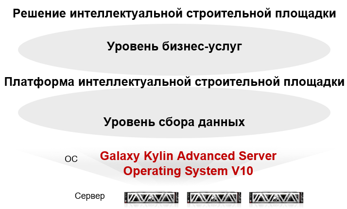

## **Сценарий**

Интеллектуальная строительная площадка Bowei работает стабильно в течение более 6 месяцев на интеллектуальной подстанции в Хэбэе. Интеллектуальная строительная площадка имеет платформу управления услугами и платформу распознавания IoT. Платформа управления услугами работает на протяжении всего жизненного цикла проекта, охватывая безопасность, качество, прогресс, команду, материалы и BIM. Платформа распознавания IoT предоставляет до 23 типов доступа к оборудованию и смежным приложениям, таким как контроль доступа, мониторинг температуры и позиционирование.

## **Решение**

- Компании Kylin и Bowei успешно перенесли решение интеллектуальной строительной площадки на операционную систему Galaxy Kylin Advanced Server Operating System V10 в течение двух месяцев. Недавно решение было модернизировано и развернуто в проекте интеллектуальной подстанции в Хэбэе.

## **Преимущества**

- **Эталонный проект в отрасли**: это инновационный проект по приложению облачных продуктов электронного правительства в Хэбэе.

- **Интеллектуальная миграция**: в решении используются большие данные, измерение температуры на основе видео, идентификация поведения и 5G.

- **BIM**: BIM, разработанная компанией Bowei, была адаптирована к операционной системе Galaxy Kylin Advanced Server Operating System V10, которая имеет огромное присутствие на рынке в области машиностроения.

## **Партнер**

