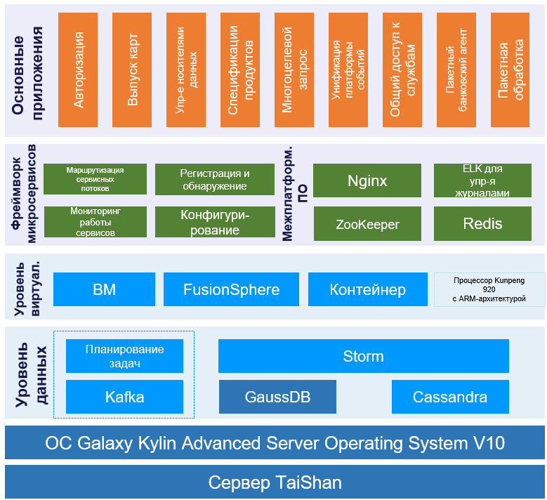

## **Сценарий**

Базовая банковская система кредитных карт, применяемая в государственном китайском банке China Construction Bank (CCB), ежедневно выполняет огромное число кредитных операций, обслуживая многочисленных клиентов. Обширная клиентская база, многообразие применяемых бланков и сложные формы документов диктуют жесткие требования, которым должна отвечать банковская система CCB: высокая согласованность работы служб, доступность, надежность, эластичная масштабируемость и быстрая адаптируемость к предоставлению новых сервисов. Также для этой банковской системы стал актуальным вопрос развертывания службы безопасности и полный переход на цифровые технологии в рамках модернизации инфраструктуры.

## **Решение**

- Исходная инфраструктура (x86+Red Hat+Oracle) модернизирована установкой серверов TaiShan 200 (вычислительные ресурсы), операционной системы Galaxy Kylin Advanced Server Operating System V10 и СУБД GaussDB (ресурсы по работе с данными).
- С помощью ОС Galaxy Kylin Advanced Server Operating System V10 всесторонне усовершенствован и оптимизирован нижний уровень системы, создана распределенная банковская служба обработки кредитных карт и перенесены данные из централизованной в распределенную систему. Новая система может теперь работать на платформах с архитектурами ARM и x86, поддерживает фреймворк гибкой обработки на основе микросервисов на уровне приложений и платформу обработки больших объемов данных для распределенных задач на уровне данных

## **Преимущества**

- Базовая система кредитных карт банка CCB трансформирована на основе сервера Kunpeng и операционной системы Galaxy Kylin Advanced Server Operating System V10.
- Экономичность, быстрый отклик, высокая эффективность обработки, масштабируемость и высокая отказоустойчивость.
- Комплекс мер обеспечения безопасности и надежности ядра, служб и приложений.

## **Партнер**

