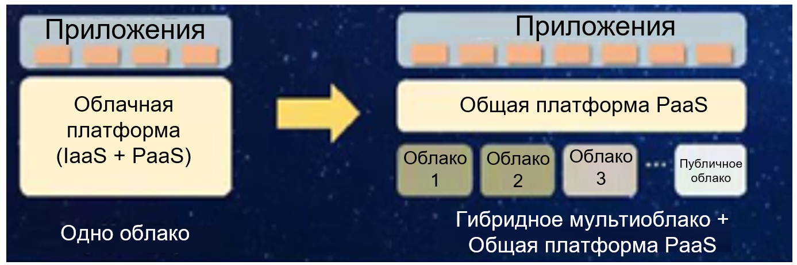

## **Сценарий**

С помощью исходных аппаратных ресурсов сервера и облака H3C было создано 200 наборов ВМ с операционной системой Unity (UOS), обеспечивая благоприятную среду для последующего портирования системы. На основе недавно приобретенного оборудования NF2180M и серверов Kunpeng S920X00K было создано 263 набора ВМ под управлением UOS на инновационной облачной платформе, что предоставляет ресурсы для портирования системы автоматизации офиса.

Используя существующие технологии, Китайская государственная почтовая корпорация (China Post) выбрала популярную и стабильную техническую архитектуру для отделения плоскости управления движком облачных контейнеров (CCE) от плоскости обслуживания. При помощи архитектуры 1+N корпорация China Post централизовала управление центром обработки данных с использованием кластера управления и развернула несколько кластеров служб в разных сетевых зонах для удовлетворения требований к безопасности, степени соответствия и изоляции служб.

## **Решение**

Операционная система UOS поддерживает несколько версий основной облачной архитектуры OpenStack, предоставляя высокодоступные компоненты и решения, которые просты в обслуживании и поддерживают облачную среду (cloud native), а также предоставляет все инструменты портирования, необходимые для полного портирования исходных данных.

Создание профессиональной группы технического обслуживания для обеспечения доступности, совместимости и стабильности программного и аппаратного обеспечения, задействованного в производственной среде.

## **Преимущества**

- В октябре 2021 года корпорация China Post успешно адаптировала и перенесла инновационную облачную платформу и систему автоматизации офиса на операционную систему UOS V20.

## **Партнер**

