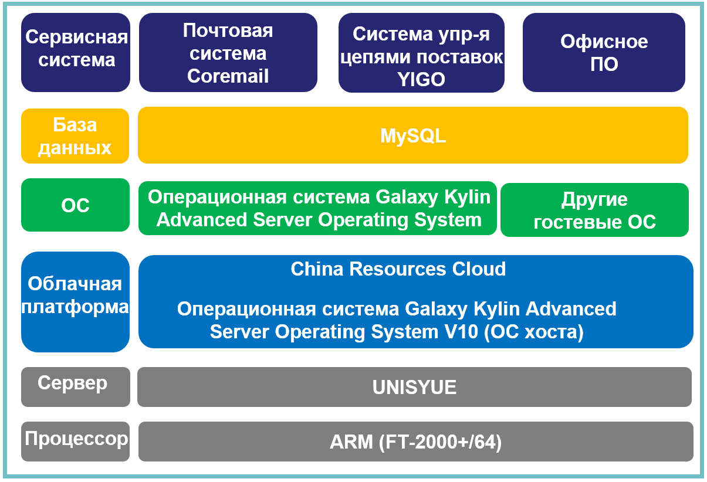

## **Сценарий**

Для обеспечения стабильной работы бизнес-систем были закуплены программно-аппаратные устройства и внедрена независимая инновационная платформа полного стека.

## **Решение**

- **Процессор**: ARM (FT-2000+/64)
- **Сервер**: UNISYUE
- **ОС**: операционная система Galaxy Kylin Advanced Server Operating System V10
- **Облачная платформа**: China Resources Cloud
- **База данных**: MySQL
- **Сервисная система**: почтовая система Coremail, система управления цепями поставок YIGO и офисное ПО

## **Преимущества**

- **Эталонный проект в отрасли**: этот проект был пилотным проектом компании China Resources Group в области независимых инноваций. В рамках этого проекта компания China Resources Group завершила портирование облака China Resources Cloud, сервисных систем и терминальных приложений, а также накопила ценный опыт в области технических инноваций, эксплуатации и обслуживания, заложив основу для более широкого использования других продуктов, таких как ОС Kylin.

## **Партнер**

