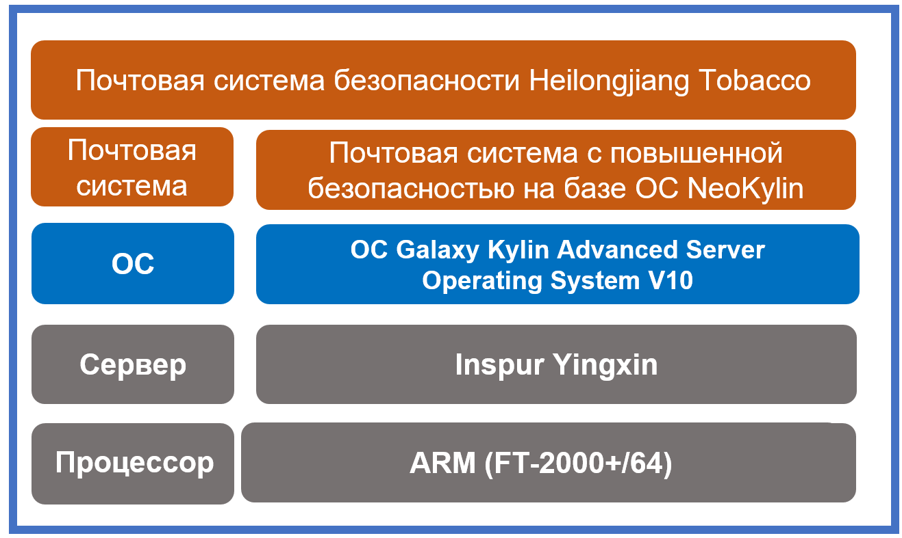

## **Сценарий**

В целях повышения безопасности и стабильности почтовой системы, фильтрации спама и писем с вирусом ООО табачной промышленности провинции Хэйлунцзян (Heilongjiang Tobacco) развернула на серверах почтовую систему с повышенной безопасностью V6.0 на базе ОС NeoKylin, чтобы передать письма через веб-сайты и клиенты электронной почты и удовлетворить потребность пользователей в передаче и хранении писем.

## **Решение**

- **Процессор**: ARM (FT-2000+/64)
- **Сервер**: Inspur Yingxin
- **ОС**: операционная система Galaxy Kylin Advanced Server Operating System V10
- **Сервисная система**: почтовая система безопасности Heilongjiang Tobacco

## **Преимущества**

- **Эталонный проект в отрасли**: успешное внедрение почтовой системы с повышенной безопасностью на базе ОС NeoKylin создало прецедент для развертывания почтовых систем безопасности в провинции Хэйлунцзян. Число пользователей почтовой системы превысило 7 000, и этот опыт помогает создать основу для широкомасштабного применения такой почтовой системы с повышенной безопасностью в будущем.
- **Безопасность и надежность**: почтовая система с повышенной безопасностью на базе ОС NeoKylin использует прокси-сервер для изоляции зоны интрасети от других зон, обеспечивая высокую степень безопасности почты.

## **Партнер**

