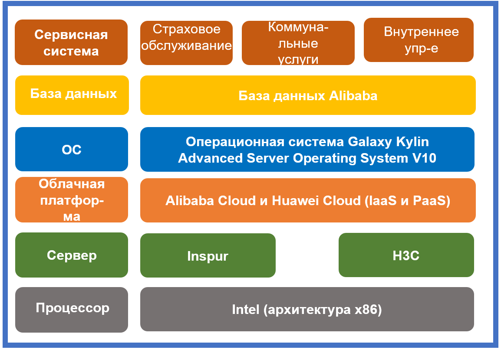

## **Сценарий**

Администрация безопасности здравоохранения провинции Цзянси развернула операционную систему Galaxy Kylin Advanced Server Operating System V10 на облаках Alibaba Cloud и Huawei Cloud для улучшения независимых инновационных возможностей.

## **Решение**

- **Процессор**: Intel (архитектура x86)
- **Сервер**: Inspur/H3C
- **Облачная платформа**: Alibaba Cloud и Huawei Cloud (IaaS и PaaS)
- **ОС**: операционная система Galaxy Kylin Advanced Server Operating System V10
- **База данных**: база данных Alibaba
- **Сервисная система**: подсистема страхового обслуживания, подсистема коммунальных услуг и подсистема внутреннего управления

## **Преимущества**

- **Реконструкция системы**: 1 000 серверов было приобретено и операционная система Galaxy Kylin Advanced Server Operating System V10 была развернута для поддержки стабильной работы систем медицинского страхования, включая подсистему страхового обслуживания и подсистему коммунальных услуг. Как платформа поддержки программного и аппаратного обеспечения системного уровня для отраслевых приложений, больших данных, облачных вычислений и распределенных хранилищ, облачная платформа поддерживает стратегические цели облака медицинского страхования и приложений в отрасли здравоохранения, и это огромный шаг вперед для отрасли здравоохранения Китая.

## **Партнер**

