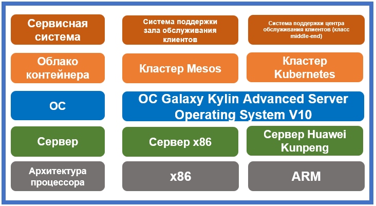

## **Сценарий**

Ведущий китайский оператор мобильной связи China Mobile (отделение в провинции Чжэцзян) предлагает большое многообразие услуг, тарифов и пакетов. В связи с этим у компании особые жесткие требования к системе поддержки. Серьезную озабоченность вызывала предстоящая миграция сервисной системы — этот процесс должен быть абсолютно незаметен для пользователей. В августе 2021 года в чжэцзянском отделении оператора China Mobile был завершен тест на адаптацию базовой системы, легко и без проблем выполнена миграция операционной системы и в базовых системах запущена в работу ОС Galaxy Kylin Advanced Server Operating System V10 (первый в телекоммуникационной отрасли запуск).

## **Решение**

- Сервер: x86 и Huawei Kunpeng
- ОС: операционная система Galaxy Kylin Advanced Server Operating System V10
- Облако контейнера: кластеры Mesos и Kubernetes
- Сервисная система: система поддержки зала обслуживания клиентов и система поддержки центра обслуживания клиентов (класс middle-end)
- ИТ-архитектура: микросервисная, контейнерная, работа в дублированной плоскости, унифицированный процесс подготовки и запуска новых сервисов.

## **Преимущества**

- Повышение операционной стабильности: результат отслеживания годовой маркетинговой деятельности в кампусе на протяжении одной недели показал, что базовые системы после миграции работают стабильно.
- Миграция базовых систем: China Mobile (Чжэцзян) стала первой в телекоммуникационной отрасли компанией, которая перевела свои базовые системы на операционную систему Kylin.
- Масштабное использование: масштабное использование операционной системы Galaxy Kylin Advanced Server Operating System V10 дал неоценимый опыт.

## **Партнер**

