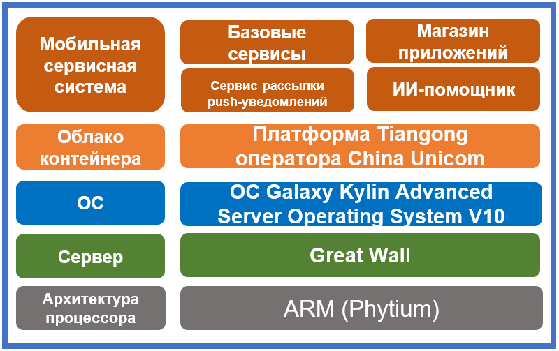

## **Сценарий**

Внутренней мобильной сервисной системой China Unicom ежедневно пользуются более чем 400 000 сотрудников оператора в самых разных сценариях. Инновационная модернизация операционной системы охватила четыре сервисных модуля: сервис рассылки push-уведомлений, ИИ-помощник, базовые сервисы и магазин приложений.

## **Решение**

- Сервер: Great Wall (Phytium)
- ОС: операционная система Galaxy Kylin Advanced Server Operating System V10
- Облако контейнера: платформа Tiangong оператора China Unicom
- Сервисная система: мобильная сервисная система Suiwoxing
- ИТ-архитектура: микросервисная, контейнерная, унифицированный процесс подготовки и запуска новых сервисов

## **Преимущества**

- Развертывание на базе микросервисов и контейнеров уменьшает зависимость от состояния хоста. Архитектура отвечает требованиям к функциональности, удобству использования и совместимости.
- Инновационная архитектура обеспечивает стабильную работу базовых сервисных систем.

## **Партнер**

