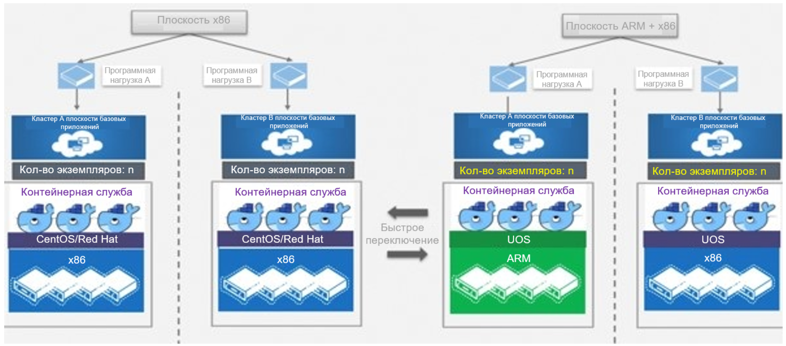

## **Сценарий**

Цель нового решения — совместный ввод в эксплуатацию и адаптации между сервисным системам (включая зал обслуживания и клиентский центр), а также ОС, контейнерными кластерами Mesos и Kubernetes и серверами. На базе ОС и серверов построены независимые и управляемые кластеры, а для маршрутизации сервисных систем к кластерам используется технология изоляции и ограничения на основе меток.

## **Решение**

## **Преимущества**

- В августе 2021 года компания China Mobile (Чжэцзян) завершила совместный ввод в эксплуатацию и адаптацию между сервисными системами и ОС UnionTech OS Server 20, контейнерными кластерами Mesos и Kubernetes, а также серверами. Оператор стал первым в отрасли, внедрившим полностью независимые и контролируемые технологии. ИТ-система оператора теперь обладает независимыми и контролируемыми функционалами, которые позволяют запускать базовые сервисные системы на собственной операционной системе.
- Процессоры и ОС легко заменены без изменения служебного кода.
- Успешный проект адаптации доказал, что в будущем подобные архитектуры можно будет массово переносить без серьезных преобразований.

## **Партнер**

