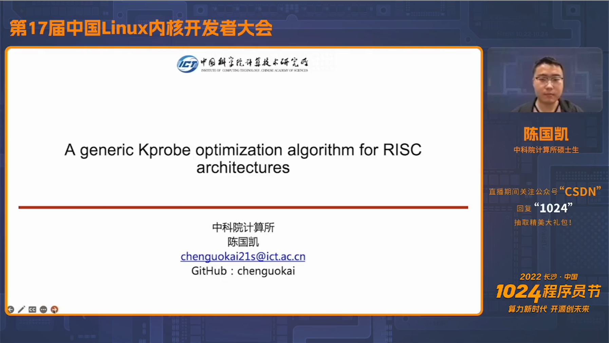
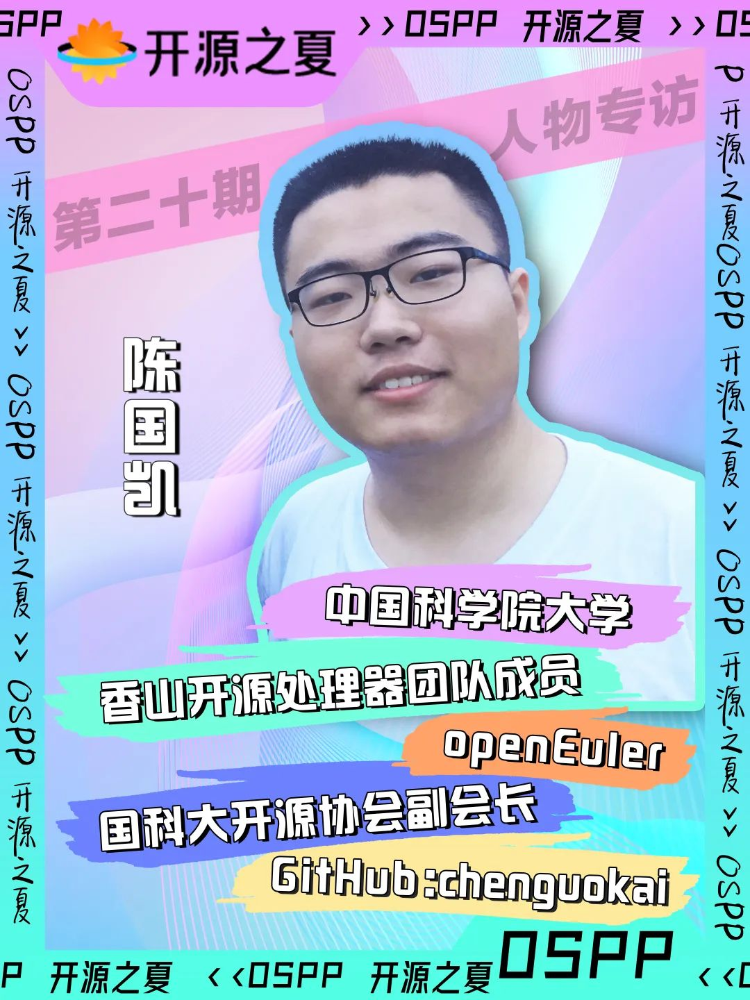
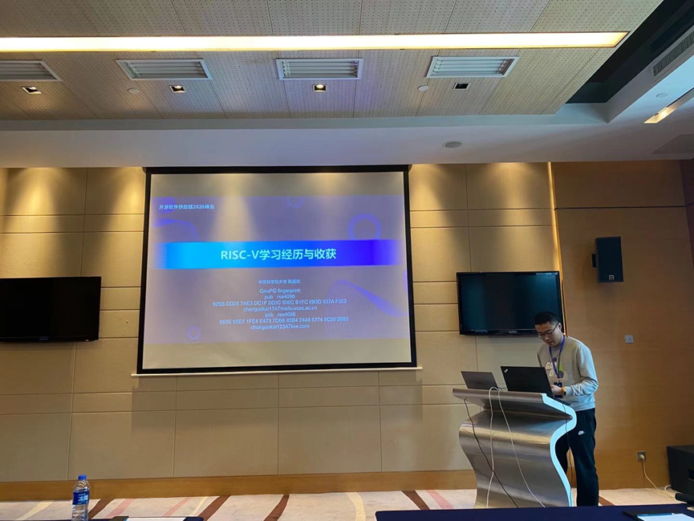
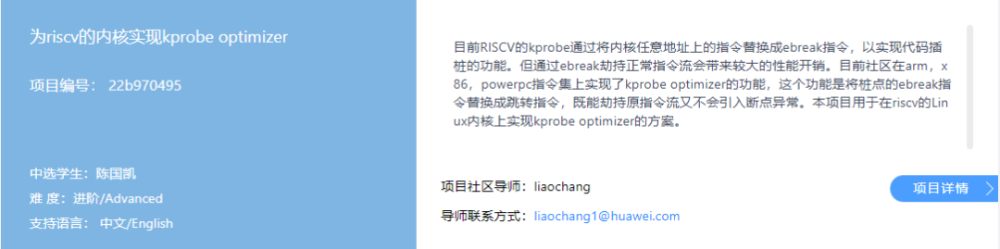
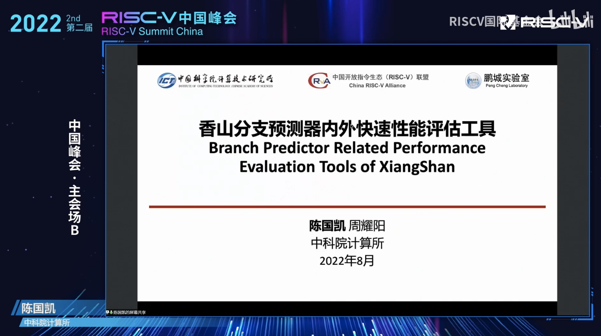

连续3年参加开源之夏，2020年获得最快进步奖的荣誉，2021年担任社区导师，2022年承担并完成openEuler的项目开发“为RISC-V架构优化 Kprobe optimizer”，于今年第17届CLK大会上进行分享；

从学习了解到兴趣驱动，再到成功挑战自己，对开源贡献的坚持让陈国凯多次实现从0到1的突破，不断提升自己。本期，我们很荣幸能够与他近距离对话，分享他的开源故事。

2022年10月23日的 CLK（第 17 届中国 Linux 内核开发者大会）上 [1]，中科院计算所研究生 陈国凯 分享了为《A generic Kprobe optimization algorithm for RISC architectures》的报告[1]，展示了本次开源之夏的项目成果。

### 自我介绍

OSPP：请简单介绍一下自己。

陈国凯：我是陈国凯，本科毕业于中国科学院大学，毕业后留在本校于中科院计算所继续读研，研究方向是计算机体系结构。我目前的主要研究内容是超标量乱序处理器前端（取指与分支预测）设计和自定义指令集扩展。这方面的知识积累也有效帮助我实现了本年度的开源之夏项目。

OSPP：你是怎样接触到开源的？在你眼中开源是什么？

陈国凯：如果说接触是指使用开源软件，我在初中时尝试在自己的电脑上安装 Linux 操作系统，以体验不同于 Windows 的另一种生态，是对开源的第一次尝试。当时在我看来，与 Windows 上存在大量付费使用需激活的软件不同，Linux 上功能相似的软件通常以免费方式分发，是极大的优势。当然，现在看来，当时我对开源的理解是非常片面而不精确的。在本科期间，我参与了学校的开源社团，也随之阅读了开源领域的一些经典文献，对开源有了更深刻的理解。现在的我认为，开源是一种相对于闭源开发而言更为先进的软硬件开发方法，也是促进知识传播的重要手段。在开源项目中，用户和使用者的界限变得模糊，有能力的用户可以将自己对现有版本的改进反馈到公开可用版本中，以学习为目的的用户也可以通过阅读并尝试修改代码学习其背后的工作机制。

OSPP：你有着非常丰富的项目与竞赛经验，有什么宝贵的经验可以和大家分享吗？

陈国凯：兴趣是最好的老师，也是最大的驱动力。我的习惯是在参与任何占用时间超过一个月的项目前，都预先基于目前个人能力偏保守地评估其可行性与收获。从高中期间参加的 NOIP 到大学期间参加的 Summer2020、龙芯杯、一生一芯及香山开源处理器等赛事项目，从保守角度看都颇有挑战性，而它们让我最终说服自己投入的决定性理由便是兴趣。

OSPP：在提高代码质量的学习方法和技巧上有什么心得？

陈国凯：STFW，RTFM 和 RTFSC。刚进入到研究生课题组遇到问题请教师兄师姐时，常会得到这三句话之一的回答，提醒我这类问题完全可以依靠自己查找阅读有关资料解决。很多人遇到问题会选择直接求助他人，但这样的求助成功率并不高，即使偶然获得了回答，通常也是碎片化而不成体系的。依靠自己的搜索或阅读则不然。开源软件的开发过程中，通常都积累了大量的说明文档与代码注释，一些共性问题还往往已被其他人在 issue/stackoverflow 平台提问并获得了详细解答，阅读这类第一手资料能够帮助自己建立针对这一类问题的知识体系，提升自己的学习与编码能力。

OSPP：跟大家分享一下你最喜欢的编程语言或开源项目吧？

陈国凯：C 和 Chisel（Scala），也是我目前最常用的两门编程语言。C 是一门保守的语言，不同于其他语言丰富的标准库，C 只提供了数量极其有限的标准函数。有限且保守的库函数或许使得 C 不适合现代快速的软件迭代，却保证了与历史代码的良好兼容，也阻止着用户滥用语法糖及高级语法对可读性的损害。此外，对内核及硬件开发者而言，从汇编进入 C 的世界所需要的前置工作少到只需设置栈指针，很大程度上方便了硬件早期初始化工作。不同于其他语言描述软件，Chisel 是一门基于 Scala 的新兴硬件描述语言。硬件设计工业界当前较多采用老旧的 Verilog 语言来描述硬件，由于设计久远且用途并不专一，其缺少大量的语法及类型检查特性，对硬件的敏捷开发产生了很大负担，特别是对信号的重复描述多且易错。Chisel 吸取了早期语言教训，强类型且提供官方的中间表示，简化了同类型信号的连接语法，让几千行代码描述超标量处理器缓存结构、批量调整模块命名等操作成为可能。

### 参与开源之夏

OSPP：你连续三年参与开源之夏活动，在 2020 年获得了最快进步奖的荣誉，在 2021 年担任过社区导师，三度参与活动以及学生导师的角色转变给你带来了怎样不同的体验和感受？

陈国凯：第一次参与开源之夏的主要感受是成功挑战了自己的预期，完成了一件之前没有很大把握做成的任务。第二次作为 Mentor 参与开源活动，让我认识了更多开源社区的小伙伴，也极大程度提升了开源项目的完成度。而今年再次以学生申请者身份参加，选择了一个相对第一次参与难度更大的项目，让我的知识储备得到了进一步丰富，也从不同于平时硬件开发的角度实践了学习过的学科理论。

图为陈国凯在 2020 开源软件供应链峰会上作为开源之夏优秀学生代表报告

OSPP：介绍一下你本次参与的项目任务，以及项目成果及应用方向吧？

陈国凯：本次我参与的项目是为 RISC-V 架构优化 Kprobe。Kprobe 是 Linux 内核提供的一种插桩机制，允许使用者在内核代码内注册断点处理函数，当内核自身执行到对应位置，相关处理函数就会得到通知以统计信息或做出修改。Kprobe 的优化则是采用分支（跳转）指令替代断点指令来实现执行到断点位置的执行流劫持。得益于体系结构相关知识积累，我对可能的各种实现方案进行了较为详尽评估并从中选择了分析指令流寻找隐藏空闲寄存器的方法实现优化。截至目前，这一优化目标已经达成，在带有相关机制的 RISC-V 版 Linux 内核上可以使用优化的 Kprobe 加速执行。

https://summer-ospp.ac.cn/#/org/prodetail/22b970495

OSPP：在项目进行中有没有印象深刻的经历？和社区、导师的交流体验给你带来了什么？

陈国凯：在本项目进行过程中，导师给出了非常及时的方案反馈与架构方向指导。此外，老师所展示的功能细分并分步推进的项目开发策略也让我受益良多。

OSPP：之后会继续丰富这次活动的文档和代码吗？对这个项目的内容有更高的期待和计划吗？

陈国凯：会，目前项目只合入 openEuler 社区而尚未进入 Linux 内核主线，我将会继续推进这一实现进入 Linux 内核主线的有关工作，希望这一实现及其背后的算法能在近未来也推进到 Linux 所支持的其他各指令集架构。

### 社区成长经历

OSPP：介绍一下你眼中的 openEuler 社区吧。

陈国凯：openEuler 社区基于各开源软件主线维护稳定版本并构建发行版，还积极参与上游功能的贡献开发，有效凝聚了大小开源开发者的力量。

OSPP：三次参与开源之夏，你对开源和开源社区的认识有什么变化么？

陈国凯：最初参与开源之夏，我可能会更关注纯技术的方面，而随着参与开源活动次数增多，我逐渐发现，开源社区最重要的是人，开源软硬件是一群志同道合的人合作共赢的必然结果而非唯一目的。

OSPP：你认为开源社区能够不断吸引贡献者加入的原因有哪些？

陈国凯：所开发软硬件的实用性、社区的友好氛围、完善的文档注释。

OSPP：你目前的专注的技术领域是什么？后续有继续参与开源或开源社区的规划吗？

陈国凯：我目前专注于香山开源超标量乱序处理器的前端设计工作。香山是一个相对少见的开源硬件社区，我希望我的努力能够让香山及其配套软件生态更加完善。

### 收获与寄语

OSPP：你认为学生在学习阶段应该如何逐渐从开源受益者转变到开源贡献者，请分享一下你参与开源的经验

陈国凯：受益者不一定是贡献者但贡献者一定是受益者，不妨尝试下寻找自己在用闭源软件的替代品，说不定会在使用过程中找到自己可以贡献的提升点。

OSPP：为参与开源之夏的学弟学妹提供一些经验与建议吧

陈国凯：主动联系项目导师，与导师保持经常的沟通，如有设计上的理解偏差及时交流，有条件时举例说明。

[1] http://ckernel.org/

[2] https://www.bilibili.com/video/BV1BU4y1z7Xo/?spm_id_from=333.337.search-card.all.click&vd_source=4acc4922073be11f2372c7c75a305c42

[3] https://live.csdn.net/room/csdnlive3/jZRrQ7RC

