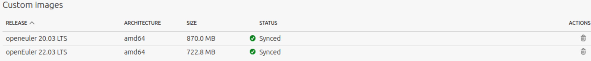
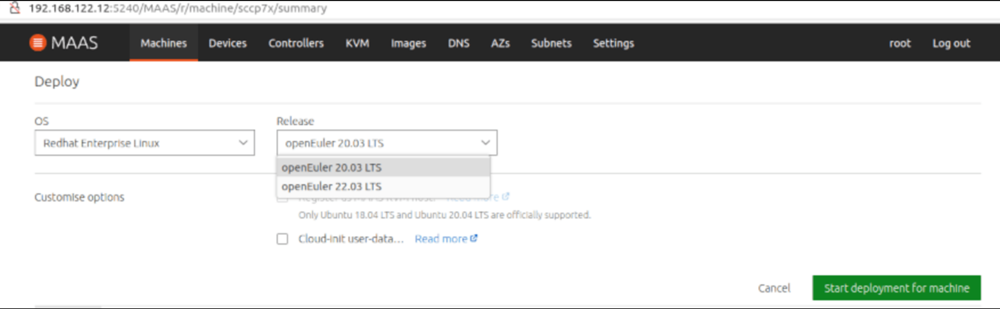
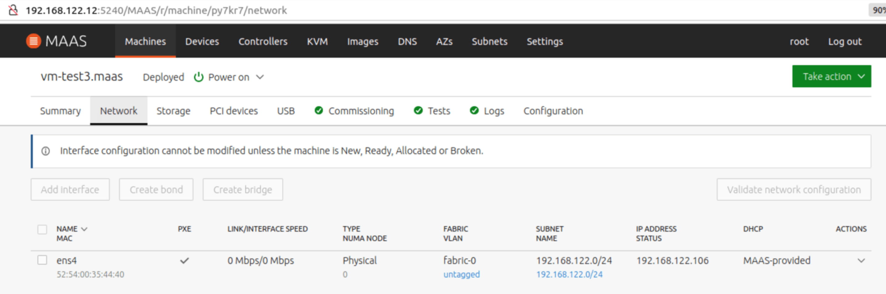
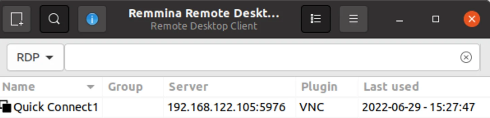
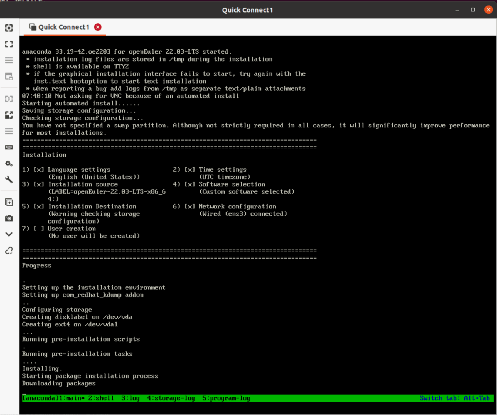

---
title: 使用Canonical MAAS 部署openEuler测试 | linux服务器操作系统 | openEuler社区官网
category: blog
date: 2022-08-23
tags:
  - Canonical MAAS
  - openEuler
archives: 2022-08
author:
  - Mao Zhanglei
summary: 在本文的测试中，展示了如何通过Packer为MAAS构建openEuler映像并验证MAAS部署，可使用的临时解决方法以及如MAAS直接支持 openEuler时，cloud-init和curtin可能的加强或修复方法。
---

Canonical 的 [MAAS](https://maas.io/)（Metal as a Service）是一款用于服务器自动发现、配置的远程操作系统安装、部署工具，可以将物理服务器转换为类似于虛拟机资源，实现物理物理服务器的自助服务，远程访问。 MAAS 目前支持 Ubuntu、CentOS、RHEL、Windows、ESXI 和自定义镜像的部署。当在数据中心管理成百上千的物理服务器，比如云、HPC 场景时，使用 MAAS 是减少运维成本的最佳选择之一。

在本文的测试中，展示了如何通过 Packer 为 MAAS 构建 openEuler 映像并验证 MAAS 部署，可使用的临时解决方法以及如 MAAS 直接支持 openEuler 时，cloud-init 和 curtin 可能的加强或修复方法。

## 测试环境要求

Packer 创建 openEuler MAAS 映像：

- Ubuntu 18.04+，能够运行 KVM 虚拟机

- Packer 1.8.0+

- 外网访问以下载 openEuler ISO 和 git 访问 packer-maas

MAAS 验证部署 openEuler 映像：

- MAAS 3.0+

- MAAS 管理的物理服务器或 KVM host

此测试可在 Ubuntu Desktop 20.04 的笔记本电脑上进行，其中 MAAS 3.1 可安装在 lxd 虚拟机中，主机自身被添加为 KVM host。主机或虚拟机均可用于 Packer 创建 openEuler 镜像，但需要 20G 可用磁盘空间。在单机上使用 MAAS 的详细方法可参考附件的文档链接。

## Packer 构建 openEuler MAAS 映像

MAAS 仅在可用于节点的 OS 映像时才有用。您可以直接从 MAAS GUI 选择和同步 Ubuntu、Centos 映像。您还可以自己构建 RHEL、Windows、ESXi maas 映像然后上传到 MAAS。有两种方法可以构建要部署到 MAAS 机器的自定义映像：MAAS Image Builder 和 packer。在这个 测试 中，我们使用了 packer 借用了 rhel8 模板。

安装 packer：

```shell
curl -fsSL https://apt.releases.hashicorp.com/gpg | sudo apt-key add -
sudo apt-add-repository "deb [arch=amd64] https://apt.releases.hashicorp.com $(lsb_release -cs) main"
sudo apt-get update && sudo apt-get install packer
```

安装依赖包

```shell
sudo apt install qemu-system qemu-utils ovmf cloud-image-utils make
```

下载 packer-maas 模板：

```shell
git clone https://github.com/canonical/packer-maas.git
```

> **因为 packer-maas 目前没有 openEuler 模板，可以使用 rhel8 模板但需适配。如下直接下载已测试过的适用于 openEuler 20.03/22.03 LTS 的模板。如想直接查看内容，可浏览器访问。**

<https://git.launchpad.net/~zhanglei-mao/+git/packer-maas-openeuler/tree/>

```shell
cd packer-maas
git clone https:// git.launchpad.net/~zhanglei-mao/+git/packer-maas-openeuler openeuler
```

使用浏览器访问 <https://repo.openeuler.org/>下载 openEuler ISO 并上传到 packer 机器。

```shell
make ISO=/PATH/TO/openeuler-22.03-LTS-x86_64-dvd.iso

例如：
ubuntu@vm-k8s-w2:~/packer-maas/openeuler$ ls /home/ubuntu/*.iso -lhs
3.4G -rw-rw-r-- 1 ubuntu ubuntu 3.4G Jun 29 07:20 /home/ubuntu/openEuler-22.03-LTS-x86_64-dvd.iso
4.2G -rw-r--r-- 1 ubuntu ubuntu 4.2G Jun 29 01:24 /home/ubuntu/openEuler-20.03-LTS-SP1-x86_64-dvd.iso
ubuntu@vm-k8s-w2:~/packer-maas/ openeuler$ make ISO=/home/ubuntu/openEuler-22.03-LTS-x86_64-dvd.iso
...
==> qemu: Waiting 3s for boot...
==> qemu: Connecting to VM via VNC (0.0.0.0:5976)
...
==> qemu: Waiting for shutdown…
...
2022/06/29 07:34:54 packer-builder-qemu plugin: VM shut down.
==> qemu: Converting hard drive...
...
    qemu (shell-local): Mounting root partition...
    qemu (shell-local): Creating MAAS image openeuler.tar.gz...
...
ubuntu@ vm-k8s-w2:~/packer-maas/openeuler$ ls openeuler.tar.gz -lhs
690M -rw-r--r-- 1 root root 690M Jun 29 07:36 openeuler.tar.gz
ubuntu@vm- k8s-w2:~/packer-maas/openeuler$ mv openeuler.tar.gz openeuler2203.tar.gz
ubuntu@vm-k8s-w2:~/packer-maas/ openeuler$ make ISO=/home/ubuntu//home/ubuntu/openEuler-20.03-LTS-SP1-x86_64-dvd.iso
...
ubuntu@vm- k8s-w2:~/packer-maas/openeuler$ mv openeuler.tar.gz openeuler2003.tar.gz
```

openeuler.tar.gz 就是创建好的 MAAS 映像，需要上传到 MAAS 服务器以便导入。 packer 输出中的 vnc 端口可用于 vnc 访问，注意每次的端口号都不同。

## 上传 openEuler 映像到 MAAS 和部署验证

如下方法将镜像上传到 MAAS：

```shell
maas $PROFILE boot-resources create \
name='rhel/rhel8' title='openEuler 22.03' architecture='amd64/generic' filetype='tgz' \ content@ =openeuler.tar.gz #

#例如
zlmao@p14s:~/tmp$ scp ubuntu@192.168.122.105:~/packer-maas/openeuler/*.gz ./
Openeuler.tar.gz 100% 689MB 209.9MB/s 00 :03
zlmao@p14s:~/tmp$ lxc file push openeuler.tar.gz maas2/home/ubuntu/
zlmao@p14s:~/tmp$ lxc exec maas2 bash
root@maas2:~# su - ubuntu
ubuntu@maas2:~$ maas login root  http://192.168.122.12:5240/maas/ $(sudo maas apikey --username root)
ubuntu@maas2:~$ maas root boot-resources create name=rhel/8 title="openEuler 22.03 LTS" architecture=amd64/generic content@=openeuler2203.tar.gz
ubuntu@maas2:~$ maas root boot-resources create name=rhel/8.2 title="openEuler 20.03 LTS" architecture=amd64/generic content@=openeuler2003.tar.gz
```

注意，如果你有更多的不同版本的 openEuler 映像，请使用不同的 rhel/8.x。
在 MAAS 图形管理介面中，您可以找到上传的像已同步。



部署，请从“Redhat Enterprise Linux”中选择操作系统，然后选择“openEuler 22.03 LTS”



约 4-10 分钟后， 会显示“Deployed”部署成功。可找到所分配的 IP 地址用于 ssh 远程访问。



注意对于 openEuler 22.03，要使用默认的“openeuler”用户名和 ssh 密钥进行远程访问。对于 openEuler 20.03 默认用户为”openEuler”。

```shell
zlmao@p14s:~$ ssh openeuler@192.168.122.106
Authorized users only. All activities may be monitored and reported.
Welcome to 5.10.0-60.18.0.50.oe2203.x86_64
System information as of time: 	Wednesday, June 29, 2022 AM08:23:20 UTC
System load: 	0.05
Processes: 	97
Memory used: 	8.9%
Swap used: 	0%
Usage On: 	48%
IP address: 	192.168.122.106
Users online: 	1
To run a command as administrator(user "root"),use "sudo ".
[openeuler@vm-test3 ~]$ uname -a
Linux vm-test3.maas 5.10.0-60.18.0.50.oe2203.x86_64 #1 SMP Wed Mar 30 03:12:24 UTC 2022 x86_64 x86_64 x86_64 GNU/Linux
[openeuler@vm-test3 ~]$

zlmao@p14s:~$ ssh openEuler@192.168.122.107
```

```shell
Authorized users only. All activities may be monitored and reported.
Welcome to 4.19.90-2109.1.0.0108.oe1.x86_64
System information as of time: 	Thu Jun 30 13:40:24 UTC 2022
System load: 	0.06
Processes: 	94
Memory used: 	6.8%
Swap used: 	0.0%
Usage On: 	31%
IP address: 	192.168.122.107
Users online: 	1
[openEuler@vm-k8s-m1 ~]$ uname -a
Linux vm-k8s-m1.maas 4.19.90-2109.1.0.0108.oe1.x86_64 #1 SMP Mon Sep 6 05:27:07 UTC 2021 x86_64 x86_64 x86_64 GNU/Linux
[openEuler@vm-k8s-m1 ~]$
```

## 如何定制 packer 模板和发现的问题

Packer 在构建时，它读取配置文件(openeuler.js)并创建一个 qemu-kvm 虛拟机, 使用 ISO 引导及 http/openeuler.ks 的作为自动安装配置文件。一旦自动安装成功完成并关闭电源后，Packer 就会调用脚本 setup-nbd 和 tar-root 生成最终映像文件。

对于所使用如下 openeuler.js 模板，与 rhel8 的区别在于 console=tty0 和 vnc_ind_address, 以使虛拟机输出重定向到 vnc 客户端及可以从网络而不仅仅是本机(127.0.0.1)进行 vnc 访问。

```shell
ubuntu@vm-k8s-w2:~/packer-maas/openeuler$ cat openeuler.json
{
    "variables":
        {
          "openeuler_iso_path": "{{env `OPENEULER_ISO_PATH`}}"
        },
    "builders": [
        {
            "type": "qemu",
            "communicator": "none",
            "iso_url": "{{user `openeuler_iso_path`}}",
            "iso_checksum": "none",
            "boot_command": [
                " ",
                "inst.ks=http://{{ .HTTPIP }}:{{ .HTTPPort }}/openeuler.ks ",
                "console=ttyS0 console=tty0 inst.cmdline",
                ""
            ],
            "boot_wait": "3s",
            "disk_size": "4G",
	    "headless": true,
	    "vnc_bind_address": "0.0.0.0",
            "memory": 2048,
            "http_directory": "http",
            "qemuargs": [
                [ "-serial", "stdio" ]
            ],
            "shutdown_timeout": "1h"
        }
    ],
    "post-processors": [
        {
            "type": "shell-local",
            "inline_shebang": "/bin/bash -e",
            "inline": [
                "source ../scripts/setup-nbd",
                "OUTPUT=${OUTPUT:-openeuler.tar.gz}",
                "source ../scripts/tar-root"
            ]
        }
    ]
}
ubuntu@vm-k8s-w2:~/packer-maas/openeuler$
```

“http/ openeuler.ks”则基于“rhel8.ks”并删除那些在 openeuler 下会失败的配置。其中最重要修改如下：

```shell
ubuntu@vm-k8s-w2:~/packer-maas/openeuler$ cat -n http/openeuler.ks
        ...
    39	yum clean all
    40	echo "%rhel 8" >> /etc/rpm/ macros.dist
    41	sed -i s/\^ID=.*\$/ID=\"rhel\"/ /etc/os-release
    42	%end
       ...
```

这是针对以下 2 个问题的临时解决方法，它会欺骗 curtin 和 cloud-init 正处理的是 rhel 操作系统从完成部署而不出错。

## 部署 openEuler 时出现的错误及可能修复方法

MAAS 使用 curtin 解压上传到 MAAS 的 openEuler 映像并在 MAAS 部署期间安装 grub 程序等。cloud-init 则是在 MAAS 部署后的首次启动期间来初始化机器，比如机器名，网络地址，注入 ssh pub key 等。cloud-int 所使用的 user-data 由 MAAS 管理及自动提供。如果没有上面的临时解决方法将 openEuler 映像假装为 rhel, 则在部署时会出现如下 2 个报错。更详细信息及问題跟踪可访问: <https://bugs.launchpad.net/curtin/+bug/1975922>

```shell
# during deploy, the curtin failed with
finish: cmd-install/stage-curthooks/builtin/cmd-curthooks: FAIL: curtin command curthooks
Traceback (most recent call last):
  File "/curtin/curtin/distro.py", line 120, in get_distroinfo
    variant = name_to_distro(variant_name)
  File "/curtin/curtin/distro.py", line 57, in name_to_distro
    return DISTROS[DISTROS.index(distname)]
ValueError: tuple.index(x): x not in tuple

# after deploy, cloud-init failed with:
2022-06-21 02:30:15,216 - stages.py[ERROR]: Unable to render networking. Network config is likely broken: No available network renderers found. Searched through list: ['eni', 'sysconfig', 'netplan']
```

以下对于 curtin 和 cloud-init 的代码的修改可以测试通：

```shell
#In curtin/curtin/distro.py
DISTRO_NAMES = ['arch', 'centos', 'debian', 'fedora', 'freebsd', 'gentoo',
                'opensuse', 'redhat', 'rhel', 'sles', 'suse', 'ubuntu', 'openEuler']
...
OS_FAMILIES = {
    DISTROS.debian: [DISTROS.debian, DISTROS.ubuntu],
    DISTROS.redhat: [DISTROS.centos, DISTROS.fedora, DISTROS.redhat,
                     DISTROS.rhel, DISTROS.openEuler],

#Make openEuler be detected as rhel8 (rpm -E "%rhel")
echo "%rhel 8" >> /etc/rpm/macros.dist

# In /usr/lib/python3.7/site-packages/cloudinit/net/sysconfig.py, change openEuler to openeuler
KNOWN_DISTROS = ['centos', 'fedora', 'rhel', 'suse', 'openeuler']

# In /usr/lib/python3.7/site-packages/cloudinit/util.py, add ‘openeuler’
                'arch', 'centos', 'debian', 'fedora', 'rhel', 'suse', 'openeuler'):
```

## 通过 vnc 来监控 packer 构建过程

Packer 构建依赖于 kickstart 配置文件并等待其所创建的虛拟机在完成安装之后自动关机，通过 vnc 来监控日志输出的错误对调试问题极其有用。如果有 Ubuntu 桌面系统，可以使用 Remmina 等 VNC 客户端进行访问。vnc 端口可以在 packer 构建的输出中找到。





注意可以使用 ctrl+b 1-5 来切换 tmux 窗口。

## 附录-参考文档

- 如何在一台机器上测试 MAAS

  - [第 1 篇安装](https://cn.ubuntu.com/blog/ubuntu-maas-installation-tutorial)

  - [第 2 篇初始化](https://cn.ubuntu.com/blog/ubuntu-maas-installation-tutorial-1)

  - [第 3 篇 KVM POD/host](https://cn.ubuntu.com/blog/ubuntu-maas-installation-tutorial-2)

- [MAAS 安装（英文）](https://maas.io/docs/how-to-install-maas#heading--fresh-install-3-1-packages)

- [增加 VM host（英文）](https://maas.io/docs/how-to-manage-vm-hosts)

- [MAAS 官方手册（英文）](https://maas.io/docs)

---

本博文由 Canonical 的 Senior Field Engineer: **Mao Zhanglei**所写。

原文链接：<https://cn.ubuntu.com/blog/use-canonical-maas-deploy-openeuler-test>
