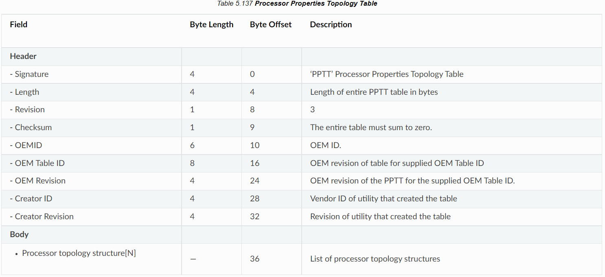
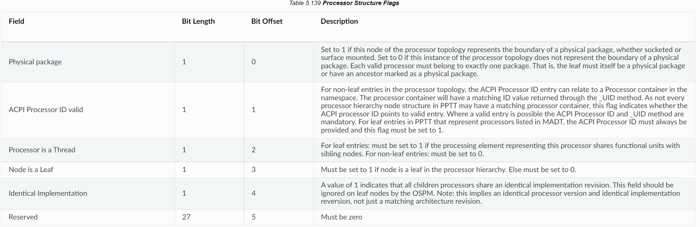

CPU 拓扑用来表示 CPU 在硬件层面的组合方式，本文主要讲解 CPU 拓扑中的 SMP（Symmetric Multi-Processor，对称多处理器系统）架构，CPU 拓扑还包括其他信息，比如：cache 等，这些部分会在后面进行补充。CPU 拓扑除了描述 CPU 的组成关系外，还为内核的调度器提供服务，从而提供更好的性能。在 StratoVirt 中，支持 CPU 拓扑为后续的 CPU 热插拔开发打下一个基础。

常见的 CPU SMP 结构是：

```
Socket --> die --> cluster --> core --> thread
```

- socket：对应主板上的 CPU 插槽
- die：处理器在生产过程中，从晶圆上切割下来的一个个小方块，Die 之间的组件是通过片内总线互联的。
- cluster：簇，大核或者小核的一种组合
- core：表示独立的物理 CPU
- thread：逻辑 CPU，英特尔超线程技术引入的新概念

## CPU 拓扑的获取原理

因为 x86 和 ARM 的拓扑获取方式不同，下面将会分开进行介绍。

### x86

在 x86 架构下面，操作系统会通过读取 CPUID 来获取 CPU 拓扑结构。在 x86 体系结构中，CPUID 指令（由 CPUID 操作码标识）是处理器补充指令（其名称源自 CPU 标识），允许软件发现处理器的细节。程序可以使用 CPUID 来确定处理器类型。

CPUID 隐式使用 EAX 寄存器来确定返回的信息的主要类别，这被称为 CPUID 叶。跟 CPU 拓扑相关的 CPUID 叶分别是：0BH 和 1FH。1FH 是 0BH 的扩展，可以用来表示更多的层级。Intel 建议先检查 1FH 是否存在，如果 1FH 存在会优先使用它。当 EAX 的值被初始化为 0BH 的时候，CPUID 会在 EAX，EBX，ECX 和 EDX 寄存器中返回 core/logical 处理器拓扑信息。这个函数（EAX=0BH）要求 ECX 同时被初始化为一个 index，这个 index 表示的是在 core 层级还是 logical processor 层级。OS 调用这个函数是按 ECX=0,1,2..n 这个顺序调用的。返回处理器拓扑级别的顺序是特定的，因为每个级别报告一些累积数据，因此一些信息依赖于从先前级别检索到的信息。在 0BH 下，ECX 可以表示的层级有：SMT 和 Core，在 1FH 下，可以表示的层级有：SMT，Core，Module，Tile 和 Die。

下表是一个更详细的一个解释：

| Initial EAX Value | Information Provided about the Processor                                                                                                                                                                                                                                                                                                                                                                                                                                                                                                 |
| ----------------- | ---------------------------------------------------------------------------------------------------------------------------------------------------------------------------------------------------------------------------------------------------------------------------------------------------------------------------------------------------------------------------------------------------------------------------------------------------------------------------------------------------------------------------------------- |
| 0BH               | EAX Bits 04 - 00: Number of bits to shift right on x2APIC ID to get a unique topology ID of the next level type\*. All logical processors with the same next level ID share current level. Bits 31 - 05: Reserved. EBX Bits 15 - 00: Number of logical processors at this level type. The number reflects configuration as shipped by Intel. Bits 31- 16: Reserved. ECX Bits 07 - 00: Level number. Same value in ECX input. Bits 15 - 08: Level type. Bits 31 - 16: Reserved. EDX Bits 31- 00: x2APIC ID the current logical processor. |
| 1FH               | EAX Bits 04 - 00: Number of bits to shift right on x2APIC ID to get a unique topology ID of the next level type\*. All logical processors with the same next level ID share current level. Bits 31 - 05: Reserved. EBX Bits 15 - 00: Number of logical processors at this level type. The number reflects configuration as shipped by Intel. Bits 31- 16: Reserved. ECX Bits 07 - 00: Level number. Same value in ECX input. Bits 15 - 08: Level type. Bits 31 - 16: Reserved. EDX Bits 31- 00: x2APIC ID the current logical processor  |

来源: Intel 64 and IA-32 Architectures Software Developer's Manual

### ARM

在 ARM 架构下，如果操作系统是依靠 Device Tree 启动的，则会通过 Device Tree 去获取 CPU 拓扑。如果是以 ACPI 的方式启动的话，操作系统会通过解析 ACPI 的 PPTT 表去获取 CPU 拓扑结构。

### ACPI——PPTT

ACPI 是 Advanced Configuration and Power Interface （高级配置和电源接口）的缩写，ACPI 是一种与体系结构无关的电源管理和配置框架。这个框架建立了一个硬件寄存器集合来定义电源状态。ACPI 是操作系统和固件之间的一个中间层，是他们两者之间的一个接口。ACPI 定义了两种数据结构：data tables 和 definition blocks。data tables 用于存储给设备驱动使用的 raw data。definition blocks 由一些字节码组成，这些码可以被解释器执行。

为了使硬件供应商在选择其实施时具有灵活性，ACPI 使用表格来描述系统信息、功能和控制这些功能的方法。这些表列出了系统主板上的设备或无法使用其他硬件标准检测或电源管理的设备，以及 ACPI 概念中所述的功能。它们还列出了系统功能，如支持的睡眠电源状态、系统中可用的电源平面和时钟源的说明、电池、系统指示灯等。这使 OSPM 能够控制系统设备，而不需要知道系统控制是如何实现的。

PPTT 表就是其中的一个表格，PPTT 表全称是 Processor Properties Topology Table，处理器属性拓扑表用于描述处理器的拓扑结构，该表还可以描述附加信息，例如处理器拓扑中的哪些节点构成物理包。

下表是 PPTT 表的结构，包含一个表头和主体，表头和其他的 ACPI 表差别不大。其中 `Signature` 用于表示这是 PPTT 表，`Length` 是整张表的大小，其他的信息可以查看下面的这张表。表的主体是一系列处理器拓扑结构。

下面的表表示处理器层级节点结构，表示处理器结构的话 `Type` 要设置为 0，`Length` 表示这个节点的字节数。`Flags` 用来描述跟处理器相关的信息，详细的看后面关于 `Flags` 的详细信息。`Parent` 用于指向这个节点的上一级节点，存放的是一个偏移量地址

下表是 `Flags` 的结构，`Flags` 占据 4 个字节的长度。`Physical package`：如果处理器拓扑的此节点表示物理封装的边界，则设置 `Physical package` 为 1。如果处理器拓扑的此实例不表示物理软件包的边界，则设置为 0。`Processor is a Thread`：对于叶条目：如果代表此处理器的处理元素与兄弟节点共享功能单元，则必须将其设置为 1。对于非叶条目：必须设置为 0。 `Node is a Leaf`：如果节点是处理器层次结构中的叶，则必须设置为 1。否则必须设置为 0。

参考：[https://uefi.org/specs/ACPI/6.4/05_ACPI_Software_Programming_Model/ACPI_Software_Programming_Model.html#processor-properties-topology-table-pptt](https://uefi.org/specs/ACPI/6.4/05_ACPI_Software_Programming_Model/ACPI_Software_Programming_Model.html#processor-properties-topology-table-pptt)

### Device Tree

Device Tree 是一种描述硬件的数据结构。内核的启动程序会将设备树加载入内存中，然后通过解析 Device Tree 来获取硬件细节。Device Tree 是树形结构，由一系列被命名的节点和属性组成，节点可以包含子节点，它们之间的关系构成一棵树。属性就是 name 和 value 的键值对。

一个典型的设备树如下图：


ARM 的 CPU 拓扑是定义在 cpu-map 节点内，cpu-map 是 cpu 节点的子节点。在 cpu-map 节点里可以包含三种子节点：cluster 节点，core 节点，thread 节点。整个 dts 的例子如下：

```json
cpus {
	#size-cells = <0>;
	#address-cells = <2>;

	cpu-map {
		cluster0 {
			cluster0 {
				core0 {
					thread0 {
						cpu = <&CPU0>;
					};
					thread1 {
						cpu = <&CPU1>;
					};
				};

				core1 {
					thread0 {
						cpu = <&CPU2>;
					};
					thread1 {
						cpu = <&CPU3>;
					};
				};
			};

			cluster1 {
				core0 {
					thread0 {
						cpu = <&CPU4>;
					};
					thread1 {
						cpu = <&CPU5>;
					};
				};

				core1 {
					thread0 {
						cpu = <&CPU6>;
					};
					thread1 {
						cpu = <&CPU7>;
					};
				};
			};
		};
    };

    //...
};
```

参考：[https://www.kernel.org/doc/Documentation/devicetree/bindings/arm/topology.txt](https://www.kernel.org/doc/Documentation/devicetree/bindings/arm/topology.txt)

图来源：[https://www.devicetree.org/specifications/](https://www.devicetree.org/specifications/)

## StratoVirt 具体实现

### CPUID

首先我们需要计算每个拓扑结构唯一的 topology ID，然后获取或者自己建立相对应的 CPUID entry，当 entry 的 function 的值等于 0xB 和 0X1F 的时候，我们需要根据 CPUID 的规范去设置相对应的 EAX, EBX, ECX 的值。EAX 设置为拓扑 ID，EBX 用来表示那个层级的有几个逻辑处理器，ECX 表示层级号。0xB 需要配置 index 等于 0，1 对应的值，0x1F 需要配置 index 等于 0，1，2 对应的值。下面是相对应的代码：

```rust
// cpu/src/x86_64/mod.rs
const ECX_INVALID: u32 = 0u32 << 8;
const ECX_THREAD: u32 = 1u32 << 8;
const ECX_CORE: u32 = 2u32 << 8;
const ECX_DIE: u32 = 5u32 << 8;

impl X86CPUState {
    fn setup_cpuid(&self, vcpu_fd: &Arc<VcpuFd>) -> Result<()> {
        // 计算 topology ID
        let core_offset = 32u32 - (self.nr_threads - 1).leading_zeros();
        let die_offset = (32u32 - (self.nr_cores - 1).leading_zeros()) + core_offset;
        let pkg_offset = (32u32 - (self.nr_dies - 1).leading_zeros()) + die_offset;

        // 获取 KVM 的 fd 和 获取它支持的 CPUID entries

        for entry in entries.iter_mut() {
            match entry.function {
                // ...
                0xb => {
                    // Extended Topology Enumeration Leaf
                    entry.edx = self.apic_id as u32;
                    entry.ecx = entry.index & 0xff;
                    match entry.index {
                        0 => {
                            entry.eax = core_offset;
                            entry.ebx = self.nr_threads;
                            entry.ecx |= ECX_THREAD;
                        }
                        1 => {
                            entry.eax = pkg_offset;
                            entry.ebx = self.nr_threads * self.nr_cores;
                            entry.ecx |= ECX_CORE;
                        }
                        _ => {
                            entry.eax = 0;
                            entry.ebx = 0;
                            entry.ecx |= ECX_INVALID;
                        }
                    }
                }
                // 0x1f 扩展，支持 die 层级
                0x1f => {
                    if self.nr_dies < 2 {
                        entry.eax = 0;
                        entry.ebx = 0;
                        entry.ecx = 0;
                        entry.edx = 0;
                        continue;
                    }

                    entry.edx = self.apic_id as u32;
                    entry.ecx = entry.index & 0xff;

                    match entry.index {
                        0 => {
                            entry.eax = core_offset;
                            entry.ebx = self.nr_threads;
                            entry.ecx |= ECX_THREAD;
                        }
                        1 => {
                            entry.eax = die_offset;
                            entry.ebx = self.nr_cores * self.nr_threads;
                            entry.ecx |= ECX_CORE;
                        }
                        2 => {
                            entry.eax = pkg_offset;
                            entry.ebx = self.nr_dies * self.nr_cores * self.nr_threads;
                            entry.ecx |= ECX_DIE;
                        }
                        _ => {
                            entry.eax = 0;
                            entry.ebx = 0;
                            entry.ecx |= ECX_INVALID;
                        }
                    }
                }
                // ...
            }
        }
}
```

### PPTT

根据 ACPI PPTT 表的标准来构建，我们需要计算每个节点的偏移值用于其子节点指向它。我们还需要计算每个节点的 uid，uid 初始化为 0，每增加一个节点 uid 的值加一。还需要根据 PPTT 表的标准计算 Flags 的值。最后需要计算整张表的大小然后修改原来的长度的值。

```rust
// machine/src/standard_vm/aarch64/mod.rs
impl AcpiBuilder for StdMachine {
    fn build_pptt_table(
        &self,
        acpi_data: &Arc<Mutex<Vec<u8>>>,
        loader: &mut TableLoader,
    ) -> super::errors::Result<u64> {
        // ...
        // 配置 PPTT 表头

        // 添加 socket 节点
        for socket in 0..self.cpu_topo.sockets {
            // 计算到起始地址的偏移量
            let socket_offset = pptt.table_len() - pptt_start;
            let socket_hierarchy_node = ProcessorHierarchyNode::new(0, 0x2, 0, socket as u32);
            // ...
            for cluster in 0..self.cpu_topo.clusters {
                let cluster_offset = pptt.table_len() - pptt_start;
                let cluster_hierarchy_node =
                    ProcessorHierarchyNode::new(0, 0x0, socket_offset as u32, cluster as u32);
                // ...
                for core in 0..self.cpu_topo.cores {
                    let core_offset = pptt.table_len() - pptt_start;
                    // 判断是否需要添加 thread 节点
                    if self.cpu_topo.threads > 1 {
                        let core_hierarchy_node =
                            ProcessorHierarchyNode::new(0, 0x0, cluster_offset as u32, core as u32);
                        // ...
                        for _thread in 0..self.cpu_topo.threads {
                            let thread_hierarchy_node =
                                ProcessorHierarchyNode::new(0, 0xE, core_offset as u32, uid as u32);
                            // ...
                            uid += 1;
                        }
                    } else {
                        let thread_hierarchy_node =
                            ProcessorHierarchyNode::new(0, 0xA, cluster_offset as u32, uid as u32);
                        // ...
                        uid += 1;
                    }
                }
            }
        }
        // 将 PPTT 表添加到 loader 中
    }
}
```

### Device Tree

StratoVirt 的 microvm 使用 device tree 启动，所以我们需要配置 device tree 中的 cpus 节点下的 cpu-map 来使 microvm 支持解析 CPU 拓扑。在 StratoVirt 中，我们支持两层 cluster。我们使用了多层循环来创建这个 tree，第一层是创建第一层 cluster，第二层对应创建第二层的 cluster，第三层创建 core，第四层创建 thread。

```rust
impl CompileFDTHelper for LightMachine {
    fn generate_cpu_nodes(&self, fdt: &mut FdtBuilder) -> util::errors::Result<()> {
        // 创建 cpus 节点
        // ...

        // Generate CPU topology
        // 创建 cpu-map 节点
        let cpu_map_node_dep = fdt.begin_node("cpu-map")?;
        // 创建第一层 cluster 节点
        for socket in 0..self.cpu_topo.sockets {
            let sock_name = format!("cluster{}", socket);
            let sock_node_dep = fdt.begin_node(&sock_name)?;
            // 创建第二层 cluster 节点
            for cluster in 0..self.cpu_topo.clusters {
                let clster = format!("cluster{}", cluster);
                let cluster_node_dep = fdt.begin_node(&clster)?;
                // 创建 core 节点
                for core in 0..self.cpu_topo.cores {
                    let core_name = format!("core{}", core);
                    let core_node_dep = fdt.begin_node(&core_name)?;
                    // 创建 thread 节点
                    for thread in 0..self.cpu_topo.threads {
                        let thread_name = format!("thread{}", thread);
                        let thread_node_dep = fdt.begin_node(&thread_name)?;
                        // 计算 cpu 的 id
                        // let vcpuid = ...
                        // 然后添加到节点中
                    }
                    fdt.end_node(core_node_dep)?;
                }
                fdt.end_node(cluster_node_dep)?;
            }
            fdt.end_node(sock_node_dep)?;
        }
        fdt.end_node(cpu_map_node_dep)?;

        Ok(())
    }
}
```

这个代码构建出来设备树的结构和前面原理中展示的结构基本一致

## 验证方法

我们可以通过下面的命令启动一个虚拟机，`smp` 参数用来配置 vCPU 拓扑

```bash
sudo ./target/release/stratovirt \
    -machine virt \
    -kernel /home/hwy/std-vmlinux.bin.1 \
    -append console=ttyAMA0 root=/dev/vda rw reboot=k panic=1 \
    -drive file=/usr/share/edk2/aarch64/QEMU_EFI-pflash.raw,if=pflash,unit=0,readonly=true \
    -drive file=/home/hwy/openEuler-22.03-LTS-stratovirt-aarch64.img,id=rootfs,readonly=false \
    -device virtio-blk-pci,drive=rootfs,bus=pcie.0,addr=0x1c.0x0,id=rootfs \
    -qmp unix:/var/tmp/hwy.socket,server,nowait \
    -serial stdio \
    -m 2048 \
    -smp 4,sockets=2,clusters=1,cores=2,threads=1
```

接着，我们可以通过观察 `/sys/devices/system/cpu/cpu0/topology` 下面的文件来查看配置的 topology。

```bash
[root@StratoVirt topology] ll
total 0
-r--r--r-- 1 root root 64K Jul 18 09:04 cluster_cpus
-r--r--r-- 1 root root 64K Jul 18 09:04 cluster_cpus_list
-r--r--r-- 1 root root 64K Jul 18 09:04 cluster_id
-r--r--r-- 1 root root 64K Jul 18 09:04 core_cpus
-r--r--r-- 1 root root 64K Jul 18 09:04 core_cpus_list
-r--r--r-- 1 root root 64K Jul 18 09:01 core_id
-r--r--r-- 1 root root 64K Jul 18 09:01 core_siblings
-r--r--r-- 1 root root 64K Jul 18 09:04 core_siblings_list
-r--r--r-- 1 root root 64K Jul 18 09:04 die_cpus
-r--r--r-- 1 root root 64K Jul 18 09:04 die_cpus_list
-r--r--r-- 1 root root 64K Jul 18 09:04 die_id
-r--r--r-- 1 root root 64K Jul 18 09:04 package_cpus
-r--r--r-- 1 root root 64K Jul 18 09:04 package_cpus_list
-r--r--r-- 1 root root 64K Jul 18 09:01 physical_package_id
-r--r--r-- 1 root root 64K Jul 18 09:01 thread_siblings
-r--r--r-- 1 root root 64K Jul 18 09:04 thread_siblings_list
```

比如：

```bash
cat core_cpus_list
```

结果是

```
0
```

表示和 cpu0 同一个 core 的 cpu 只有 cpu0。

```bash
cat package_cpus_list
```

会显示

```
0-1
```

表示和 cpu0 同一个 socket 的 cpu 有从 cpu0 到 cpu1。

下面这些工具也可以辅助进行验证。

比如：lscpu

```bash
lscpu
```

通过执行 `lscpu` 命令会出现下面结果

```
Architecture:            aarch64
  CPU op-mode(s):        32-bit, 64-bit
  Byte Order:            Little Endian
CPU(s):                  64
  On-line CPU(s) list:   0-63
Vendor ID:               ARM
  Model name:            Cortex-A72
    Model:               2
    Thread(s) per core:  1
    Core(s) per cluster: 16
    Socket(s):           -
    Cluster(s):          4
    Stepping:            r0p2
    BogoMIPS:            100.00
    Flags:               fp asimd evtstrm aes pmull sha1 sha2 crc32 cpuid
NUMA:
  NUMA node(s):          4
  NUMA node0 CPU(s):     0-15
  NUMA node1 CPU(s):     16-31
  NUMA node2 CPU(s):     32-47
  NUMA node3 CPU(s):     48-63
Vulnerabilities:
  Itlb multihit:         Not affected
  L1tf:                  Not affected
  Mds:                   Not affected
  Meltdown:              Not affected
  Spec store bypass:     Vulnerable
  Spectre v1:            Mitigation; __user pointer sanitization
  Spectre v2:            Vulnerable
  Srbds:                 Not affected
  Tsx async abort:       Not affected
```

## 关注我们

StratoVirt 当前已经在 openEuler 社区开源。后续我们将开展一系列技术分享，让大家更加详细地了解 StratoVirt。如果您对虚拟化技术或者 StratoVirt 感兴趣，欢迎扫描文末小助手二维码，回复 StratoVirt 加入 SIG 交流群。

项目地址：https://gitee.com/openeuler/stratovirt

项目交流：https://gitee.com/openeuler/stratovirt/issues


