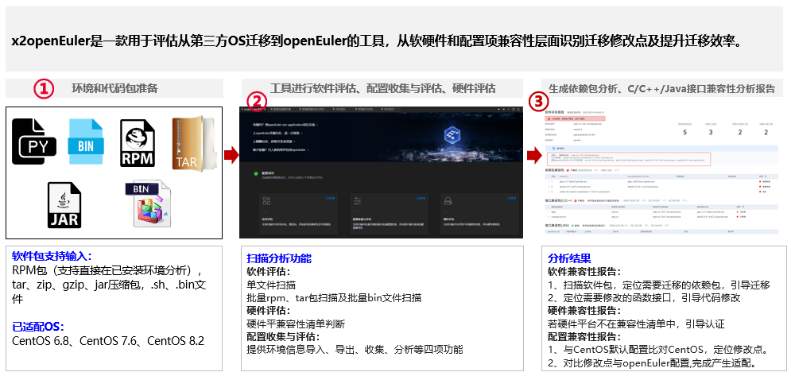
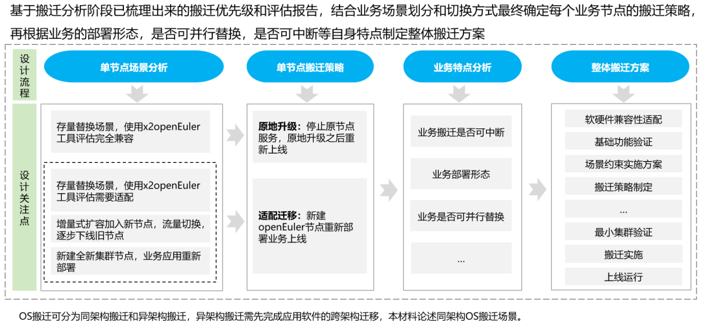
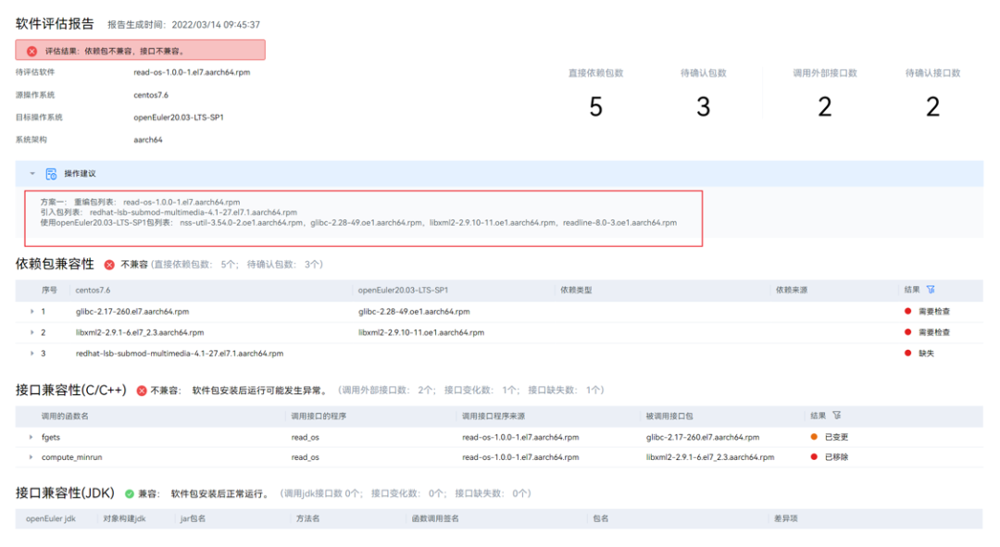
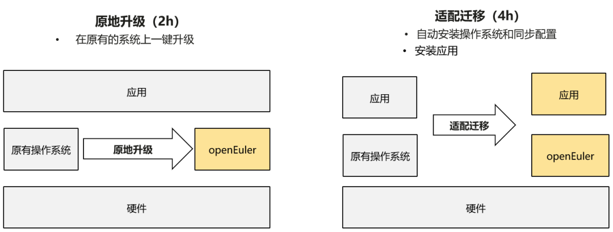
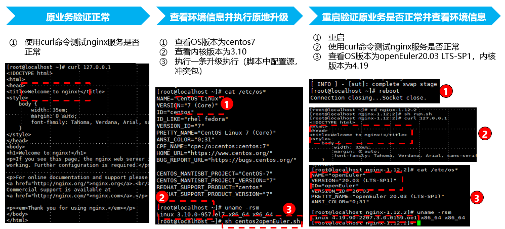
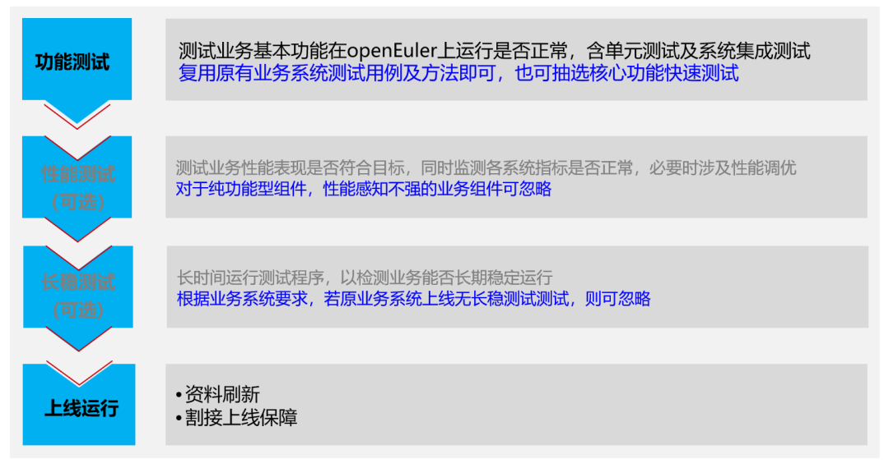

## 概述

​ 随着数字化转型深入，操作系统正在向支持多样性计算、支持全场景的方向发展。在数字化转型的过程中，企业面临迁移操作系统的刚性需求，由于不同操作系统之间存在差异，企业在迁移操作系统时面临三个问题：如何处理软硬件兼容性问题，如何快速恢复系统环境？如何发挥系统的极致性能？针对企业在迁移操作系统的需求，欧拉开源社区推出这份迁移指南，助力企业简单、平稳、高效进行操作系统迁移。

操作系统和应用软件迁移主要包含以下六个步骤。

## 步骤一：成立迁移保障组织

在进行迁移操作系统前，公司内部的业务部门、IT 维护部门以及 OSV、ISV 需要成立迁移保障组织，为操作系统迁移提供技术支持和组织保障。如果您有操作系统迁移意向，欢迎扫码登记，欧拉开源社区中的工作人员将免费为您提供操作系统迁移咨询服务。

## 步骤二：迁移分析

​ 迁移保障组织成立后，公司内部收集需要迁移的业务名称、迁移诉求、软件栈、业务部署形态、服务器硬件信息，形成迁移项目全景图。

根据迁移项目全景图，按照业务的提供商、操作系统和硬件环境进行筛选，指定业务的迁移优先级。

最后，使用 x2openEuler 工具对操作系统的硬件、软件和配置进行兼容性评估，对不兼容的软件包需要进行补全或者替代，给出兼容性报告供后续步骤使用。

图为：x2openEuler 工具

x2openEuler 工具下载网址下载网址
<https://repo.oepkgs.net/openEuler/rpm/openEuler-20.03-LTS-SP1/contrib/x2openEuler/>

## 步骤三：方案设计

​ 根据兼容性报告和业务迁移的优先级，制定每个业务节点的迁移策略，根据业务的部署形态、是否可并行替换、是否可中断等自身特点定制整体搬迁方案。

## 步骤四：移植适配

x2openEuler 兼容性报告中需要适配的软件，需要根据报告进行适配，并在迁移后的新系统上重新部署。

图为：x2openEuler 兼容性报告

## 步骤五：搬迁实施

欧拉开源社区为用户提供两种迁移路径，如下图所示：

图为：操作系统迁移的两条路径

建议用户先使用 x2openEuler 工具的对软件的兼容性进行评估，根据业务需求选择不同的迁移方式。

在制定好整体的搬迁方案后，即可开始进行业务迁移，根据 x2openEuler 兼容性报告，完全兼容的业务使用 x2openEuler 工具直接进行原地升级，最大程度保留原有业务和配置不变。

图为：原地升级示例

## 步骤六：测试上线

在业务系统迁移完毕后，可以通过原有的业务系统测试用例和方法对业务进行单元测试和系统集成测试，也可以抽取核心功能模块进行快测试，根据测试提供的性能数据，判断是否有必要进行性能调优，欧拉开源社区提供性能调优工具 A-Tune，可以帮助企业快速进行性能调优。

图为：测试流程

openEuler 官网-迁移专区：<https://www.openeuler.org/zh/migration/guidance/1-summary/>
