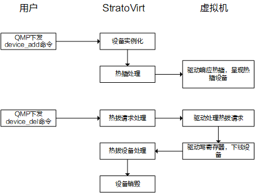

热插拔即带电插拔，在虚拟化场景下，热插拔就是在虚拟机运行过程中对磁盘网卡等设备进行动态调整。

常见的热插拔机制有 ACPI 机制的热插拔,PCIe-Native 机制的热插拔。ACPI 机制的热插拔依赖 ACPI 表，在 ACPI 表中会存放设备热插拔相关的信息。PCIe-Native 机制的热插拔是 PCI 规范中定义的，设备一般是热插到 Root Port 设备上，Root Port 设备可以认为是一个虚拟的桥设备，对应一个插槽。Root Port 设备本身不支持热插拔，因此需要在启动虚拟机前提前配置。

目前,StratoVirt 标准机型中实现了基于 PCIe-Native 机制的热插拔。支持热插拔的设备包括磁盘、网卡、PCI 直通设备。

热插拔的整体流程如下：


对于热插主要分为两步：

用户通过 QMP 下发 device_add 命令,StratoVirt 收到命令后会进行设备的实例化，然后插入到对应的 Root Port 设备上。
Root Port 设备更新相关的寄存器配置，然后发送中断通知虚拟机内驱动处理。
对于热拔也可以分为两步：

用户通过 QMP 下发 device_del 命令,StratoVirt 收到命令后，更新 Root Port 中的寄存器，然后发送中断通知虚拟机内驱动处理。
虚拟机内驱动处理后会回写寄存器，触发 StratoVirt 侧销毁相应设备。

## 具体实现

在 StratoVirt 的 pci/src/hotplug.rs 文件中定义了热插拔特性，其中 plug 函数对应热插操作,用于热插设备。unplug_request 函数对应热拔操作，用于发起热拔设备请求，这里只是通知虚拟机内驱动去处理热拔请求，还未移除设备，可以理解为是一个异步请求。当虚拟机内驱动处理完成后，写寄存器触发设备下线后，会回调 unplug 函数用于销毁设备。

```shell
pub trait HotplugOps: Send {
    /// Plug device, usually called when hot plug device in device_add.
    fn plug(&mut self, dev: &Arc<Mutex<dyn PciDevOps>>) -> Result<()>;

    /// Unplug device request, usually called when hot unplug device in device_del.
    /// Only send unplug request to the guest OS, without actually removing the device.
    fn unplug_request(&mut self, dev: &Arc<Mutex<dyn PciDevOps>>) -> Result<()>;

    /// Remove the device.
    fn unplug(&mut self, dev: &Arc<Mutex<dyn PciDevOps>>) -> Result<()>;
}
```

### 热拔实现

对于设备热拔请求的逻辑主要在 unplug_request 函数，该函数负责更新寄存器，并且通过调用 hotplug_event_notify 函数发送中断通知虚拟机内驱动处理设备热拔请求。

unplug_request 函数里主要是清零了 Link 状态寄存器中的 PCI_EXP_LNKSTA_DLLLA 标记位，并且在 Slot 状态寄存器中的设置了 PCI_EXP_HP_EV_ABP 标记位。从这里也可以发现，其实无论是热插请求还是热拔请求，都是通过 Attention Button Pressed（对应 PCI_EXP_HP_EV_ABP）事件触发的，虚拟机内驱动会根据设备的在位状态来判断是热插请求还是热拔请求。

```shell
impl HotplugOps for RootPort {
    fn unplug_request(&mut self, dev: &Arc<Mutex<dyn PciDevOps>>) -> Result<()> {
        let devfn = dev
            .lock()
            .unwrap()
            .devfn()
            .chain_err(|| "Failed to get devfn")?;
        if devfn != 0 {
            return self.unplug(dev);
        }

        let offset = self.config.ext_cap_offset;
        le_write_clear_value_u16(
            &mut self.config.config,
            (offset + PCI_EXP_LNKSTA) as usize,
            PCI_EXP_LNKSTA_DLLLA,
        )?;

        let mut slot_status = PCI_EXP_HP_EV_ABP;
        if let Some(&true) = FAST_UNPLUG_FEATURE.get() {
            slot_status |= PCI_EXP_HP_EV_PDC;
        }
        le_write_set_value_u16(
            &mut self.config.config,
            (offset + PCI_EXP_SLTSTA) as usize,
            slot_status,
        )?;
        self.hotplug_event_notify();
        Ok(())
    }
}
```  

对于热拔设备，StratoVirt 侧在更新寄存器发送中断通知虚拟机内驱动后，实际上还没有真正的移除设备，而是等到虚拟机内驱动处理后回写寄存器通知 StratoVirt 侧下线设备后，才会真正销毁设备。

虚拟机内驱动写 Root Port 寄存器会调用到 write_config 函数，在 write_config 函数里会调用 do_unplug 函数来处理热拔设备相关的逻辑。

```shell
fn write_config(&mut self, offset: usize, data: &[u8]) {
        ...

        self.do_unplug(offset, end, old_ctl);
    }
```

do_unplug 函数里首先保证了写入的寄存器是 Slot Control 寄存器，否则直接返回，不做处理。然后判断在设备当前在位的情况下，写入的寄存器标记位为 PCI_EXP_SLTCTL_PWR_IND_OFF 和 PCI_EXP_SLTCTL_PCC 时，并且这两个标记位发生了变化，也就是写入之前的没有这两个标记位，上述条件都满足时，会调用 remove_devices 函数开始真正销毁设备。

| 符号 | 描述                                                                                                                                                                                                                                                                                                                                                                                                                                                                                                 |
| ----------------- | ---------------------------------------------------------------------------------------------------------------------------------------------------------------------------------------------------------------------------------------------------------------------------------------------------------------------------------------------------------------------------------------------------------------------------------------------------------------------------------------------------------------------------------------- |
| PCI_EXP_SLTCTL_PCC               | Power Controller Control 表示电源管理状态，置 1 表示上电状态 |
| PCI_EXP_SLTCTL_PWR_IND_OFF              | Power Indicator off 表示是否允许移除设备，置 1 表示设备允许被移除  |

```shell
fn do_unplug(&mut self, offset: usize, end: usize, old_ctl: u16) {
    let cap_offset = self.config.ext_cap_offset;
    // Only care the write config about slot control
    if !ranges_overlap(
        offset,
        end,
        (cap_offset + PCI_EXP_SLTCTL) as usize,
        (cap_offset + PCI_EXP_SLTCTL + 2) as usize,
    ) {
        return;
    }

    let status =
        le_read_u16(&self.config.config, (cap_offset + PCI_EXP_SLTSTA) as usize).unwrap();
    let val = le_read_u16(&self.config.config, offset).unwrap();
    // Only unplug device when the slot is on
    // Don't unplug when slot is off for guest OS overwrite the off status before slot on.
    if (status & PCI_EXP_SLTSTA_PDS != 0)
        && (val as u16 & PCI_EXP_SLTCTL_PCC == PCI_EXP_SLTCTL_PCC)
        && (val as u16 & PCI_EXP_SLTCTL_PWR_IND_OFF == PCI_EXP_SLTCTL_PWR_IND_OFF)
        && (old_ctl & PCI_EXP_SLTCTL_PCC != PCI_EXP_SLTCTL_PCC
            || old_ctl & PCI_EXP_SLTCTL_PWR_IND_OFF != PCI_EXP_SLTCTL_PWR_IND_OFF)
    {
        self.remove_devices();

        if let Err(e) = self.update_register_status() {
            error!("{}", e.display_chain());
            error!("Failed to update register status");
        }
    }

    self.hotplug_command_completed();
    self.hotplug_event_notify();
}
```

在调用 remove_devices 函数移除设备之后，调用 update_register_status 函数更新寄存器的状态，主要是清理了 Link 状态和设备在位状态，并且设置了 Presence Detect Changed（对应 PCI_EXP_HP_EV_PDC）标记位表示设备在位状态发生了变化。

```shell
/// Update register when the guest OS trigger the removal of the device.
fn update_register_status(&mut self) -> Result<()> {
    let cap_offset = self.config.ext_cap_offset;
    le_write_clear_value_u16(
        &mut self.config.config,
        (cap_offset + PCI_EXP_SLTSTA) as usize,
        PCI_EXP_SLTSTA_PDS,
    )?;
    le_write_clear_value_u16(
        &mut self.config.config,
        (cap_offset + PCI_EXP_LNKSTA) as usize,
        PCI_EXP_LNKSTA_DLLLA,
    )?;
    le_write_set_value_u16(
        &mut self.config.config,
        (cap_offset + PCI_EXP_SLTSTA) as usize,
        PCI_EXP_SLTSTA_PDC,
    )?;
    Ok(())
}
```

在更新完寄存器后，在 hotplug_command_completed 还会设置 Command Completed（对应 PCI_EXP_HP_EV_CCI）表示命令处理完成，最后再发送中断通知虚拟机内驱动。至此，整个设备热拔流程就结束了。

```shell
fn hotplug_command_completed(&mut self) {
    if let Err(e) = le_write_set_value_u16(
        &mut self.config.config,
        (self.config.ext_cap_offset + PCI_EXP_SLTSTA) as usize,
        PCI_EXP_HP_EV_CCI,
    ) {
        error!("{}", e.display_chain());
        error!("Failed to write command completed");
    }
}
```


| 符号 | 描述                                                                                                                                                                                                                                                                                                                                                                                                                                                                                                 |
| ----------------- | ---------------------------------------------------------------------------------------------------------------------------------------------------------------------------------------------------------------------------------------------------------------------------------------------------------------------------------------------------------------------------------------------------------------------------------------------------------------------------------------------------------------------------------------- |
| PCI_EXP_HP_EV_CCI            | Command Completed 表示命令处理完成，可以处理下一条命令 |

## 总结

PCIe Native 机制的热插拔主要是通过 Root Port 设备上的寄存器来表示不同状态，通过中断来通知虚拟机，从而实现了设备的热插拔。

## 加入我们

StratoVirt 中的热插拔特性已经在 openEuler 社区开源，如果您对相关技术感兴趣，欢迎您的围观。您可以扫描文末小助手微信二维码，回复 StratoVirt 加入 SIG 交流群。

项目地址：https://gitee.com/openeuler/stratovirt

如有疑问，也欢迎在此提交 issue：https://gitee.com/openeuler/stratovirt/issues
