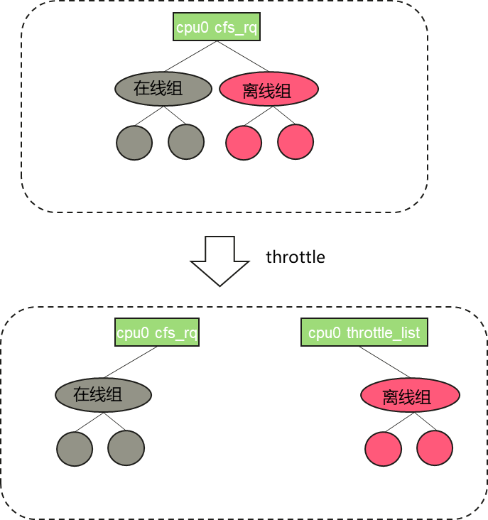
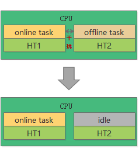

## 概述
在数据中心服务器或者各种云集群（后续简称集群）的生产环境上，部署着很多日常的在线（LC, Latency-critical service）服务。这类服务具有一定的负载不确定性，集群需要将服务器的平均利用率保持在较低的水平，使得当突发流量带来请求洪峰时，仍有充足资源用于计算与响应，从而避免了请求堆积造成的服务瘫痪，保证用户能够拥有良好的体验。但是这样做造成了大批的空闲资源浪费，提高了维护成本。在这种条件下想要提高资源利用率，一种直接的方式是在线服务负载较低时，部署另一种任务，提高资源的利用效率。这类应用不要求有极高的响应速度，但是将耗费较大的计算资源，我们称之为离线任务（BE, Best-effort batch）。因此各大云服务厂商引入在线离线混合部署方案来提升服务器的资源利用率，以降低云的运营成本。但事物的发展是具有两面性的，混合部署也不例外，提升资源利用率的同时也会带来资源隔离的问题。

本文详细介绍并分享关于提升 CPU 资源隔离的混部技术细节：

- 「CPU 抢占」：当一台服务上同时存在在线服务、离线服务，如果不对离线服务加以限制，离线服务将会尽可能多的占用资源，从而增加在线任务的相应时延。所以本方案在同一个核上的在线（LC）服务能够抢占压制离线（BE）服务,最终保证在线服务的 QoS.

- 「SMT 隔离控制」：同一个物理  CPU  的超线程共享核心的硬件资源，如  Cache  和计算单元。当在线任务和离线任务同时运行在一对超线程上时，会因为硬件资源争抢出现相互干扰的情况。此时需要驱离离线任务，该 HT 核进入 idle。

在混部场景 CPU 在离线调度的实现中，存在在线作业时，我们会对离线任务进行 throttle，以确保在线任务的 CPU 资源供应。当开启 HT 后，我们会驱离同时运行在同一个物理核且运行在不同逻辑核的离线任务。本方案的设计目标是保证在线业务服务质量前提下实现资源利用率最大化提升。因此本方案的设计是围绕如何提升 CPU 资源利用率和保障在线业务的响应速度展开。主要包括以下两个子特性的设计：


### 特性一、CPU 抢占

#### （1）在线任务抢占时延保证

为了保证在线任务能够快速抢占离线任务，我们默认会将离线任务的调度策略设置为`SCHED_IDLE`，而在线任务调度策略不做修改（通常情况下在线任务的调度策略为`SCHED_OTHER`），当在线任务抢占离线任务时，可以快速抢占，不受限于`sched_min_granularity_ns  和sched_wakeup_granularity_ns`机制限制。

#### （2）在线任务绝对压制离线任务

当在线任务在运行时，离线任务需要停止运行，以避免和在线任务抢占 CPU 资源，因此在线任务需要尽可能地压制离线任务，通过引入` throttle 机制`对离线任务进行限制,  在一个 CPU 上同时存在在线和离线任务的场景下，将`离线组对应的cfs_rq` 添加到一个`全局 percpu` 链表`throttle_list`，从而将 CPU 资源完全让给在线任务。具体流程如下:



图 1  离线任务 throttle

### 特性二、SMT 隔离控制
由于同一个物理  CPU  上的超线程共享核心的硬件资源，比如  Cache  和计算单元。当在线任务和离线任务同时运行在一对超线程上时，相互之间会因为硬件资源争抢，而出现相互干扰的情况。而  CFS  在设计时完全没有考虑这个问题。其结果是，在混部场景中，在线业务的性能受损。实际测试使用  CPU  密集型  benchmark，因超线程导致的性能干扰可达 40%+。虽然  Linux 5.14  版本已经合入了  Core Scheduing，但该特性本身是为了解决利用 SMT 侧信道攻击的，避免互相不被信任的两个进程工作在一个核的不同 SMT 上。其有几点缺陷是我们不用该特性做 SMT 驱离的理由，首先其设计和实现过重，开销较大（比如  core  级别的  rq lock）。其次其并不支持组调度功能，是以进程为粒度进行隔离，而我们的需求是希望对在线任务和离线任务进行隔离。为了尽可能减轻这种竞争的影响，我们让一个核执行在线任务的时候，它对应的  MT  上不再运行离线任务；或者当一个核上有离线任务运行的时候，在线任务调度到了其对应的  HT  上时，会由该在线任务发送 IPI 将离线任务驱赶走。保证在线任务运行时不被干扰。如下图所示：



图 2 SMT 隔离控制方案设计


## 方案需要重点解决的问题

### （1）离线任务  kill boost

当在线任务 100%  运行时，kill  一个离线任务，此时离线任务需要得到运行以释放一些系统资源，但是因为当前方案在线任务会对离线任务产生绝对压制，为此引入 kill boost 解决此问题;

离线任务所在 group 为离线 group，root group 为在线任务，当对一个离线任务进行 kill 时，将对应的离线任务移入到 root group,  从而使离线任务变为在线任务，能够得到机会运行从而释放资源。

### （2）优先级反转

如果在线任务和离线任务之间有共享资源(比如内核中的一些公共数据)，当离线任务因访问共享资源而拿到锁(抽象一下，不一定是锁)后，如果被“绝对压制”，一直无法运行，当在线任务也需要访问该共享资源，而等待相应的锁时，优先级反转出现，导致死锁(长时间阻塞也可能)。优先级反转是调度模型中需要考虑的一个经典问题。

目前该方案主要分为两个模块，优先级反转检测和优先级反转处理：

- **「优先级反转检测」**：出现优先级反转的前提的是，在线任务长时间 100%占用 CPU，导致离线任务被压制无法释放资源导致，基于这一特点，我们可以通过检测离线任务是否长时间没有得到运行来判断是否可能存在优先级反转流程。

- **「优先级反转处理」**：当检测到优先级反转时，对应 CPU 上的离线任务不再被在线任务压制,  可以正常运行，在返回用户态之前会进入睡眠流程，其中每次睡眠时间可以根据参数进行设置。当 CPU 处理完队列中的所有任务时，就会进入 idle,  此时代表当前 CPU 恢复正常情况。代表优先级反转问题已经解决，进入正常的在离线混跑逻辑。

## 任务管理

容器混部场景中，在离线任务是以`Cgroup  组`的形式进行配置的，所以我们提供了`Cgroup  接口`进行任务管理。对应路径为：

```csharp
/sys/fs/cgroup/cpu/xxx/cpu.qos_level
```

其中，`cpu.qos_level`文件代表当前 group 里任务的在离线属性，默认值为 0，代表该任务为在线任务组; 若值为-1 则代表为离线任务组

于是，如果想要对任务进行管理，可以在工作节点上创建离线任务组，将离线任务的 pid 写入到该组的 task 中，再设置对应的`cpu.qos_level`文件：

```
# echo <pid> > /sys/fs/cgroup/cpu/xxx/tasks
# echo -1 > /sys/fs/cgroup/cpu/xxx/cpu.qos_level
```


## 通过混部引擎 rubik 进行管理

在容器混合部署场景下，混部引擎 rubik 可以自动感知用户配置的业务优先级并配置其 CPU 优先级属性，rubik 具体的介绍和使用详见《openEuler 资源利用率提升之道 03：rubik 混部引擎简介》。

针对本文提到的 CPU 优先级的配置，用户只需要在部署业务 pod 时，在 yaml 内添加`volcano.sh/preemptable`的 annotation 标识业务属性，rubik 就会自动设置 pod 对应 cgroup 组的 cpu.qos_level 值。例如，如下为一个 nginx 在线业务 pod 的 yaml 文件：

```
# cat nginx-online.yaml
apiVersion: v1
kind: Pod
metadata:
  name: nginx-online
  annotations:
    volcano.sh/preemptable: "false"   # volcano.sh/preemptable为true代表业务为离线业务，false代表业务为在线业务，默认为false
spec:
  containers:
  - name: nginx
    image: nginx
    resources:
      limits:
        memory: "200Mi"
        cpu: "1"
      requests:
        memory: "200Mi"
        cpu: "1"
```

执行`kubectl apply -f nginx-online.yaml`部署 nginx 业务后，进入`nginx-online Pod `对应的 cgroup 路径下，查看`cpu.qos_level`是否已设置（在线业务为 0，离线业务为-1）：

```
# cat /sys/fs/cgroup/cpu/kubepods/pod59f1cdfa-a0ad-4208-9e95-efbef3519c00/cpu.qos_level
0
```

## 总结

本文介绍的“CPU 在离线抢占”和“SMT 隔离控制”在在离线混部场景对 CPU 资源进行管控，已经有比较好的效果了，但还有一些不够完美的地方，如 LLC/MBA 动态调整软件策略不够精细，要达到较好的效果依赖硬件优先级算法，我们可以期待新的鲲鹏服务器。同时在公有云场景对邻居干扰的消减也是很重要的，openEuler 在这方法也做了一些探索，“潮汐 affinity”技术取得了不俗的效果，也会在后续的文章中与大家见面。下一期将会分享资源利用率内存相关的技术。

## 加入我们


文中所述资源利用率提升技术，由  Cloud Native SIG、Kernel SIG 共同参与，其源码将在 openEuler 社区逐步开源。如果您对相关技术感兴趣，欢迎您的围观和加入。您可以添加小助手微信(vx：wildLittleHelper），加入对应 SIG 微信群。
