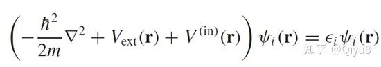
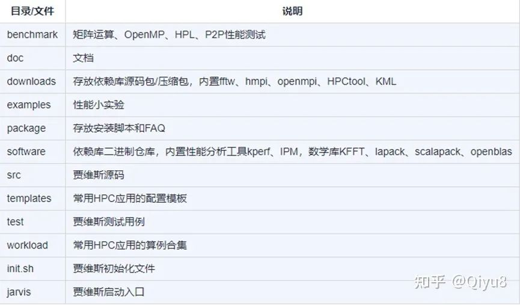
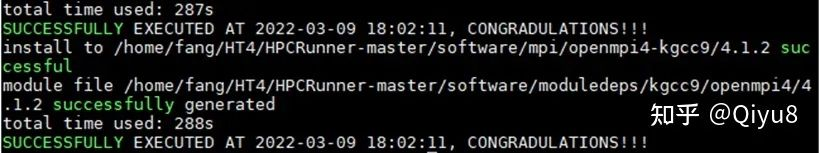
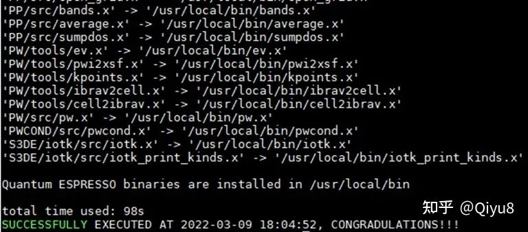
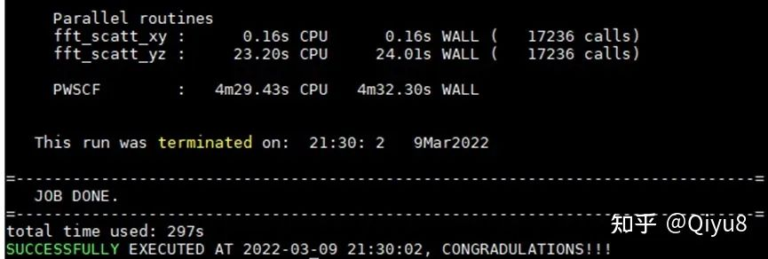
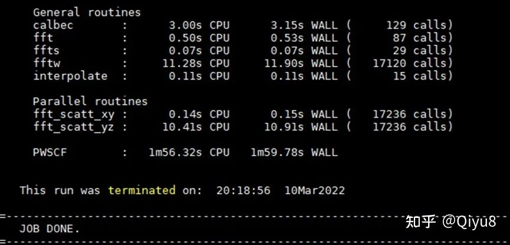
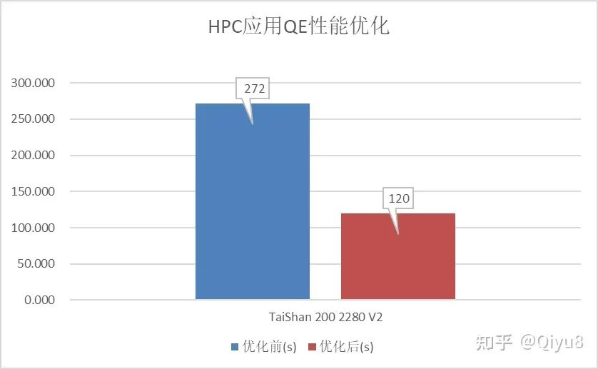

> 本文作者：方春林（Qiyu8）
> 原文来源：[https://zhuanlan.zhihu.com/p/489828346](https://zhuanlan.zhihu.com/p/489828346)
---
> **关于作者**
方春林，Numpy/Taro Maintainer，USIMD和HPCRunner开源项目Leader，目前主要聚焦于openEuler HPC SIG运营，openEuler HPC SIG致力于建立气象、分子动力学、生物和制造等领域的生态交流圈，打造HPC多样性算力部署调优统一平台，自动容器化助力极简部署，一站式调优HPC应用，让看似阳春白雪的HPC应用走向平民化！
---

## 1. 前言
说起高性能计算（High Performance Computing，缩写 HPC），很多人第一个想法就是动辄亿亿次浮点运算的“超级计算机”，国家花这么大代价做出来的机器干啥用呢，其实大到天气预报、飞机制造、新冠疫苗研发，小到唐氏筛查、《熊出没》渲染，到处可见HPC的身影，就拿最近的北京冬奥会来说，其成功举办就脱离不了济南超算对空气质量预报准确及时的预警，当然HPC也可以离我们很远，举几个戈登贝尔奖的栗子(被誉为“超级计算应用领域”内的诺贝尔奖)。

获奖年份    | 获奖项目 | 超算系统
-------- | ----- | -----
2021 | 超大规模量子随机电路实时模拟 | 中国.神威
2020  | 超过一亿个原子的分子动力学模拟计算 | 美国.Summit
2016  | 千万核可扩展全球大气动力学全隐式模拟 | 中国.神威

对超算来说硬件很重要，但现在是“软件吞噬一切”的时代，路修的再好没有车在上面跑也没用，如果把开源软件比作汽车市场，那么HPC应用就是这个市场中的 “豪车”，为了追求最极致的性能，它们用着最先进的“发动机”(编译器)、最复杂的“轮胎”(并行技术)，同时也拥有最繁琐的“机械结构”(安装和调优流程)，优化过HPC应用的“赛车手”都有一个感受：抱黄连敲门—苦到家了，难怪HPC被喻为是IT行业“金字塔上的明珠”，本文旨在通过部署调优一个量子化学的HPC应用让大家直观的感受HPC的魅力，让看似阳春白雪的HPC也能走向平民化，走向每个人、每个家庭、每个组织。


## 2. 求解薛定谔方程

波函数被证明对获取材料的宏观性能(如光学性质、力学性质、热力学性质、磁学性质)极具价值，现实中的物质由多个电子构成的，它们的波函数该如何求解？一个铁原子有26个电子，两个有52个电子，计算2个铁原子相互作用时，需要计算任意一个与其它51个电子的相互作用，当计算原子数增加时，计算量呈指数增加，100个铁原子的计算量恐怕都是天文数字了，更不要说几十万个原子（纳米材料），这就不得不提著名的Kohn-Sham公式，他将多电子体系近似用一个或几个函数来代替求解多体薛定谔方程，计算量大大减少，Kohn因为这个公式获1998年Nobel化学奖，本文要介绍的HPC应用QE就是这个公式的开源实现，在量子化学领域被广泛应用，从官网介绍来看，“QUANTUM ESPRESSO是一种用于电子结构计算和材料建模的量子化学方法的软件套件，在GNU通用公共许可证下免费分发。它基于密度泛函理论，平面波基组和赝势（包括范数守恒和超软）理论。”，这段文字看不懂没关系，只要记住求解公式是这个就行了：



▲ Kohn-Sham公式

## 3. 安装QE

*准备工作：CentOS7/openEuler+ARM服务器*


QE的安装可以参考文档([https://support.huaweicloud.com/prtg-kunpenghpcs/openmind_kunpengqe_02_0001.html](https://support.huaweicloud.com/prtg-kunpenghpcs/openmind_kunpengqe_02_0001.html))一步步安装。

但是本文推荐另一种更简便的安装方式，那就是HPC贾维斯助([https://gitee.com/openeuler/hpcrunner](https://gitee.com/openeuler/hpcrunner))，专门为HPC应用打造的一键依赖安装、环境配置、编译、运行、调优平台，将HPCRunner解压或者clone到服务器某个位置，其目录结构及说明如下所示：


▲ 贾维斯源码目录

步骤1：进入这个贾维斯目录并初始化环境

```csharp
cd hpcunner

source ./init.sh
```

步骤2：拷贝QE的HPC配置并切换到改配置(基于鲲鹏GCC+OpenMPI技术栈)

```csharp
cp ./templates/qe/6.4/data.qe.test.config ./

./jarvis -use data.qe.test.config
```


步骤3：获取QE及依赖软件

```csharp
l 下载QE 6.4版本(https://github.com/QEF/q-e/archive/refs/tags/qe-6.4.1.tar.gz)，解压至tmp目录

tar -xzvf ./downloads/q-e-qe-6.4.1.tar.gz -C /tmp


2 将QE的算例也拷贝至/tmp

\cp -rf ./workloads/QE/qe-test /tmp
```


步骤4：一键下载并安装依赖

l 执行如下命令安装鲲鹏GCC+OpenMPI (请准备咖啡，5分钟左右)

```csharp
./jarvis -d -dp
```

▲ 下载依赖并安装

步骤5：一键编译QE

```csharp
./jarvis -b
```

▲ QE的编译


步骤6：一键运行QE

```csharp
./jarvis -r
```

▲ QE的运行

几分钟后应该可以看到“JOB DONE”字样，经过14次SCF自洽运算我们就可以得出原子间的能量值，到这里你已经体验了一遍HPC应用的安装运行全流程了。


## 4. QE调优

在HPC应用运行的过程中，可以通过perf性能工具无侵入式的采集热点函数数据，而且以目录树的形式展现出来。

```csharp

步骤1：运行QE

./jarvis -r


步骤2：新建窗口并进入hpcrunner目录，运行性能采集命令

./jarvis -p

```

从热点函数实时分布图可以看出除了MPI通信之外，GEMM矩阵运算操作占比较高，可以考虑使用openblas进行替代，同时可以考虑把编译器换成毕昇、MPI通信库换为HyperMPI。

```csharp

步骤3：拷贝优化配置

cp ./templates/qe/6.4/data.qe.test.opt.config ./


步骤4：切换到优化配置

./jarvis -use data.qe.test.opt.config


步骤5：一键下载并安装依赖(大概6分钟左右)

./jarvis -d -dp


步骤6：一键编译QE

./jarvis -b


步骤7：一键运行QE

./jarvis -r

```


▲ 优化之后的QE

这次的运行时间是不是更短了呢？让我们对比一下前后的性能情况吧


▲ QE前后性能对比

如果你也得到了这个结果，那么恭喜你完成了一次HPC应用的调优！


## 5. 总结

雄关漫道真如铁,而今迈步从头越，实际HPC应用的优化之路险阻而又漫长，越是交叉学科越需要全人类的智慧共同参与才能结出美丽的果实，但是我坚信只要一直走，总有一天会到达目的地。

美好的未来在前方，如果您对HPC有兴趣请加入到openEuler HPC SIG，这里除了有迁移调优技术分享，还有大量开源实习机会([https://gitee.com/openeuler/hpcrunner/issues](https://gitee.com/openeuler/hpcrunner/issues))，在家也能领工资，更有百万奖金众智计划等你来拿。请关注开源项目贾维斯，为多样性算力添砖加瓦，共建openEuler生态。


**欢迎围观联系，加入交流群openEuler HPC SIG**

[https://gitee.com/openeuler/hpcrunner](https://gitee.com/openeuler/hpcrunner)

**欢迎关注贾维斯项目：**

[https://gitee.com/openeuler/hpc](https://gitee.com/openeuler/hpc)
