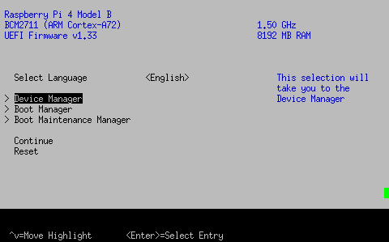
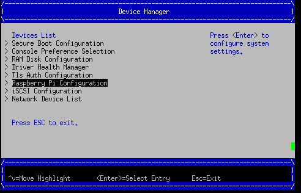
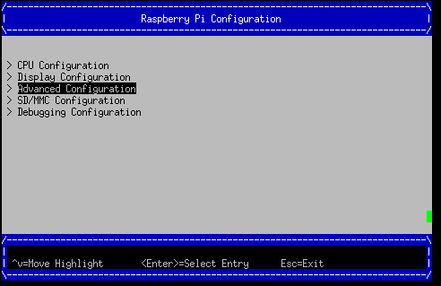
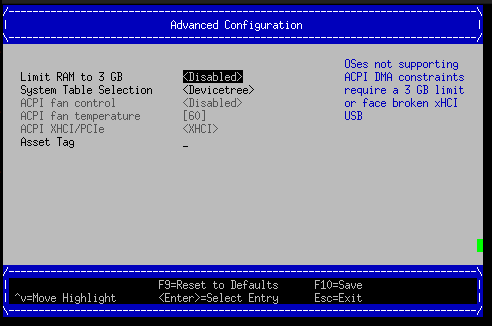
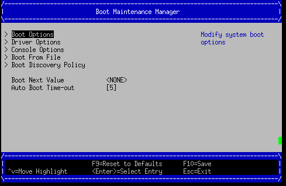
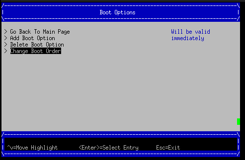
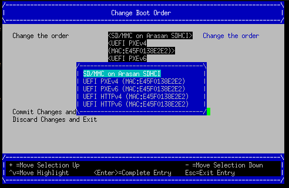
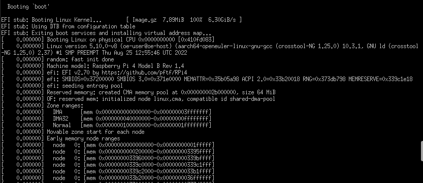
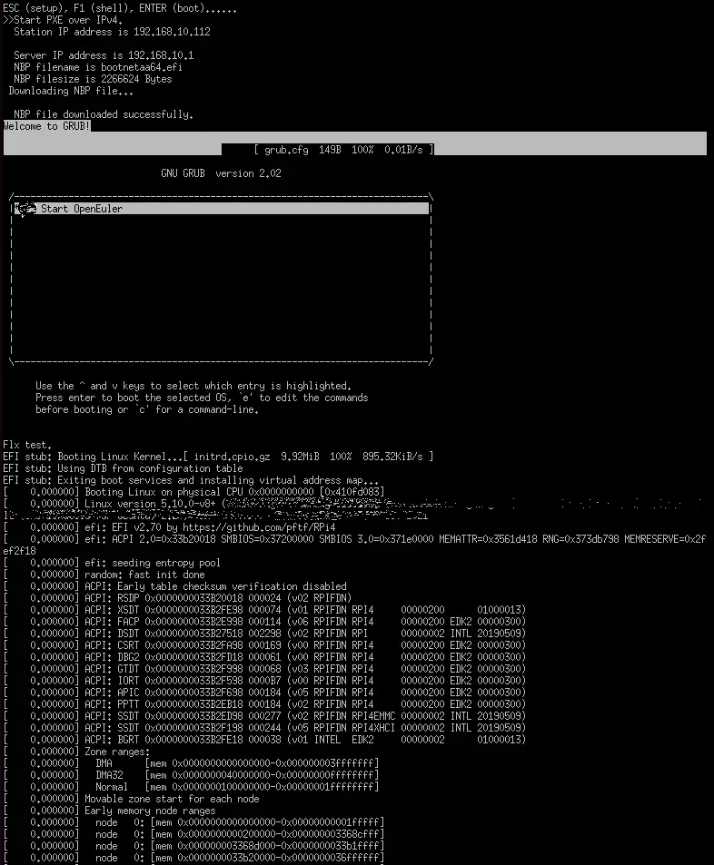

混合部署的从核启停依赖 UEFI 第三方固件支持 PSCI 标准实现，本文介绍如何使树莓派 4B 支持 UEFI，并可通过 SD 卡或网络启动 openEuler Embedded。

### 使用 openEuler Embedded UEFI+GRUB 的树莓派镜像

openEuler Embedded 的树莓派镜像集成了基于树梅派 4B 的混合部署环境依赖，因此建议直接使用 openEuler Embedded UEFI+GRUB 的树莓派镜像，该镜像对齐 tiny 镜像的软件包配置，并集成 openssh 支持网络登录、混合部署 mcs 依赖库及混合部署 mcs 预留内存 mcsmem dtoverlay。


### 构建树梅派 openeuler-image-uefi 镜像和烧录

分支支持要求：openEuler-22.09 及之后的主线 master 分支。

环境准备流程参考前期发布的《openEuler Embedded 对树莓派 4B 的支持》内构建指导部分。

 - 构建命令示例：

```
su openeuler
source /usr1/openeuler/src/yocto-meta-openeuler/scripts/compile.sh raspberrypi4-64 /usr1/openeuler/src/build/build-raspberrypi4-64/
bitbake openeuler-image-uefi
```

- 构建镜像生成示例：

```
openeuler-image-uefi-raspberrypi4-64-*.rootfs.rpi-sdimg
```

- 将 openeuler-image-uefi-raspberrypi4-64-*.rpi-sdimg 烧录到 SD 卡。

- openEuler 烧录参考《openEuler Embedded 对树莓派 4B 的支持》内镜像使用方法部分。

### openeuler-image-uefi 启动使用指导

**「步骤 1」**：烧录后首次启动需修改 UEFI 配置，启动阶段按 ESC 进入 UEFI，按下图操作解锁 3G 内存限制并关闭 ACPI 选用 DEVICETREE，保存重启后再操作步骤 2。









**「步骤 2」**：更改 boot order 或手动选择 SD 卡启动，如下，最后选择 Commit Changes and Exit。





**「步骤 3」**：启动


**「注意：」**

 - 此 UEFI 版本的固件默认使用 3G 内存 limit，可以在 UEFI 菜单中关闭 3G limit，否则系统启动后你看到的内存只有
   3G（参考官方配置说明：[https://github.com/pftf/RPi4/](https://github.com/pftf/RPi4/)
   ）。
   
-  该版本 UEFI+ACPI 部署方法有缺陷（HDMI 驱动异常），首次使用必须进入 UEFI 菜单，使用 DEVICETREE 模式。

### 手动刷新固件使树莓派 4B 支持 UEFI 引导
#### 环境/工具准备

- 编译工具链：可用 openEuler Embedded 的交叉编译工具链，参考[https://docs.openeuler.org/zh/docs/22.03_LTS/docs/Embedded/SDK 应用开发.html](https://docs.openeuler.org/zh/docs/22.03_LTS/docs/Embedded/SDK%20%E5%BA%94%E7%94%A8%E5%BC%80%E5%8F%91.html)。

- 设备：建议树莓派 4B 的出厂配置，包括树莓派 4B 基础套件和 SD 卡。

### openEuler Embedded 标准镜像 + UEFI 固件下载和刷新方法

#### 1 将 openEuler Embedded 树莓派镜像烧录到 SD 卡

如何获得 openEuler Embedded 树莓派镜像，参考前期发布的《openEuler Embedded 对树莓派 4B 的支持》。

```
# 假设镜像名 openeuler-image-raspberrypi4-64.rootfs.rpi-sdimg，SD卡识别为/dev/sda (linux环境)
sudo dd bs=4M if=openeuler-image-raspberrypi4-64.rootfs.rpi-sdimg of=/dev/sda
```

烧录完成后，将 SD 卡（boot 盘）根目录的 kernel8.img 文件压缩成 Image.gz：

```
# boot分区可能已经满了，移出kernel8.img再操作
mv SDbootVolumes/kernel8.img /tmp/Image
gzip -c /tmp/Image > SDbootVolumes/Image.gz
```

#### 2 下载树莓派 UEFI 固件

以 v1.33 版本为例，通过[https://github.com/pftf/RPi4/releases/download/v1.33/RPi4_UEFI_Firmware_v1.33.zip](https://github.com/pftf/RPi4/releases/download/v1.33/RPi4_UEFI_Firmware_v1.33.zip)下载树莓派 UEFI 固件，下载固件后解压，将除了bcm2711-rpi-4-b.dtb之外的所有文件拷贝到 SD 卡（boot 盘）根目录（覆盖之前的文件）:

```
# 备份bcm2711-rpi-4-b.dtb
cp SDbootVolumes/bcm2711-rpi-4-b.dtb /bakdir/bcm2711-rpi-4-b.dtb
cp -rf /xxx/RPi4_UEFI_Firmware_v1.33/* SDbootVolumes/
# 恢复使用备份的openEuler Embedded的dtb
cp /bakdir/bcm2711-rpi-4-b.dtb SDbootVolumes/
```

**「注意：」**

 - 3G 内存解锁和关闭 ACPI 使能 DEVICETREE 请参考上述“openeuler-image-uefi 启动使用指导”章节
   
- kernel8.img 不再需要，请务必删除，否则将影响启动。

#### 3 制作 grub 并选择启动方式

- SD 卡启动参考本文章节：树莓派 UEFI 之手动制作 grub 并通过 SD 卡启动 openEuler Embedded

- 网络卡启动参考本文章节：树莓派 UEFI 之手动制作 grub 并通过网络启动 openEuler Embedded

### 树莓派 UEFI 之手动制作 grub 并通过 SD 卡启动 openEuler Embedded

#### grub 准备（编译+制作 grub 启动组件）

**「grub 源码获取」**

下载地址：[https://github.com/coreos/grub/releases/tag/grub-2.02](https://github.com/coreos/grub/releases/tag/grub-2.02)

**「grub 组件编译」**

解压源码包并进入根目录，准备开始构建 arm64-efi（交叉编译）的 grub 库，注意此时交叉编译工具已经配置完毕，按如下步骤执行：

```
./autogen.sh
./configure --prefix=/xxx/grub-2.02/build --with-platform=efi --disable-werror --target=aarch64-openeuler-linux-gnu
make
```

构建成功后，在当前目录会生成对应的二进制和 grub 组件依赖库，其中 grub-core 即制作 grub-efi 需要的工具库，grub-mkimage 即制作板子 grub.efi 引导的 host-tool。

**「制作引导程序」**

接下来制作板子引导 grub 程序，下例输出名为 bootaa64.efi，生成后请放置到 SD 卡 boot 分区的对应目录（/EFI/BOOT/bootaa64.efi）：

```
./grub-mkimage -d ./grub-core -O arm64-efi -o bootaa64.efi -p '' ls grub-core/*.mod | cut -d "." -f 1
mkdir -p SDbootVolumes/EFI/BOOT
cp ./bootaa64.efi SDbootVolumes/EFI/BOOT/
```

「说明：」 xxxxx 目录中请不要带“.”，否则请适配上述语法。

**「制作引导配置文件」**

最后，编辑 grub.cfg 配置文件，grub.cfg 配置文件同 bootaa64.efi 放在一起（/EFI/BOOT/grub.cfg），就绪后在 UEFI 菜单中选择 SD 卡启动即可。grub.cfg 示例内容如下（后面是 cmdline 内容，linux gz 压缩的内核，使用 SD 卡分区，不需要 initrd）：

```
insmod gzio
set timeout=0

menuentry 'Start OpenEuler' {
echo "openEuler test."
linux /Image.gz coherent_pool=1M 8250.nr_uarts=1 snd_bcm2835.enable_compat_alsa=0 snd_bcm2835.enable_hdmi=1 bcm2708_fb.fbwidth=1824 bcm2708_fb.fbheight=984 bcm2708_fb.fbswap=1 smsc95xx.macaddr=E4:5F:01:38:E2:E2 vc_mem.mem_base=0x3ec00000 vc_mem.mem_size=0x40000000  dwc_otg.lpm_enable=0 console=tty1 console=ttyS0,115200 console=ttyAMA0,115200 root=/dev/mmcblk0p2 rootfstype=ext4 rootwait
}
```

「说明：」

上述内容需配合 openEuler Embedded 构建的树莓派镜像，并在 UEFI 非 ACPI（DEVICETREE）下使用，dtb 使用 openEuler Embedded 镜像中的内容。其中 Image.gz 即内核 Image 的 gzip 压缩，可通过gzip -c kernel8.img > Image.gz获得（若使用 openEuler Embedded 镜像），kernel8.img 不再需要，请务必删除，否则将影响启动。

## 树莓派 UEFI 之手动制作 grub 并通过网络启动 openEuler Embedded

#### 1 准备 PXE 部署服务器

以 ubunutu 14.04 为例，dhcp 中指定的 filename 就是 grub 的 efi 引导文件名。

假设服务器网段为 192.168.10.x，服务器 IP 为 192.168.10.1，网卡 eth0 用于 dhcp 服务，初始化服务器 IP 示例：

```
sudo ifconfig eth0 192.168.10.1 up
```

#### 2 使能 DHCP 服务

安装 DHCP 软件：

```
sudo apt-get install isc-dhcp-server
```

编辑`/etc/dhcp/dhcpd.conf `文件，例如：

```
allow booting;
allow bootp;
option domain-name "example.org";
default-lease-time 600;
max-lease-time 7200;
ddns-update-style none;

subnet 192.168.10.0 netmask 255.255.255.0 {
range 192.168.10.100 192.168.10.200;
filename "mygrub.efi"; #默认下载的grub文件名，和3中制作的efi引导程序名字需匹配
option routers 192.168.10.1;
next-server 192.168.10.1; #tftp服务器IP，PXE必须，HTTPBOOT可选
option broadcast-address 192.168.10.255;
}
```

配置 DHCP 服务网络接口，编辑文件`/etc/default/isc-dhcp-server`增加/修改字段：


INTERFACES=”eth0” #dhcp使用的网卡
启动 DHCP 服务：

```
sudo /etc/init.d/isc-dhcp-server restart
```

#### 3 使能 TFTP 服务
安装 TFTP 服务器软件:

```
sudo apt-get install tftpd-hpa
```

配置 TFTP 服务，编辑`/etc/default/tftpd-hpa`文件，例如：

```
TFTP_USERNAME="tftp"
TFTP_ADDRESS=":69"
TFTP_DIRECTORY="/var/lib/tftpboot/"
TFTP_OPTIONS="--secure -l -c -s"
```

启动 TFTP 服务：

```
sudo /etc/init.d/tftpd-hpa restart
```

#### 4 grub 准备（编译+制作 grub 启动组件）

 - 「grub 源码获取」

下载地址：[https://github.com/coreos/grub/releases/tag/grub-2.02](https://github.com/coreos/grub/releases/tag/grub-2.02)

 - 「grub 组件编译」

解压源码包并进入根目录，准备开始构建 arm64-efi（交叉编译）的 grub 库，注意此时交叉编译工具已经配置完毕，按如下步骤执行：

```
./autogen.sh
./configure --prefix=/xxx/grub-2.02/build --with-platform=efi --disable-werror --target=aarch64-openeuler-linux-gnu
make
```

构建成功后，在当前目录会生成对应的二进制和 grub 组件依赖库，其中，grub-core 即制作 grub-efi 需要的工具库，grub-mkimage 即制作板子 grub.efi 引导的 host-tool。

 - 「制作引导程序」

接下来制作板子引导 grub 程序，下例输出名为 mygrub.efi：

```
./grub-mkimage -d ./grub-core -O arm64-efi -o mygrub.efi -p '' ls grub-core/*.mod | cut -d "." -f 1
```

「说明：」

xxxxx 目录中请不要带“.“，否则请适配上述语法。

- 「制作引导配置文件」

最后，编辑 grub.cfg 配置文件，grub.cfg 配置文件放在 tftp 的根目录（/var/lib/tftpboot/grub.cfg），就绪后在 UEFI 菜单中选择 IPV4 网络启动即可，grub.cfg 示例内容如下（Image.gz 后面是 cmdline 内容，linux gz 压缩的内核，initrd 文件系统）：

```
insmod gzio
set timeout=0

menuentry 'Start OpenEuler' {
echo "openEuler test."
linux /Image.gz coherent_pool=1M 8250.nr_uarts=1 snd_bcm2835.enable_compat_alsa=0 snd_bcm2835.enable_hdmi=1 bcm2708_fb.fbwidth=1824 bcm2708_fb.fbheight=984 bcm2708_fb.fbswap=1 smsc95xx.macaddr=E4:5F:01:38:E2:E2 vc_mem.mem_base=0x3ec00000 vc_mem.mem_size=0x40000000  dwc_otg.lpm_enable=0 console=tty1 console=ttyS0,115200 console=ttyAMA0,115200
initrd /initrd.cpio.gz
}
```

### 附：网络启动时内核 Image.gz 和文件系统 initrd 的来源说明

#### 文件系统例子

若使用网络启动，可使用 openEuler Embedded 构建的标准树梅派镜像构建过程中的 rootfs 并手动打包，也可使用 openEuler Embedded 发布的 qemu-aarch64 参考文件系统 （https://repo.openeuler.org/openEuler-22.03-LTS/embedded_img/arm64/aarch64-std/openeuler-image-qemu-aarch64-20220331025547.rootfs.cpio.gz）

手动打包 rootfs 例子（预先需准备 openEuler Embedded 树梅派已构建完成的环境）：

```
# 假设已经处于构建build目录
cd tmp/work/raspberrypi4_64-openeuler-linux/openeuler-image/1.0-r0/rootfs/
find . | cpio -H newc -o | gzip -n9c > ../initrd.cpio.gz
# 生成在上层目录的initrd.cpio.gz即为所需文件系统
```

「说明：」

配置文件系统/etc/inittab 时注意 getty 登录时串口重定向要配置正确，否则可能没有打印。（树莓派 4B 硬件串口 PL011 对应，引脚 14TXD 和 15RXD）

#### 内核例子

若使用网络启动，可使用 openEuler Embedded 构建的标准树梅派镜像中的 kernel8.img，格式即 Image，然后通过 gzip 压缩为 Image.gz 格式。

内核单独编译例子（openEuler）
参考 openEuler 树莓派交叉编译内核 ：https://gitee.com/openeuler/raspberrypi/blob/master/documents/交叉编译内核.md

「注意：」

 - 若使用上述 UEFI+ACPI 部署方法，必须在 config 中开启 ACPI 系列功能支持。在make menuconfig ARCH=arm64菜单中，选中 ACPI 默认系列支持。建议在 UEFI 中关闭 ACPI 选用 DEVICETREE（参考 openeuler-image-uefi 启动使用指导相关配置）。
   
- 编译生成的 Image，在上述 efi 配置下，grub.cfg 的 Linux 格式需使用 gz 命令压缩成 Image.gz。

#### 操作说明

将上述内核和文件系统，放在 tftp 服务目录（/var/lib/tftpboot）下即可进行网络启动。

网络启动基本流程如下：

1. DHCP 服务器给单板分配 IP

2. 单板启动 UEFI 选择 PXE 启动

3. PXE 根据 DHCP 的 filename 和 tftp 服务器地址，从 tftp 服务器下载 mygrub.efi

4. 进入 grub 引导程序，根据 grub.cfg 配置，从对应 tftp 目录下载文件系统和内核并加载启动

其中，使用的 ACPI 资源表/DTB 是 UEFI 固件初始化好的（引导内核前已放在对应内存），不过 cmdline/bootargs 可通过 grub.cfg 进行配置，在加载内核时，grub 会传递给 UEFI 并上报给系统。



### 关注我们

Embedded 已经在 openEuler 社区开源。将开展一系列主题分享，如果您对 Embedded 的构建，应用感兴趣，欢迎围观和加入。


Embedded SIG：
[https://www.openeuler.org/zh/sig/sig-detail/?name=sig-embedded](https://www.openeuler.org/zh/sig/sig-detail/?name=sig-embedded)

项目地址：
[https://gitee.com/openeuler/yocto-meta-openeuler](https://gitee.com/openeuler/yocto-meta-openeuler)

欢迎大家多多 star、fork，多多参与社区开发，多多贡献。