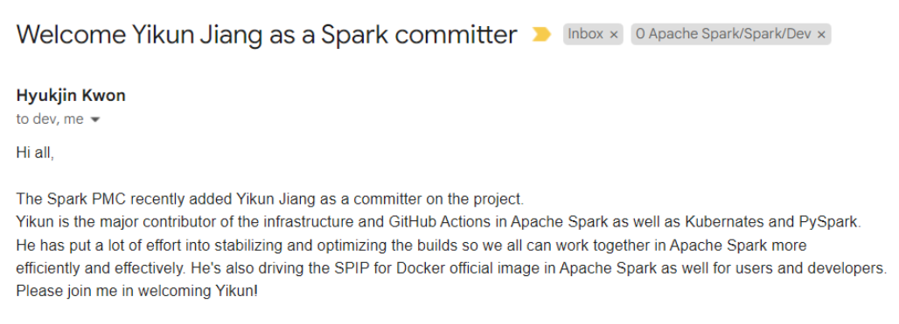

2022年10月初，openEuler Maintainer 姜逸坤接受Apache Spark PMC邀请，正式成为Apache Spark Committer（核心贡献者）[1]。

他的主要贡献是Apache Spark在基础设施、云原生、PySpark等方向的改进。

## 开源之路，从懵懂到深入

姜逸坤2016年加入华为计算开源团队，先后成为OpenStack社区 (OpenInfra基金会) Core Member、openEuler社区 (开放原子开源基金会) Maintainer、Volcano社区 (CNCF基金会) Reviewer、Spark社区 (Apache基金会) Committer，横跨多个顶级开源社区的经历让他快速完成知识积累和个人成长，而他对于技术和开源的热爱始终如一。

## 从多样性算力支持到Apache Spark核心贡献者

penEuler 作为最优支持多样性算力的原生操作系统，支持x86、ARM、RISC-V、LoongArch、SW64 等多种处理器架构，而开源社区的应用软件多架构支持最初并不完善，应用软件的短板使得openEuler社区用户无法充分、便利地发挥多样性算力的最大价值。

早在2019年，逸坤所在团队就开始了开源社区的多架构支持工作，在Apache Spark社区，他与团队成员和Spark社区协作共同完成了ARM64架构的适配，并且在Apache Spark 3.0.0版本正式支持ARM64架构（SPARK-30057），为Spark社区添加了 ARM CI 确保Spark在ARM64平台持续可用（SPARK-29106）。

随着在Spark社区贡献的逐步深入，他所做的工作从最初的多样性算力适配，慢慢地变为多样性算力架构级的增强。2021年11月，逸坤作为第一作者，联合华为、Apple、Netflix、Cloudera等开发者在Spark社区共同完成特性的设计和代码开发——《Spark-36057: 支持Spark on Kubernetes自定义调度功能》，并以Apache Spark + Volcano调度系统作为参考实现合入到社区，最终在Apache Spark 3.3.0版本作为亮点特性发布，增强了Spark多样性算力调度能力。随后，openEuler社区中的众多大数据用户（如华为、亚信、中国系统等），开始集成该方案到其下游的产品和服务中，以增强队列调度、资源预留、多样性算力调度的能力。“Upstream first”，并积极推动下游开源用户使用，是他一直坚持的理念。

近期，他在Apache Spark社区发起了一个新的提案——《SPARK-40513: 为Spark提供Docker官方镜像支持》，这个提案为Apache Spark社区提供官方容器镜像规范、标准及参考实现，并发布镜像，目前已获得Spark社区全票通过。这为后续诸如openEuler等操作系统更高效、更高质量地完成定制Spark大数据应用镜像奠定了基础。

同时，逸坤通过他在云计算、云原生、基础设施、ARM CI等领域的积累，为Apache Spark社区的基础设施稳定和优化付出了很多努力。最终，顺利获得了Apache Spark社区的认可，成为Apache Spark Committer。

## 让openEuler与外部开源社区更好的连接、融合

Apache Spark社区的贡献仅仅是一个缩影，逸坤和他所在的团队持续活跃在openEuler社区的大数据、OpenStack、云原生、HPC、基础设施等SIG组，努力将openEuler社区连接并融入到更广阔的开源世界。也欢迎更多的人加入进来，让openEuler社区与外部开源社区更好融合，产生更多伟大的合作与创新！

[1] Welcome Yikun Jiang as a Spark committer https://lists.apache.org/thread/xftwh05x64sbwp3k0qbp24mwp2bqdch9

[2] SPIP: Support Customized Kubernetes Schedulers https://issues.apache.org/jira/browse/SPARK-36057

[3] SPIP: Support Docker Official Image for Spark https://issues.apache.org/jira/browse/SPARK-40513