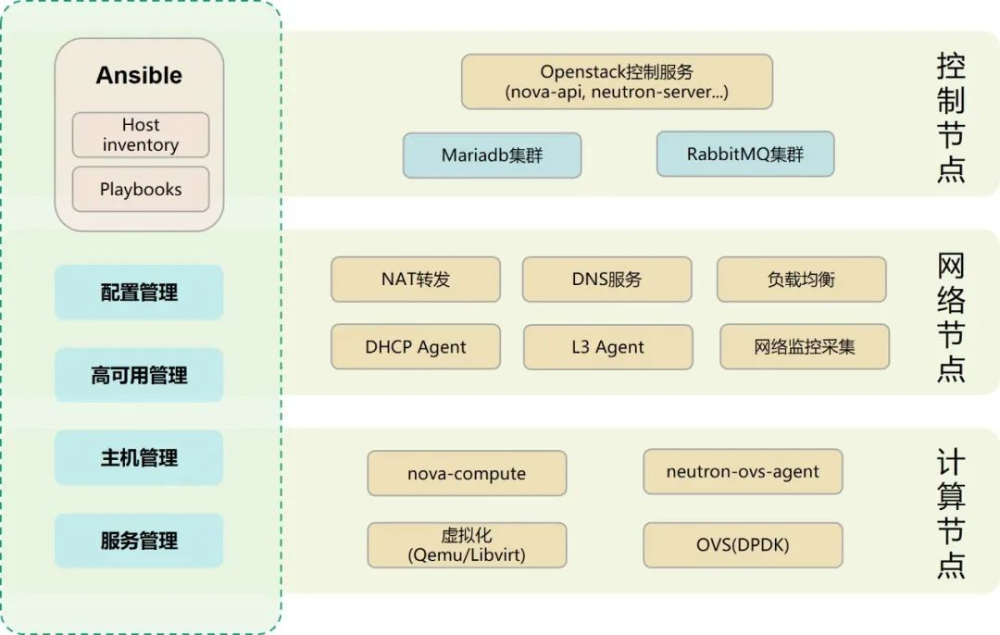

2022年8月，经openEuler开源社区技术委员会审议通过，联通数科正式将opensd开源至openEuler开源社区。

opensd是联通数科为解决OpenStack企业级部署的复杂性，针对自身OpenStack产品开发的一套自动化部署工具，可以让交付人员使用管理文本的方式，实现主机配置管理、OpenStack及其依赖的基础组件的安装与配置管理，极大地简化了OpenStack服务的部署过程。

opensd初始开源版本可用于部署OpenStack Rocky版本高可用服务。在openEuler-22.09中，opensd已增加对OpenStack Yoga版本及Python3的支持，可用于对keystone、glance、cinder、placement、nova、neutron等服务的部署，已通过在arm64和x86架构环境下的安装及部署验证测试。

### 技术架构：

opensd是使用ansible编写的自动化部署工具，将OpenStack各组件的检查、数据库配置、安装前准备、认证、安装过程、安装完成后的配置等细节组织成“剧本”(Playbooks)，同时将各组件以“角色”（Roles）的形式体现出来，结构清晰易懂，配置简单实用。用户通过修改安装、配置过程中对应的“剧本”就可以实现定制化集群部署。

### 功能特色：

支持OpenStack Rocky、Yoga版本的部署；

支持大规模场景下nova cell v2 分离部署；

支持cinder、glance多ceph后端等复杂场景下的OpenStack部署。

### 未来规划：

opensd由OpenStack SIG进行开发维护，计划在openEuler-22.03-LTS-SP1中继续进行开发，将增加对OpenStack Train版本的支持。

欢迎朋友们加入opensd项目，

一起做点有意思的事儿。

项目地址：

https://gitee.com/openeuler/opensd

联通数科作为欧拉社区的贡献者，发起成立并参与贡献OpenStack SIG，持续参与OpenStack在openEuler操作系统的适配工作，助力欧拉操作系统云化基座实现，与欧拉社区一起合力打造更适合云计算发展的操作系统。

