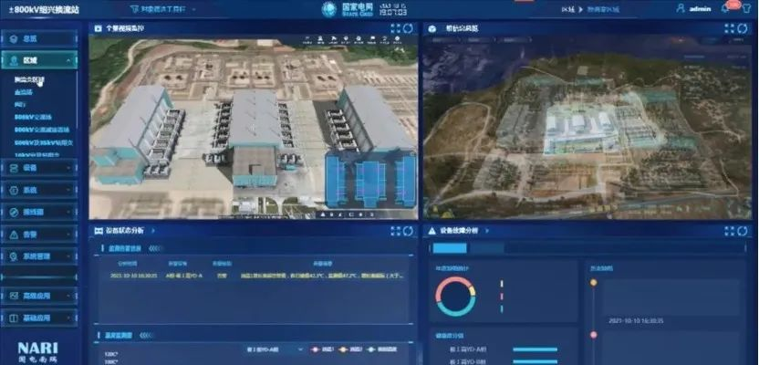

近日，采用麒麟信安操作系统和华为泰山系列服务器的国网宁夏电力灵州数字换流站投入试运行，标志着我国首批数字换流站核心系统进一步实现自主创新。

据悉，数字换流站是通过融合虚拟现实、数字孪生等技术，构建底层物物互联、人机互联、融通共享、迭代敏捷的数字换流站体系，实现设备状态全面感知、缺陷及早发现、异常主动预警、健康深度管控、应急处置高效等设备管理"五种能力"的全面提升。除国网宁夏电力灵州数字换流站外，麒麟信安还全程参与了山东沂南、江苏泰州、浙江绍兴等国家电网首批四座数字换流站覆盖全国40座特高压的操作系统建设实施工作，为数字换流站试点项目提供了以麒麟信安操作系统为安全底座的联合解决方案，切实满足了特高压背景下电力行业对高安全、高可靠和强实时等严格要求，强力保障直流输电系统安全稳定运行。

-- 图片来源于国网浙江电力官微 --

麒麟信安是openEuler首批商业发行版的厂商，并结合自身优势，在操作系统安全性、可靠性、实时性及虚拟化方面进行了创新开发，面向电力等行业应用场景挖掘价值。此次数字换流站试点项目是麒麟信安联合华为在国家电网的首次深度合作，是麒麟信安针对特高压的换流站设备，实现高安全、高可靠的国产自主系统创新。依托多年的技术优势和创新实践，麒麟信安具备与openEuler LTS同步发行商业版本的能力，并持续进行产品迭代演进，深耕行业需求叠加生发出更多新应用新场景，实现操作系统与行业属性深度耦合，携手openEuler为电力等关键领域提供稳定可靠的数字基础设施操作系统，赋能诸多关键行业应用。

基于openEuler开源创新与应用实践，麒麟信安正加速与电力能源企业在发电、配电、输电、变电等各大电力细分领域开展全方位合作，打造了覆盖安全操作系统、云桌面、存储加密系统等多层次、多样化的产品体系。目前，基于麒麟信安操作系统的联合增值解决方案已全面落地应用，麒麟信安以产品、场景、应用的多维度技术实力，助力电力行业数字化体系建设。

接下来，麒麟信安将携手华为等产业链上下游伙伴共同构建自主创新国产基础软硬件平台，继续推进以芯片和操作系统等为基础的安全联合解决方案在数字换流站等更多电力行业场景实现落地应用，促进新型电力系统关键技术实现创新突破。以openEuler为底座的数字系统正面向重要行业和应用场景融合创新发展，成为为数字经济发展的巨大推动力，欧拉生态也将持续繁荣。

