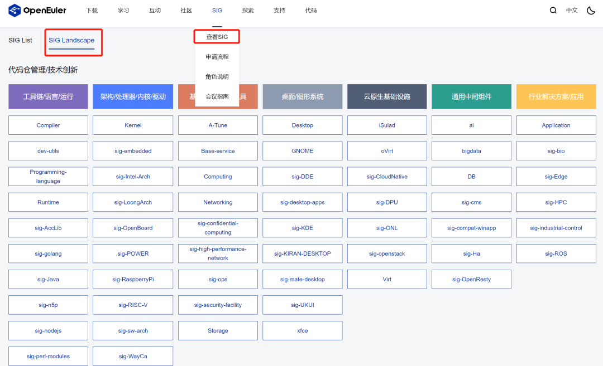
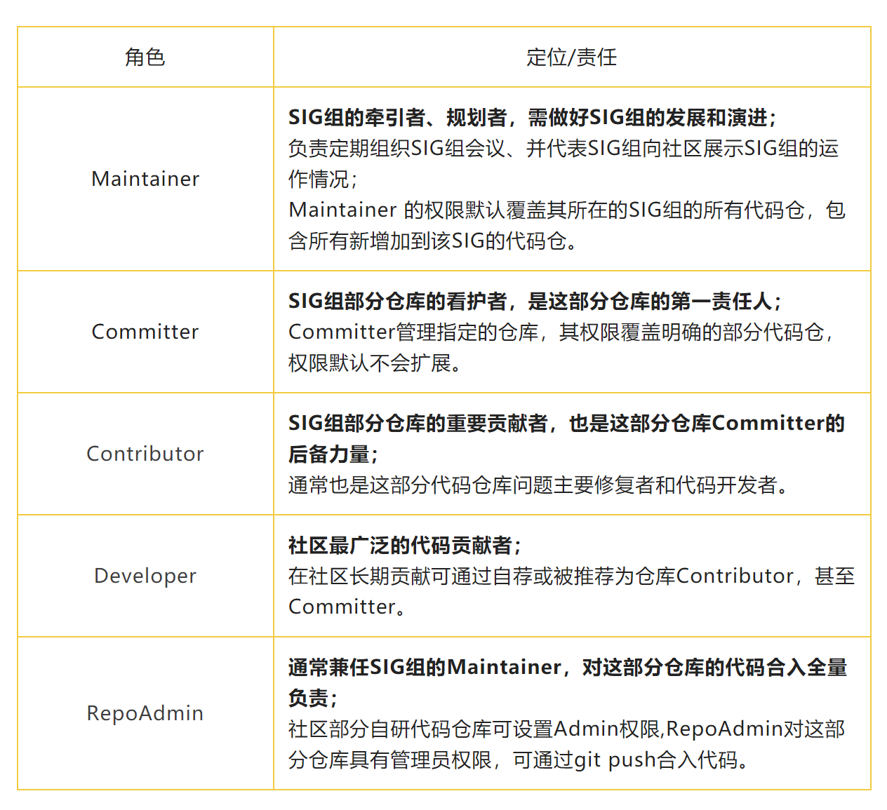
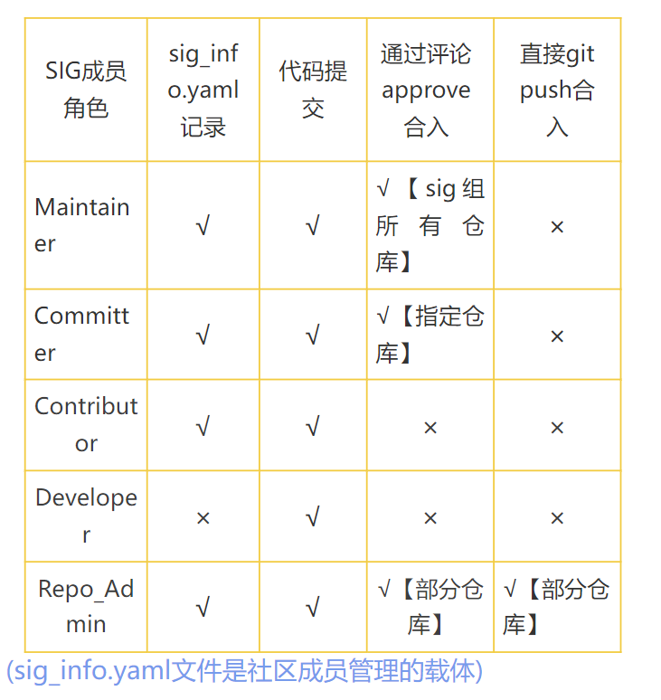

SIG，即 Special Interest Group（特别兴趣小组）。它是openEuler社区的开发者们为了更好地管理和发展社区技术生态，根据多样性计算、云原生全栈、全场景协同、大数据与AI、兼容性与迁移等不同领域方向自发组织的兴趣小组。

不管是萌新学员，还是开源老司机，均可以按照自己的兴趣加入不同的SIG组，找到志趣相投的朋友，带着用户需求，一起开发一起实现！

开源至今，开发者们已在openEuler社区成立近百个SIG组。社区不少小伙伴都比较好奇，这些SIG组都有哪些成员角色？又是怎么管理运作的？下面我们来详细说说。

下图为 openEuler SIG Landspace（部分SIG展示）

### SIG组成员角色划分

在openEuler社区，SIG 组的核心成员主导该SIG的治理，与组内成员共同推动交付成果的输入，并争取让交付成果成为openEuler社区版本发行的一部分。

通过和多个SIG组讨论，并经过社区TC委员会确认，openEuler社区对SIG组成员角色进行如下划分，并承担相应的责任：

### SIG成员角色权限划分

在SIG组中，不同角色承担不同的责任，尤其在社区Gitee代码托管平台，明确每个角色的权限划分，有助于代码仓更好地管理与工作，也让社区小伙伴们能够更好地交流，参与社区贡献。

SIG成员角色权限划分如下：

### SIG组成员管理

上文中提到的sig_info.yaml文件是社区成员管理的载体。因此，每个SIG组都需要新增一份sig_info.yaml文件以便进行SIG管理。

sig_info.yaml文件主要由Maintainer和Committer编写，具体的编写方式可以查看：

https://www.openeuler.org/zh/blog/georgecao/openEuler-sig-member-management.html

在进行sig_info.yaml 文件配置时，需要包含：

1.  需要配置全局的Maintainer，且Maintainer对sig组所有仓库都有合入权限（继承原Maintainer逻辑）；

2. 可以在部分仓库下添加这些仓库特有的Committer，Committer仅有这一部分仓库的合入权限；

3. 可以在部分仓库下新增Contributor字段，并列出关联成员的GiteeID。Contributor作为仓库的主要贡献者，无代码合入权限；

4. 可以在部分仓库下新增Admin字段, 并列出关联成员的GiteeID。Admin字段内的成员对这部分仓库具有管理员权限，可通过git push合入代码。

注意：sig_info.yaml 文件已与OWNER文件进行兼容。只有当前SIG目录下OWNER文件被删除后，sig_info.yaml信息才会生效；OWNER文件存在时则继续保持原成员关系和权限管控功能。

如果您对该方案有任何疑问，可邮件至：

george@openeuler.sh进行联系。

如果您对操作系统感兴趣，欢迎加入openEuler！

1. 点此查看openEuler SIG Landspace，快速了解SIG组的分布，加入自己感兴趣的技术领域。

https://www.openeuler.org/zh/sig/sig-list/

2. openEuler SIG申请流程：

https://www.openeuler.org/zh/sig/sig-guidance/

