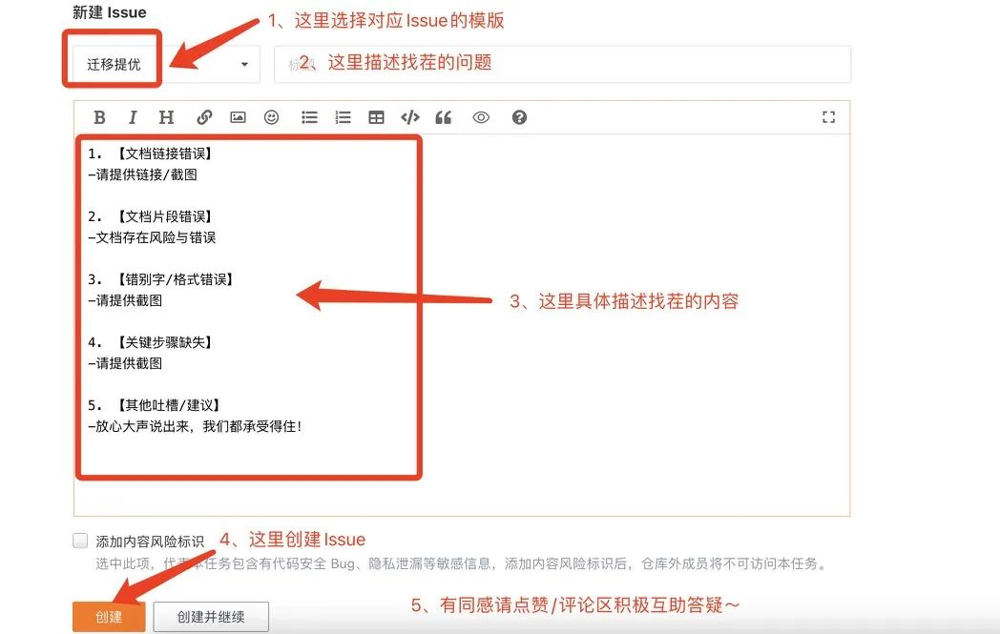
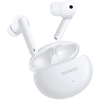
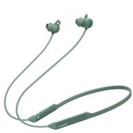
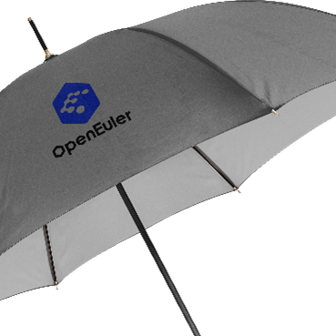

Hey， openEuler的开发者、用户们看过来！

一个小细节！发现了吗？

迁移专区升级啦

为了进一步提升迁移专区的资料质量和使用体验

结合朋友们给予社区的心声和建议

openEuler社区推出找茬儿有奖活动：

“openEuler官网迁移专区提优活动”

你对官网迁移专区有什么想说的

想聊的、想吐槽的、建议优化的

都可以大声说出来！

放心！我们都承受得住！

还有HUAWEI 无线耳机大奖、社区周边好礼等你来拿！

### 活动方式

1. 体验新版本openEuler官网迁移专区[1]；

2. 在兼容性SIG新创建一个带【迁移提优】标题的Issue[2]，写下您的建议；

3. Issue的内容需要与迁移专区相关，如错别字、链接不对、格式出错、代码片段错误、关键步骤缺失、其他建议等；

4. 活动特设立互助学霸奖、同感奖、参与奖。参与结果按不同奖项进行排名。

下图为Issue创建的示例：

### 活动奖励

#### 1. 互助学霸奖 3 名

鼓励社区成员积极互助，提供自己的经验帮助回答Issue中能解决的问题，每得到1位提问者感谢回复，可获得3积分，即互助完成。大于10积分的用户可参与本活动的积分排名，前3名将获得HUAWEI FreeBuds4i无线耳机。

#### 2. 同感奖3名：

鼓励用户提出大家共同关心的问题，有利于技术专家团队快速响应解决。按Issue的点赞量排序，前3名将获得HUAWEI FreeLace无线耳机。

#### 3.参与奖20名：

鼓励用户积极参与提问，参与即可获得openEuler定制雨伞，按Issue的时间先后顺序排名。

### 活动时间

2022年11月4日-2022年11月18日

### 活动（捉虫）地址

[1] 迁移专区：

https://www.openeuler.org/zh/migration/

[2] 兼容性SIG：

https://gitee.com/openeuler/oec-application/issues

### 注意事项

1. 创建的Issue和回复需与openEuler迁移专区相关，需对内容进行配图说明，不得抄袭引用；

2. 每用户最多仅获得一次奖励，不可重复获奖；

3. 活动参与时间需在活动期内，即2022年11月4日-2022年11月18日，逾时不候；

4. 活动结束后7个工作日内公布获奖名单，在公示后7日内提交有效的收件信息给openEuler小助手，核实无误后将安排寄送奖品，逾期视为自动放弃；

5. 获奖通知请留意Gitee私信，关注活动动态详情请添加openEuler小助手‘openeuler123’，备注【迁移】进入Migrate to openEuler用户交流群。

6. openEuler社区对本次活动具有最终解释权。

