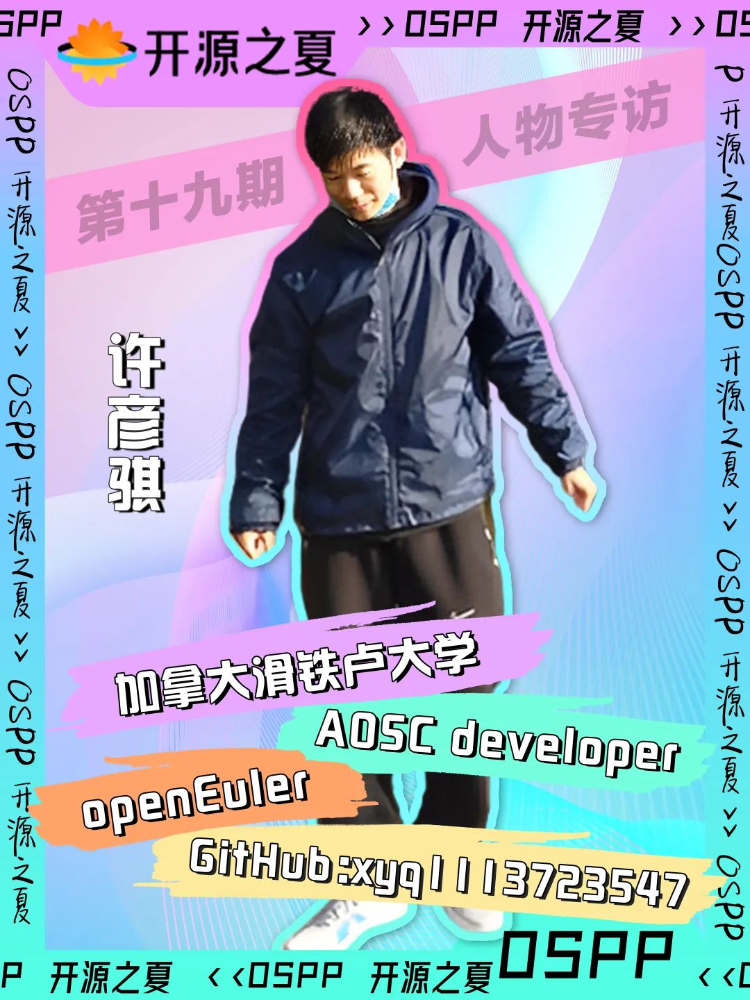
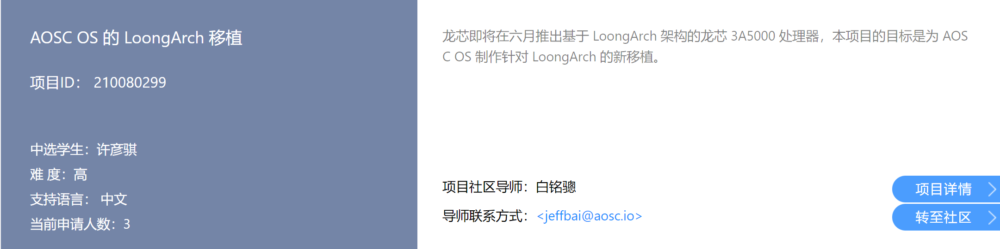
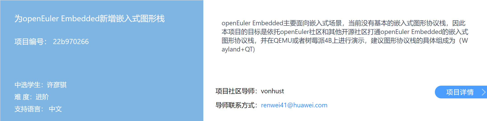

加拿大滑铁卢大学本科大四学生许彦骐，在本次开源之夏活动中出色地完成了openEuler社区的开发任务，自身对开源有着自己一份独特的理解。本期，我们很荣幸邀请到这位开源爱好者，来讲讲他的故事。

本期参与人物采访专栏的是来自 openEuler 社区的许彦骐同学，本届开源之夏承担的项目是【为 openEuler Embedded 新增嵌入式图形栈】

### 自我介绍

OSPP：请简单介绍一下自己

许彦骐：我是许彦骐，加拿大滑铁卢大学本科大四在读国际生，主修计算机科学。目前暂居格鲁吉亚，即将返回加拿大。

OSPP：最初是怎样接触到开源的？介绍一下自己的开源项目经历？

许彦骐：最初接触到开源还是受到 Linux 的影响，高中的时候使用过 Ubuntu 一段时间，后来因此了解到了其他的发行版，比如 Debian, Arch Linux 以及小众的 Puppy Linux, TinyCore Linux。开源项目我最开始了解到是 Google Summer of Code，在找导师的时候加了关于 GSoC 的中文微信群，因此就了解到了 OSPP。

OSPP：作为一名开源老将，你眼中的开源是什么？

许彦骐：从狭义上来讲，我眼中的开源是源代码开放，任何人都可以免费阅读并下载。从广义上来讲，开源也是一种“人人为我，我为人人”的互助模式，对全球 IT 行业都有很大的影响。

OSPP：可以跟大家分享一下你最喜欢的编程语言或开源项目吗？

许彦骐：我比较喜欢的开源项目有 FFmpeg, OpenCV, 编程语言则是 C/C++, Python。

### 参与开源之夏

OSPP：这次是你第二次参加开源之夏活动了，当初为什么选择参与开源之夏？第二次参与活动有什么不一样的感受或体验么？

许彦骐：当初选择参与开源之夏是因为活动运行模式跟 Google Summer of Code 差不多，同时中文作为主要语言没有交流障碍。第二次参加的感觉比去年那次轻松不少，可能是因为没有中期考核以及项目本身难度差异的原因。

OSPP：简单介绍一下你去年的项目吧，结项后有再继续参与项目贡献或维护么？

许彦骐：去年项目是【AOSC OS 的 LoongArch 的移植】，社区购买的移植机器的 CPU 是龙芯 3A5000。LoongArch 是一套由龙芯中科研发的指令集架构，与 MIPS, RISC-V 有一定的相似处，不过它是完全独立且不兼容其他指令集。去年结项后有给 AOSC 贡献过一些 PR，不过 LoongArch 移植项目本人并没有继续维护，原因是 LoongArch 实际上有两套 ABI 且互不兼容，Linux 内核，编译工具链，Glibc 库目前必须同时选用龙芯推送到开源社区上游的新版本，以及所有的依赖于具体架构的软件包都需要重新编译打包，工作量很大。

https://summer-ospp.ac.cn/2021/#/org/prodetail/210080299

OSPP：介绍一下你今年在开源之夏中选的项目及开发情况吧

许彦骐：今年项目是 【为 openEuler Embedded 新增嵌入式图形栈】，在树莓派4B上测试并演示，图形协议栈的具体组成为 Wayland + Qt5。开发项目是利用 openEuler Embedded 的工具 yocto-meta-openeuler 实现了在 x86_64 上交叉编译 Arm64 上的图形栈软件源码，使树莓派上能通过 DRM/KMS 而不是老旧的 Linux framebuffer 运行 3D 图形显示，通过 Weston 的引入实现了 Wayland compositor。在此之上添加了 QtWayland，能运行简单的基于 Qt 的图形应用，如 helloworld-gui[1], qt5-opengles-test[2]。

https://summer-ospp.ac.cn/#/org/prodetail/22b970266

OSPP：项目开发期间，社区和导师给你带来怎样的帮助？
许彦骐：社区主要是针对已有软件包的编译构建问题进行答疑解惑，以及支撑图形栈所需的基础软件包的添加、构建、以及测试。导师则是提出具体的项目计划，以及专业的意见，比如先让我用原版 yocto poky 来尝试编译图形栈的内容。
OSPP：在项目进行中遇到的印象最深刻的问题是什么？如何解决的？有什么收获吗？

许彦骐：记忆最深刻的问题是树莓派 4B 的 DRM/KMS 的生成问题。DRM/KMS 属于 Linux 内核的一部分，但是依赖于树莓派的内核分支以及闭源固件。解决方案则是通过编译固定版本且带有树莓派补丁的 openEuler 内核源码，搭配固定版本的树莓派闭源固件来解决。收获则是对 Linux 图形栈有更底层的理解，以及开始明白开源固件的重要性。

### 社区成长经历

OSPP：请简单介绍一下你参与开源社区的经历

许彦骐：最早我是在海外龙芯开源社区群聊天，去年入选后便在 AOSC 参加过几次在线聚会，到现在经常也会看 AOSC 的聊天频道。AOSC 主要在软件编译打包，Rust 支持，多语言支持和中文翻译，以及上古计算机上着力，同时能学到一些偏软件底层以及硬件的知识。

OSPP：你有着很丰富的实习经历，你认为在开源社区和在企业公司进行开发工作有什么不一样的地方？

许彦骐：开源社区从组织上来说比企业公司会松散得多，而且一些开源社区是完全不考虑商业化的，因此在社区工作上也是比较随缘的。而企业公司则一般会要求固定的时间和地点去工作，同时任务目标明确，运维、网络、数据库通常也是不同的小组在做，追求的通常是商业方面的工作效率和技术上的市场竞争。

OSPP：你对于自己日后在社区的发展有怎样的规划？

许彦骐：目前的打算还是先顺利毕业，社区沟通交流上如果有人咨询，看情况会给一些应有的帮助。

OSPP：你认为对于在校生而言，如何从零开始参与开源社区？

许彦骐：本人认为对于在校生而言，从零开始参与开源社区需要的可能并不是单纯的技术能力，而是时间和兴趣。可以先在社区的交流群上多看，多交流，从而了解到社区需要的技术、待解决的问题等等。同时还要看跟个人兴趣的匹配程度，如果跟自己的兴趣所匹配，就可以尝试加入开发，提交自己的 PR。如果是海外的开源社区，英语表达、语法、拼写上要多注意，英语课本上的表达远远不够，单纯地依赖翻译软件也容易出错。可以先多看海外的英文技术文章，官方文档来学习基础表达和知识。

### 收获与寄语

OSPP：之前积累的专业知识和项目经验对你完成此次的项目任务有什么帮助吗？

许彦骐：之前积累的专业知识和项目经验对完成项目帮助挺多的，比如之前有学习过编写 Bash 脚本，在 AOSC 编译打包了许多软件包，对基本的 Linux 概念，软件依赖，交叉编译都有实际的操作经验。了解到 openEuler Embedded 所使用的 yocto-meta-openeuler 本质上是 Python 加 Bash 脚本，能够自动让一系列软件包下载、编译、打包。因此我排查错误的时候就有了基本的技术判断。

OSPP：你认为参与开源对于计算机相关专业的大学生来说是必要的吗？

许彦骐：个人认为参与开源对于计算机相关专业的大学生来说其实也不是必要的。如果能在软件大公司学习也是很好的选择，他们能够提供完整的软件开发工具，长期的商业支持，以及广泛的用户基础。

OSPP：你身边学生群体中的开源参与氛围怎么样？

许彦骐：加拿大学生参与开源的氛围比较好，尤其是滑铁卢大学，许多的开源软件、Linux 发行版在滑铁卢大学都有 mirror，我的大学同学也有加入 FreeBSD 做实习的，同时在 AOSC 也有滑铁卢大学的同学。

OSPP：为参与开源之夏的同学提供一些经验与建议吧

许彦骐：开源之夏的同学们可以在阿里巴巴开源镜像站上找开源软件，操作系统等。Git 操作可以边实践边学习，Gitee 网页最下方就有命令学习和大全。在国外的同学推荐使用 Google 搜索英文技术内容，在国内的同学也可以使用 bing 和 duckduckgo。

### 相关链接

[1] https://github.com/enjoysoftware/helloworld-gui

[2] https://github.com/mer-qa/qt5-opengles2-test
