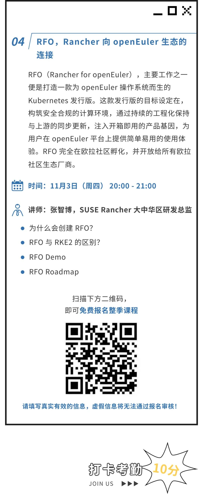

第三期课程「K3s，并非为了轻量而是简单易用」已圆满结束，课程讲义获取方式在文末自取哦！

### Rancher Kubernetes 发行版

### 应用精讲训练营｜第四期

#### 打卡考勤

打卡本期课程，即可获得10分考勤分！

本季课程结束之后，将会为符合评分标准的小伙伴颁发结课证书。

参与直播课程：每期10分，共40分

在线结课考试：满分为60分，共20道选择题

总积分超过75分者，即可获得 SUSE Rancher 颁发的官方结课证书！打卡3期及以上课程的小伙伴才能获得考试资格，所有参加考试的小伙伴可免费解锁一套 SUSE Rancher 限量版磁力徽章！

友情提示：

请在报名时填写真实有效的手机号和邮箱，以便积分的统计与核对，后续您将通过预留信息收到课程开播提醒和考试通知。

### 第三期课程回顾

#### K3s，并非为了轻量而是简单易用

-  K3s 介绍

-  K3s 安装

-  K3s 升级

-  K3s 备份和恢复

-  K3s 高级功能介绍

-  K3s 衍生项目

#### 课程讲义：

在 Rancher 微信公众号内回复“221027”，

即可获取 PPT 下载链接

#### 第三期 QA 链接：

https://docs.qq.com/doc/DRHBJZ0ZMbnJ6Znds

### About SUSE Rancher

Rancher是一个开源的企业级Kubernetes管理平台，实现了Kubernetes集群在混合云+本地数据中心的集中部署与管理。Rancher一向因操作体验的直观、极简备受用户青睐，被Forrester评为“2020年多云容器开发平台领导厂商”以及“2018年全球容器管理平台领导厂商”，被Gartner评为“2017年全球最酷的云基础设施供应商”。

目前Rancher在全球拥有超过三亿的核心镜像下载量，并拥有包括中国联通、中国平安、中国人寿、上汽集团、三星、施耐德电气、西门子、育碧游戏、LINE、WWK保险集团、澳电讯公司、德国铁路、厦门航空、新东方等全球著名企业在内的共40000家企业客户。

2020年12月，SUSE完成了对RancherLabs的收购，Rancher成为了SUSE"创新无处不在(Innovate Everywhere)"企业愿景的关键组成部分。SUSE和Rancher共同为客户提供了无与伦比的自由和所向披靡的创新能力，通过混合云IT基础架构、云原生转型和IT运维解决方案，简化、现代化并加速企业数字化转型，推动创新无处不在。

当前，SUSE及Rancher在中国大陆及港澳台地区的业务，均由数硕软件（北京）有限公司承载。SUSE在国内拥有优秀的研发团队、技术支持团队和销售团队，将结合Rancher领先的云原生技术，为中国的企业客户提供更加及时和可信赖的技术支撑及服务保障。
