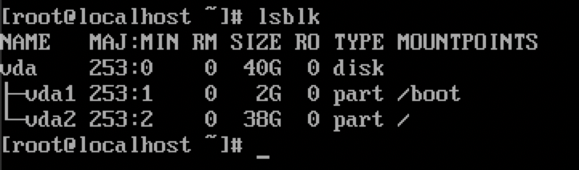
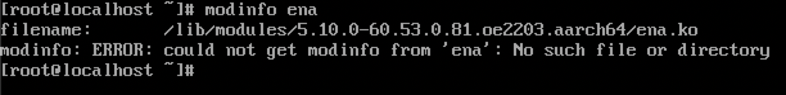
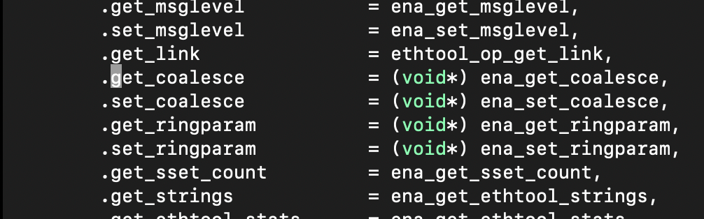
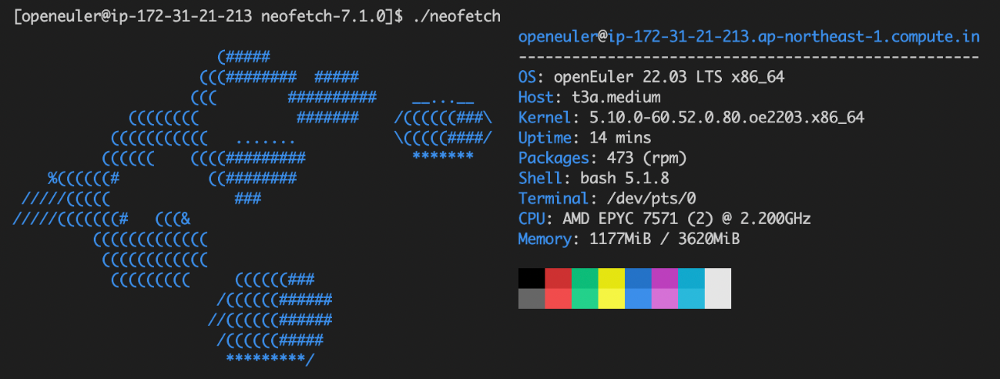

作者简介

王瀚兴，SUSE 软件工程师，主要负责 Rancher 产品线相关的研发工作。


欧拉开源社区的 RFO SIG 正在努力将 openEuler 与 Rancher 整合，以推动社区的云原生版图发展。而 openEuler 如何在云环境开箱即用是一个非常重要的基础，承接上篇文章，本篇将主要介绍 openEuler AWS AMI 镜像制作的详细过程。

通过创建 AWS AMI 镜像可将 openEuler 与 AWS 云服务相结合，支持云环境中标准的 ssh key注入、分区扩容、用户数据执行等功能，并使用 cloud-init 机制实现自动启动 Rancher RKE2 集群。今后，openEuler Cloud Images 的工作也将成为 RFO SIG 的一部分，逐步扩展支持更多的云平台。

### 调整硬盘分区大小

openEuler 官方提供的 qcow2 格式的镜像为一个总磁盘大小为 40G 的虚拟机镜像，在 qemu 中启动虚拟机，查看分区情况。



可以看到磁盘含有两个分区，其中 2G 为 boot 分区，38G 为 root 分区。


使用 Net Based Disk (NBD) 将 qcow2 镜像的分区加载到 Linux 系统中，之后使用 resize2fs 压缩 ext4 文件系统的体积，并使用分区调整工具 fdisk 调整分区的大小。

```shell
# 加载 NBD 内核模块
$ sudo modprobe nbd max_part=3
# 加载 qcow2 镜像中的分区至系统
sudo qemu-nbd -c "/dev/nbd0" "openEuler-22.03-LTS-x86_64.qcow2"
$ lsblk
NAME         MAJ:MIN RM  SIZE RO TYPE MOUNTPOINT
nbd0          43:0    0   40G  0 disk
|-nbd0p1      43:1    0    2G  0 part
|-nbd0p2      43:2    0   38G  0 part

# 调整 ext4 文件系统大小至6G
$ sudo resize2fs /dev/nbd0p2 6G
# 使用fdisk调整分区大小至6G
$ sudo fdisk /dev/nbd0

Welcome to fdisk (util-linux 2.34).
Changes will remain in memory only, until you decide to write them.
Be careful before using the write command.


Command (m for help): d
Partition number (1,2, default 2): 2

Partition 2 has been deleted.

Command (m for help): n
Partition type
   p   primary (1 primary, 0 extended, 3 free)
   e   extended (container for logical partitions)
Select (default p):

Using default response p.
Partition number (2-4, default 2): 2
First sector (4194304-83886079, default 4194304):
Last sector, +/-sectors or +/-size{K,M,G,T,P} (4194304-83886079, default 83886079): +6G

Created a new partition 2 of type 'Linux' and of size 6 GiB.
Partition 2 contains a ext4 signature.

Do you want to remove the signature? [Y]es/[N]o: N

Command (m for help): w

The partition table has been altered.
Calling ioctl() to re-read partition table.
Syncing disks.

# 从系统中卸载 qcow2 镜像的分区
$ sudo qemu-nbd -d /dev/nbd0
```
 
之后使用 qemu-img 将 qcow2 镜像缩小至8G，并转换为 RAW 格式。

```shell
$ qemu-img resize openEuler-22.03-LTS-x86_64.qcow2 --shrink 8G
$ qemu-img convert openEuler-22.03-LTS-x86_64.qcow2 openEuler-22.03-LTS-x86_64.raw
```

### Snapshot 和 Base AMI 的创建

首先使用 awscli 提供的工具，将 RAW 镜像上传至 AWS S3 bucket 中。

```shell
$ aws s3 cp openEuler-22.03-LTS-x86_64.raw s3://${BUCKET_NAME}/
```

创建 vmimport policy 和 role policy。

```shell
$ cat << EOF > trust-policy.json
{
   "Version": "2012-10-17",
   "Statement": [
      {
         "Effect": "Allow",
         "Principal": { "Service": "vmie.amazonaws.com" },
         "Action": "sts:AssumeRole",
         "Condition": {
            "StringEquals":{
               "sts:Externalid": "vmimport"
            }
         }
      }
   ]
}
EOF

$ aws iam create-role --role-name vmimport --assume-role-policy-document file://trust-policy.json

$ cat << EOF > role-policy.json
{
   "Version":"2012-10-17",
   "Statement":[
      {
         "Effect": "Allow",
         "Action": [
            "s3:GetBucketLocation",
            "s3:GetObject",
            "s3:ListBucket"
         ],
         "Resource": [
            "arn:aws:s3:::${BUCKET_NAME}",
            "arn:aws:s3:::${BUCKET_NAME}/*"
         ]
      },
      {
         "Effect": "Allow",
         "Action": [
            "s3:GetBucketLocation",
            "s3:GetObject",
            "s3:ListBucket",
            "s3:PutObject",
            "s3:GetBucketAcl"
         ],
         "Resource": [
            "arn:aws:s3:::${BUCKET_NAME}",
            "arn:aws:s3:::${BUCKET_NAME}/*"
         ]
      },
      {
         "Effect": "Allow",
         "Action": [
            "ec2:ModifySnapshotAttribute",
            "ec2:CopySnapshot",
            "ec2:RegisterImage",
            "ec2:Describe*"
         ],
         "Resource": "*"
      }
   ]
}
EOF

$ aws iam put-role-policy --role-name vmimport --policy-name vmimport --policy-document file://role-policy.json

```

创建 import-snapshot 任务，将存储在 S3 bucket 的 RAW 镜像创建为 Snapshot。

```shell
$ aws ec2 import-snapshot \
   --description "openEuler RAW image import task" \
   --disk-container \
   "Format=RAW,UserBucket={S3Bucket=${BUCKET_NAME},S3Key=openEuler-22.03-LTS-x86_64.raw}"
```

等待几分钟后，通过 import task ID 获取导入成功后的 Snapshot ID。

```shell
$ aws ec2 describe-import-snapshot-tasks \
      --import-task-ids ${IMPORT_TAST_ID}
```

使用此 Snapshot 创建不含 cloud init 机制的 Base AMI 镜像。

```shell
$ aws ec2 register-image \
    --name "DEV-openEuler-22.03-LTS-x86_64-BASE" \
    --description "DEV openEuler image, do not use for production!" \
    --root-device-name /dev/xvda \
    --architecture x86_64 \
    --ena-support \
    --virtualization-type hvm \
    --block-device-mappings \
      DeviceName=/dev/xvda,Ebs={SnapshotId=${SNAPSHOT_ID}}
```

至此，我们获得了 Base AMI ID。

### 使用 Packer 创建包含 Cloud init 机制的 AMI 镜像

首先创建 Packer 的配置文件，注意修改配置文件中的 <BASE_AMI_ID> 为刚刚获取的 Base AMI ID。

```shell
{
    "variables": {
        "version": "{{env `OPENEULER_VERSION`}}",
        "build": "{{env `AWS_IMAGE_BUILD_NUMBER`}}",
        "arch": "{{env `OPENEULER_ARCH`}}"
    },
    "builders": [
        {
            "type": "amazon-ebs",
            "name": "amazon-ebs-hvm-x86_64",
            "region": "ap-northeast-1",
            "ami_regions": [
                "ap-northeast-1"
            ],
            "source_ami": "<BASE_AMI_ID>",
            "instance_type": "t3a.micro",
            "ssh_username": "root",
            "ssh_password": "openEuler12#$",
            "ami_name": "openEuler-{{user `version`}}-x86_64-hvm-{{user `build`}}",
            "ena_support": "true"
        }
    ],
    "provisioners": [
        {
            "type": "shell",
            "environment_vars": [
                "VERSION={{user `version`}}",
                "ARCH={{user `arch`}}"
            ],
            "script": "./install-cloudinit.sh"
        }
    ]
}
```

新建脚本文件 install-cloudinit.sh，用来执行安装 cloud init 和其他配置的指令。

```shell
#!/bin/bash
set -e

yum -y update
yum -y install cloud-init cloud-utils-growpart gdisk
yum -y install vim tar make zip gzip wget git tmux \
    conntrack-tools socat iptables-services htop

# disable Apparmor
echo "GRUB_CMDLINE_LINUX_DEFAULT=\"apparmor=0\"" >> /etc/default/grub
# Update grub config
if [[ "$(uname -m)" == "x86_64" ]]; then
    grub2-mkconfig -o /boot/grub2/grub.cfg
elif [[ "$(uname -m)" == "arm64" ]]; then
    grub2-mkconfig -o /boot/efi/EFI/openEuler/grub.cfg
fi
```

最后使用以下指令使用 packer 构建 AMI 镜像。

```shell
$ packer build <PACKER_CONFIG.json>
```

### 构建 ARM 架构的 AMI 镜像

理论上构建 ARM 架构的 AMI 镜像的整体流程与 x86_64 架构的流程几乎一致，但是在实际操作过程中遇到了使用 Base AMI 镜像启动服务器后找不到网卡设备而无法 ssh 连接到服务器的情况。

在使用串口连接到服务器上进行调试后发现，ARM 架构的 openEuler 系统的内核中没有预装 AWS ENA 网卡驱动，所以无法访问网络连接。




后续 openEuler 会为 ARM 架构的内核增添 ENA 驱动支持，在此之前可使用编译 ENA 驱动内核模块并导入的方式，作为一个临时的解决办法，感兴趣的朋友可以参考一下。

此办法只能作为一个临时的解决方法，不建议用作生产环境中。

首先在本地运行一个用来编译内核模块的 openEuler aarch64 虚拟机，安装 gcc，make，git，vim 内核头文件等编译需要的工具，克隆 ENA 驱动的源码到本地并编译。

```shell
$ yum -y install make git gcc vim kernel-devel-$(uname -r)
$ git clone git clone https://github.com/amzn/amzn-drivers.git
$ cd amzn-drivers/kernel/linux/ena/
$ make -j2
```

编写这篇文章时，在编译的过程中会遇到这个报错：

```shell
/root/amzn-drivers/kernel/linux/ena/ena_ethtool.c:1218:19: error: initialization of ‘int (*)(struct net_device *, struct ethtool_coalesce *, struct kernel_ethtool_coalesce *, struct netlink_ext_ack *)’ from incompatible pointer type ‘int (*)(struct net_device *, struct ethtool_coalesce *)’ [-Werror=incompatible-pointer-types]
 1218 |  .get_coalesce  = ena_get_coalesce,
      |                   ^~~~~~~~~~~~~~~~
compilation terminated due to -Wfatal-errors.
```

一个比较直接的解决办法是编辑 ena_ethtool.c，在 1218-1221 行，为这几个函数指针添加 (void*) 强制的指针类型转换。




编译后会生成 ena.ko 内核模块文件，可用 modinfo ena.ko 查看该模块的信息。

```shell
$ modinfo ena.ko
filename:       /root/amzn-drivers/kernel/linux/ena/ena.ko
version:        2.8.0g
license:        GPL
description:    Elastic Network Adapter (ENA)
author:         Amazon.com, Inc. or its affiliates
......
```

在调整硬盘分区时，挂载分区，复制此内核模块文件到挂载的分区的目录中并编辑 modprobe 配置文件，在每次开机启动时都加载这个内核模块。

```shell
# 假设将分区挂载到了 /mnt 目录下面
$ sudo mount /dev/nbd0p2 /mnt
# 这里将内核模块复制到了 /root 目录下面
$ sudo cp ./ena.ko /mnt/root/
$ sudo bash -c ' echo "install ena insmod /root/ena.ko" >> /mnt/etc/modprobe.d/ena.conf '
$ sudo bash -c ' echo "ena" >> mnt/etc/modules-load.d/ena.conf '
$ sudo sync && sudo umount /mnt
```

重启系统后，可以使用 lsmod 查看已加载的内核模块，或使用 dmesg 查看内核日志，可以看到 ENA 驱动被加载的记录。

```shell
$ sudo lsmod
Module                  Size  Used by
ena                   147456  0
......

$ dmesg | grep ena:
[   94.814488] ena: loading out-of-tree module taints kernel.
[   94.814896] ena: module verification failed: signature and/or required key missing - tainting kernel
```

目前 openEuler 社区已修复了 ARM 架构的内核不包含 ENA 网卡驱动的问题，会在后续的内核更新中获取到包含 ENA 驱动的内核。更多信息可在此PR中获取到：https://gitee.com/openeuler/kernel/pulls/104

### 已构建的 AMI 镜像使用

在 AWS EC2 实例的控制台页面，使用构建的 AMI 镜像创建一个 EC2 虚拟机，设定网络安全组、SSH 密钥、磁盘大小、用户数据等配置。

在本篇文章中，设定的 EBS 磁盘大小为 30G，在用户数据中填写了安装 RKE2 的脚本：

```shell
#!/bin/bash

echo "-------- Start custom user data ----------"

yum update
curl -sfL https://get.rke2.io > install.sh
chmod +x ./install.sh
sudo INSTALL_RKE2_METHOD=tar ./install.sh
sudo systemctl enable rke2-server
sudo systemctl start rke2-server

echo "-------- User data finished successfully -----------"
```

实例启动后，cloud init 机制会自动创建用户名为 openeuler 的账号并设定仅使用 ssh key 登录，同时 root 账号的 ssh 登录也会被禁止。磁盘的 root 分区会自动扩容到我们设定的 EBS 磁盘大小，用户数据中填写的脚本也将被自动执行。



查看 cloud init 输出的日志，其中包括用户数据的执行结果：

```shell
$ tail -f /var/log/cloud-init-output.log
Is this ok [y/N]: Operation aborted.
[INFO]  finding release for channel stable
[INFO]  using v1.24.4+rke2r1 as release
[INFO]  downloading checksums at https://github.com/rancher/rke2/releases/download/v1.24.4+rke2r1/sha256sum-amd64.txt
[INFO]  downloading tarball at https://github.com/rancher/rke2/releases/download/v1.24.4+rke2r1/rke2.linux-amd64.tar.gz
[INFO]  verifying tarball
[INFO]  unpacking tarball file to /usr/local
Created symlink /etc/systemd/system/multi-user.target.wants/rke2-server.service → /usr/local/lib/systemd/system/rke2-server.service.
-------- User data finished successfully -----------
Cloud-init v. 21.4 finished at Wed, 21 Sep 2022 06:56:30 +0000. Datasource DataSourceEc2Local.  Up 130.47 seconds
```
验证分区自动扩容至总容量为设定的 EBS 的大小：

```shell
$ lsblk
NAME        MAJ:MIN RM SIZE RO TYPE MOUNTPOINTS
nvme0n1     259:0    0  30G  0 disk
├─nvme0n1p1 259:1    0   2G  0 part /boot
└─nvme0n1p2 259:2    0  28G  0 part /
```

验证 RKE2 安装成功，所有 pods 均正常启动：

```shell
$ sudo /var/lib/rancher/rke2/bin/kubectl --kubeconfig /etc/rancher/rke2/rke2.yaml get nodes
NAME                                               STATUS   ROLES                       AGE     VERSION
ip-172-31-21-213.ap-northeast-1.compute.internal   Ready    control-plane,etcd,master   7m58s   v1.24.4+rke2r1

$ sudo /var/lib/rancher/rke2/bin/kubectl --kubeconfig /etc/rancher/rke2/rke2.yaml get pods -A
NAMESPACE     NAME                                                                        READY   STATUS      RESTARTS   AGE
kube-system   cloud-controller-manager-ip-172-31-21-213.ap-northeast-1.compute.internal   1/1     Running     0          14m
kube-system   etcd-ip-172-31-21-213.ap-northeast-1.compute.internal                       1/1     Running     0          14m
kube-system   helm-install-rke2-canal-l5rnl                                               0/1     Completed   0          14m
kube-system   helm-install-rke2-coredns-jckq7                                             0/1     Completed   0          14m
kube-system   helm-install-rke2-ingress-nginx-dxcsc                                       0/1     Completed   0          14m
kube-system   helm-install-rke2-metrics-server-kgjdf                                      0/1     Completed   0          14m
kube-system   kube-apiserver-ip-172-31-21-213.ap-northeast-1.compute.internal             1/1     Running     0          14m
kube-system   kube-controller-manager-ip-172-31-21-213.ap-northeast-1.compute.internal    1/1     Running     0          14m
kube-system   kube-proxy-ip-172-31-21-213.ap-northeast-1.compute.internal                 1/1     Running     0          14m
kube-system   kube-scheduler-ip-172-31-21-213.ap-northeast-1.compute.internal             1/1     Running     0          14m
kube-system   rke2-canal-ng2sw                                                            2/2     Running     0          13m
kube-system   rke2-coredns-rke2-coredns-76cb76d66-nklrw                                   1/1     Running     0          13m
kube-system   rke2-coredns-rke2-coredns-autoscaler-58867f8fc5-mpgd7                       1/1     Running     0          13m
kube-system   rke2-ingress-nginx-controller-fhpbd                                         1/1     Running     0          12m
kube-system   rke2-metrics-server-6979d95f95-2lrp8                                        1/1     Running     0          13m
```

#### About SUSE Rancher

Rancher是一个开源的企业级Kubernetes管理平台，实现了Kubernetes集群在混合云+本地数据中心的集中部署与管理。Rancher一向因操作体验的直观、极简备受用户青睐，被Forrester评为“2020年多云容器开发平台领导厂商”以及“2018年全球容器管理平台领导厂商”，被Gartner评为“2017年全球最酷的云基础设施供应商”。


目前Rancher在全球拥有超过三亿的核心镜像下载量，并拥有包括中国联通、中国平安、中国人寿、上汽集团、三星、施耐德电气、西门子、育碧游戏、LINE、WWK保险集团、澳电讯公司、德国铁路、厦门航空、新东方等全球著名企业在内的共40000家企业客户。


2020年12月，SUSE完成收购RancherLabs，Rancher成为了SUSE “创新无处不在（Innovate Everywhere）”企业愿景的关键组成部分。SUSE和Rancher共同为客户提供了无与伦比的自由和所向披靡的创新能力，通过混合云IT基础架构、云原生转型和IT运维解决方案，简化、现代化并加速企业数字化转型，推动创新无处不在。


当前，SUSE及Rancher在中国大陆及港澳台地区的业务，均由数硕软件（北京）有限公司承载。SUSE在国内拥有优秀的研发团队、技术支持团队和销售团队，将结合Rancher领先的云原生技术，为中国的企业客户提供更加及时和可信赖的技术支撑及服务保障。


