## 1、准备工作

首先在 openEuler 官网下载 ISO 镜像，下载地址为[https://repo.openeuler.org/openEuler-22.03-LTS/ISO/x86_64/](https://repo.openeuler.org/openEuler-22.03-LTS/ISO/x86_64/)。为了快速下载安装，选择 3.4G 大小的`openEuler-22.03-LTS-x86_64-dvd.iso`，下载完成后使用 UltraISO 工具制作 U 盘启动盘。制作完启动盘后，点击我的电脑查看并记录 U 盘启动盘的标签名称，安装时会使用到。安装之前，点击并下载`openEuler-22.03-LTS-everything-x86_64-dvd.iso`，后面系统安装起来后搭建本地 yun 源时会用到。

这里解释下为什么下载两个不同的 iso 文件，即要下载的这两个 iso 文件有什么差异。两个文件中的软件包都是经过 openEuler 社区严格测试的，质量都能得到 openEuler 社区的保证。但是 everything 的 iso 中包含了 openEuler 社区正式发布的全量的软件包，而基本的 iso 仅包含了 OS 必需的软件包和常用的重要软件包。由于 everything 的包太大，会导致制作安装包、安装等过程耗时长，且安装后消耗更多的磁盘空间，而笔者是不需要安装 everything 中的所有的软件包的，因此仅选择基础包安装，将 everything 的包制作为本地 yum 源来按需安装使用。

## 2、安装和配置

### 2.1 本地安装

准备工作完成后，下面就开始安装。插入 U 盘启动盘后按电源键开机，在开机过程中按 F10 键进入 BIOS 程序（笔者的安装电脑是惠普，因此按 F10 可进入 BIOS，其他品牌的电脑需要查询相关手册确认进入 BIOS 按键），设置修改系统的加载顺序为从 U 盘启动加载。设置完成后保存并继续安装，系统自动进入 GRUB 安装引导界面，如下图所示

  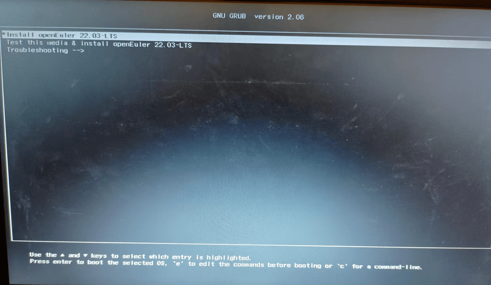

如图中所提示，直接按 Enter 键就会进入启动自检程序，按 e 键编辑启动命令。由于存在 3.1 中的问题，这里直接按 e 键进入并编辑启动命令，如下

  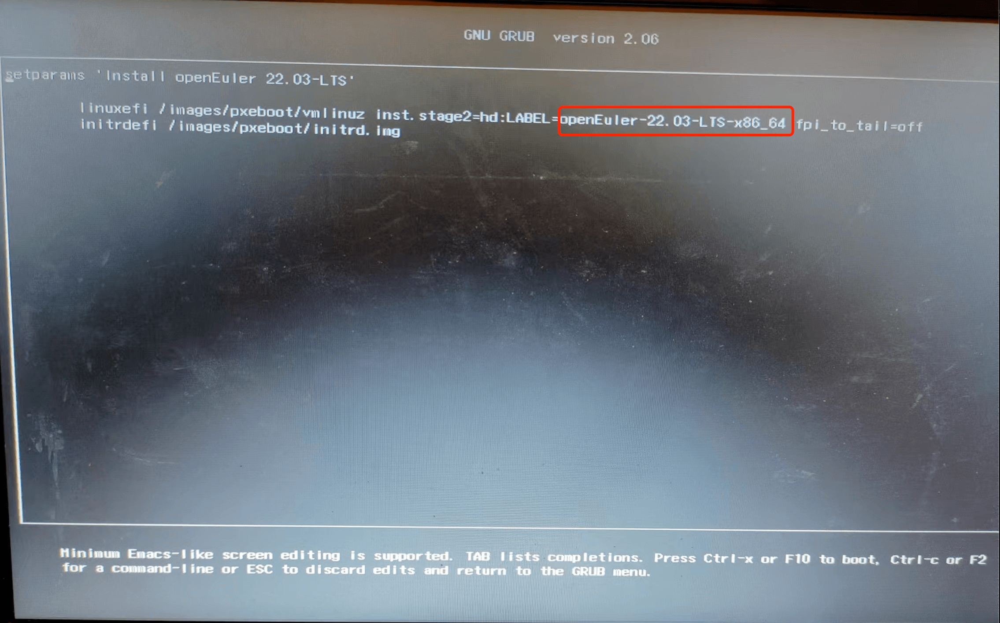
  将红框中圈出的名称，改为U盘启动盘的名称。修改完毕后按F10继续，启动安装程序。安装程序启动成功后进入安装界面，如下

  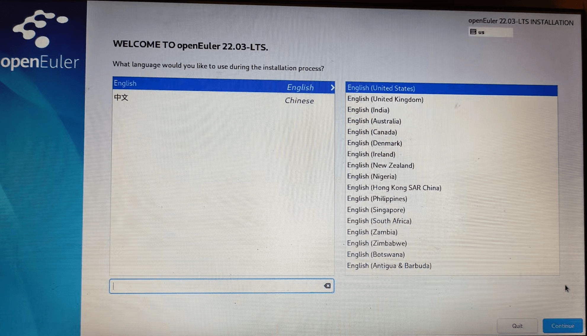

点击继续进入安装概览界面，如下图所示

  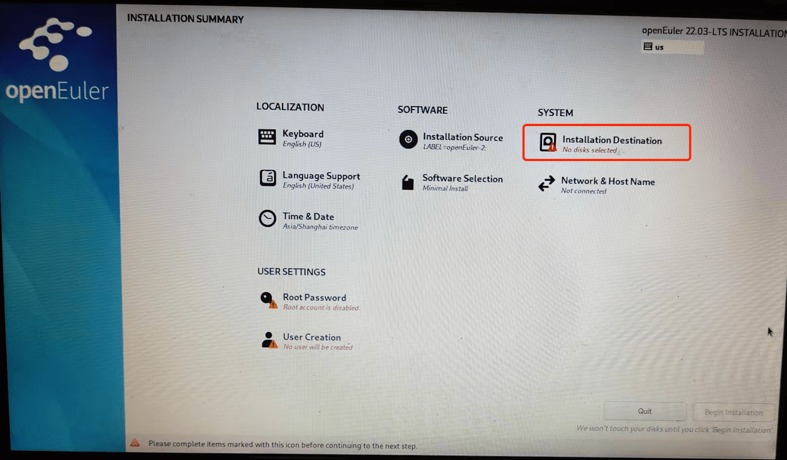

点击图中标有红色叹号的 Installation Destination，进行系统磁盘划分，如下图所示

 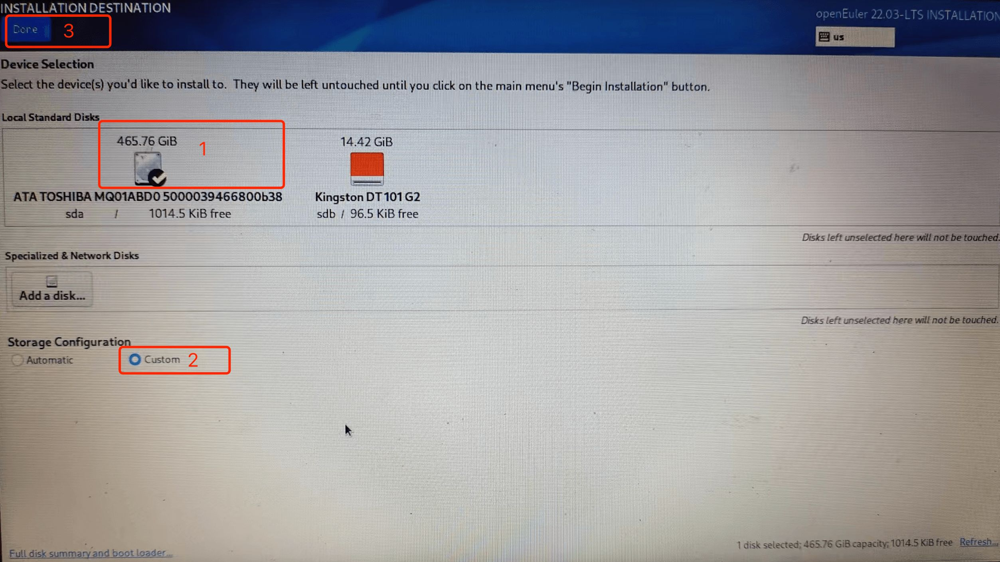

图中红框 1 中圈出来的即为笔者电脑的磁盘，旁边的则为 U 盘启动盘，我们首先点击选择磁盘，然后选中下方的 Custom，最后再点击左上角的 Done 按钮进入自定义配置界面。

  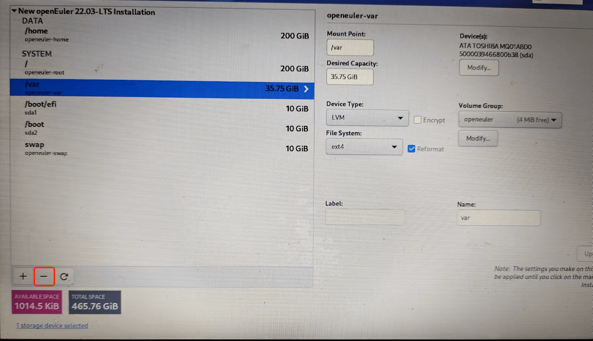  
 
 由于笔者的磁盘已经没有剩余空间，而且磁盘上也没有什么有用的数据，因此删除所有分区并重新格式化磁盘。如上图所示，针对所有已存在的磁盘，点击图中圈出来的“-”按钮进行删除。删除所有分区后如下图所示。 
 
  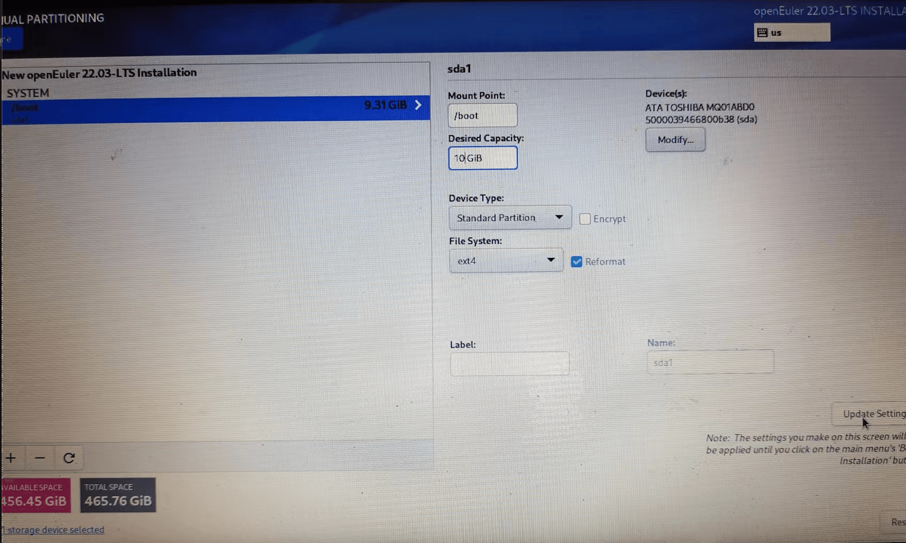

点击删除按钮旁边的新增按钮“+”，新增磁盘分区。如下图所示

  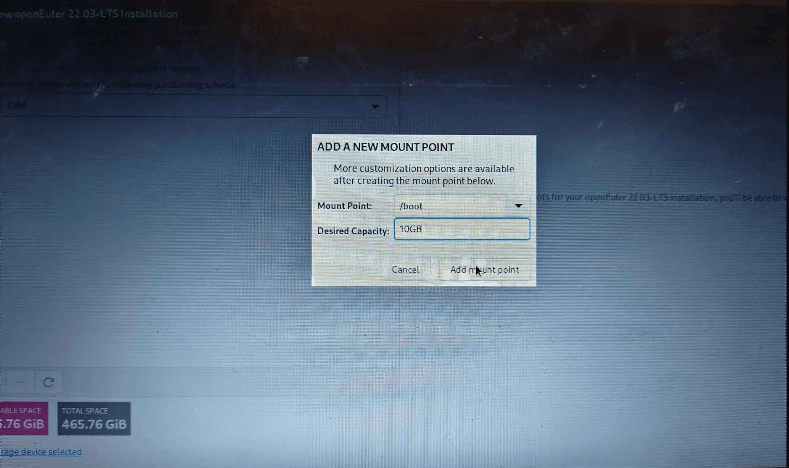

设置分区的容量大小，并选择分区的挂载点。需要注意，必须设置`/boot、/boot/efi` 的分区挂载点，且设备类型设置为默认值 Standard Partition，如下图红框中所示，否则无法安装启动。建议针对选择框中提供的所有挂载点进行设置。

  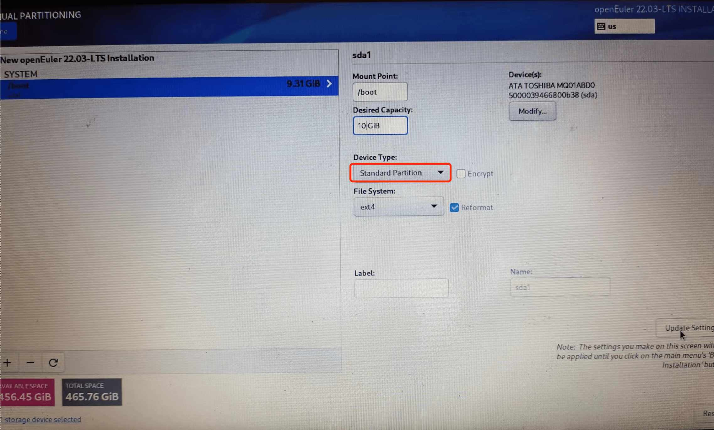  
  
  所有分区挂载点设置完毕后，点击左上角的Done按钮进入下一步。此时会弹出刚才设置的分区的统计信息列表，如下图所示，点击选择“Accept Changes”按钮继续即可。
  
  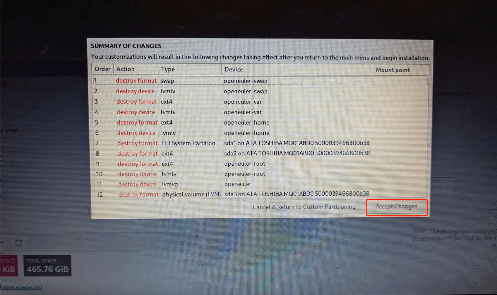

此时会回到初始时的安装概览页面，点击“User Settings”部分中的“Root Password”，设置 root 用户密码，如下

  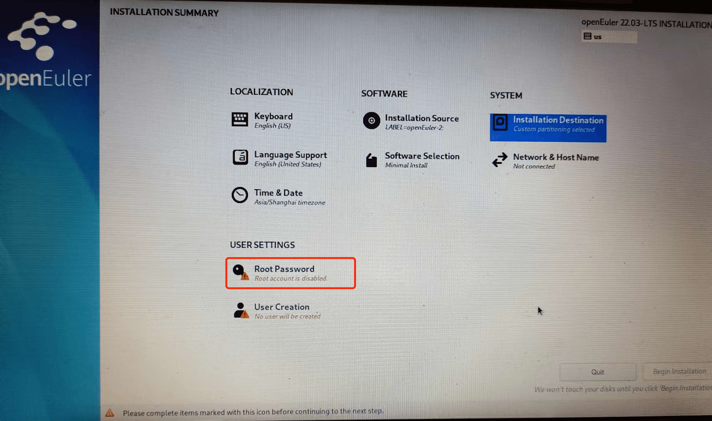

  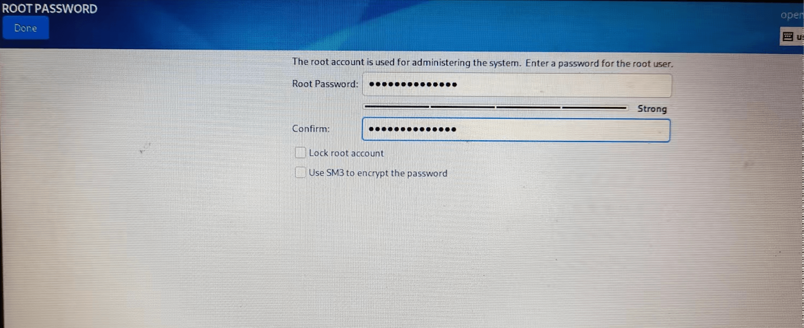

设置密码后，点击左上角的 Done 按钮回到安装概览页面，点击右下角的 Begin Installation 开始安装，如下

  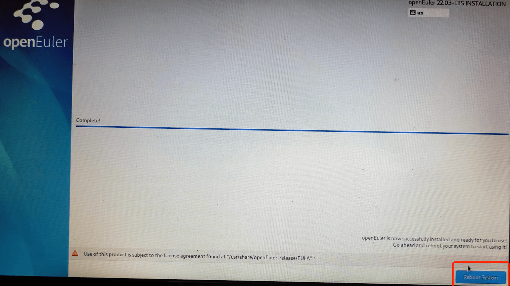

安装完成后显示安装完成页面，点击右下角的 Reboot 重启即可。

  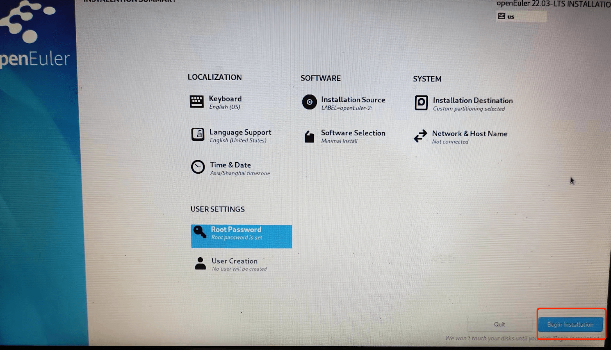

注意：在重启前请拔掉 U 盘，或重启过程中及时按 F10 进入 BIOS 修改启动顺序，否则重启后会再次进入安装程序。

### 2. 配置本地 Yum 源

1）将准备工作中下载的`openEuler-22.03-LTS-everything-x86_64-dvd.iso`文件拷贝到/root 目录下，执行以下命令进行挂载

```shell
  mount /root/openEuler-22.03-LTS-everything-x86_64-dvd.iso /mnt
```

2）进入`/etc/yum.repos.d`目录，备份 `openEuler.repo` 文件，然后修改 `openEuler.repo` 为以下内容

```shell
  [base]
  name=openEuler
  baseurl=file:///mnt
  enabled=1
  gpgcheck=0
```

  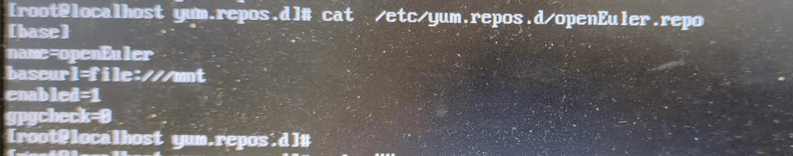

此时 yum 的本地源就配置完成，可以开始使用`dnf install`的方式进行软件包安装。

### 2.3 安装图形界面

openEuler 的官方仓库提供 Gnome 的桌面环境，在依据 2.2 中的步骤配置好本地 yum 后，执行以下简单命令即可安装 Gnome 桌面环境。

```shell
  dnf install gnome-shell gdm gnome-session
```

设置 gdm 开机自启动

```shell
  systemctl enable gdm.service
  systemctl set-default graphical.target

```

安装并设置成功后，重启系统，即可进入桌面环境。Gnome 桌面环境的登录窗口如下所示

  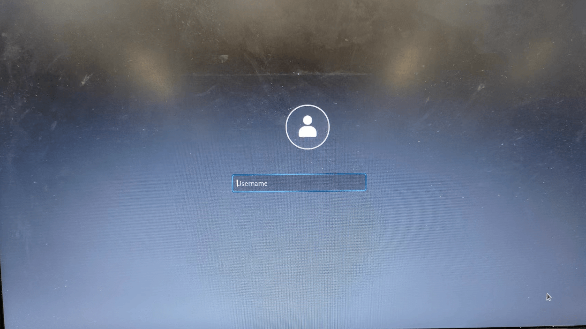  
  
  输入用户名和密码，登录系统后呈现Gnome桌面，其桌面非常干净，如下所示  
  
  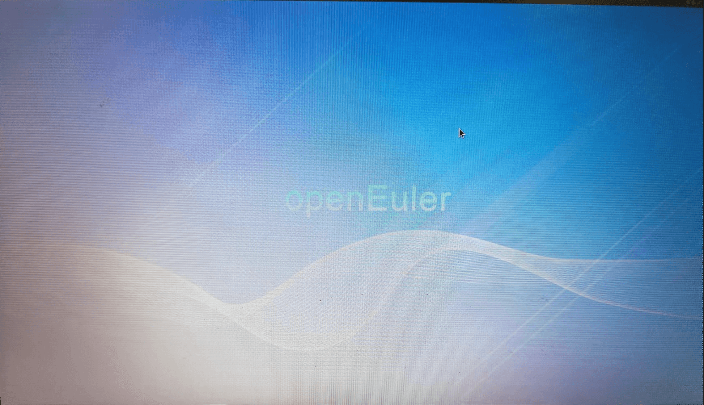

## 3、问题记录

**问题 1：安装程序启动失败，报错： Failed to start Switch Root. `/dev/root` does not exist.**

  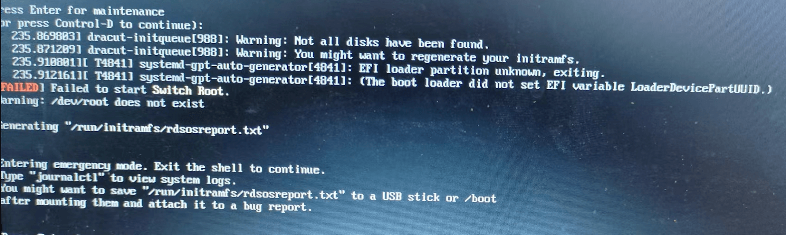

这个问题是由于 windows 对 U 盘的标签长度进行了限制，U 盘的标签和启动命令中的 LABEL 的名称不一致导致从 U 盘启动安装时找不到资源导致的。  
 在开始安装前，修改安装命令，将启动标签修改为 U 盘的标签名称即可，具体参考安装步骤开始部分。

**问题 2：缺少 wifi 驱动，导致无法连接 wifi**  
 依据 1 中安装步骤安装完成后，发现无法连接 wifi，使用 nmcli dev wifi list 命令显示 wifi 列表为空，使用 nmcli dev show 显示 wlo1 状态不可用，如下。使用 lscpi 查看无线网卡为 Ralink 5390，猜测是缺少该无线网卡的驱动。
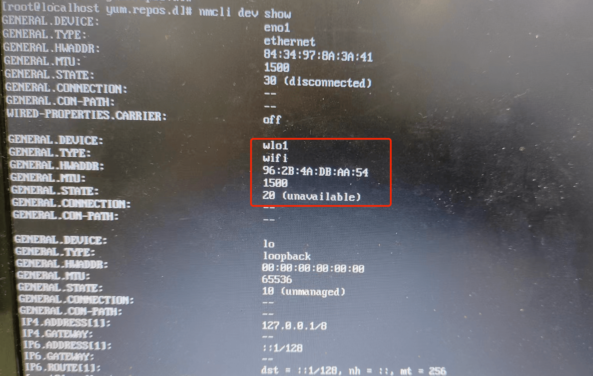

## 参考资料

[https://zhuanlan.zhihu.com/p/438277685](https://zhuanlan.zhihu.com/p/438277685)
