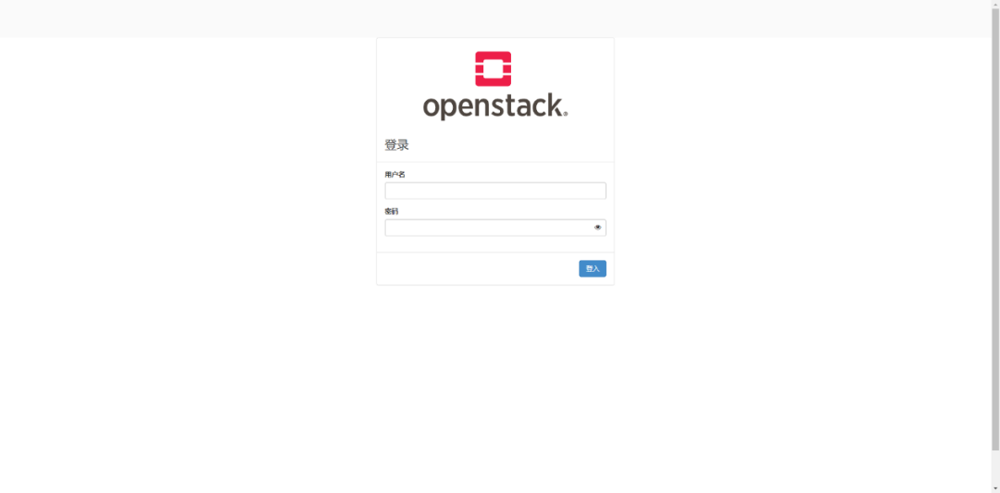
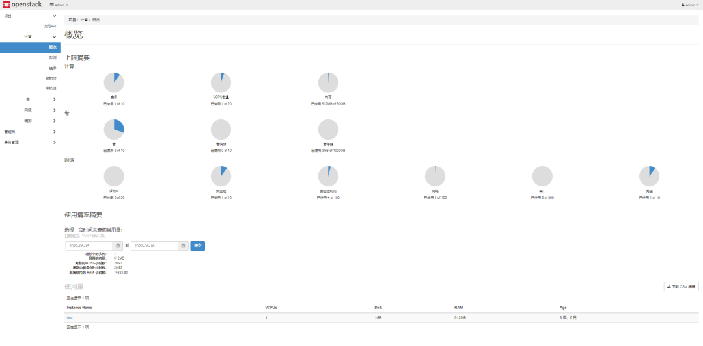

## 概述

​2022 年 3 月，在麒麟软件和 openEuler 社区的共同努力下，同时支持 x86_64 和 aarch64 架构的云底座操作系统 NestOS 首个正式版发布。NestOS 如何使用？与我们熟知的通用 OS 有哪些异同？本文将以容器化部署 OpenStack 场景作为实际应用案例，尝试为大家回答上述问题。

## 整体方案

在本方案中，我们以 Libvirt 创建 NestOS 虚拟化实例的方式组建集群，通过 Kolla-ansible 部署工具完成 OpenStack 容器化部署。任何可正常运行 Kolla-ansible 的主机均可作为部署节点，不建议采用 NestOS 作为部署节点。例如本方案中部署节点为 openEuler 21.09，而 NestOS 则作为 OpenStack 集群的实际运行环境，担当控制、计算、存储等节点。为简化行文描述，后文以单个 NestOS 实例配置进行介绍，实际使用可根据需求添加任意数量 NestOS 实例。

如您是首次了解 NestOS，可首先在 openEuler 22.03 官方文档中查阅 [NestOS 相关用户指南](https://docs.openeuler.org/zh/docs/22.03_LTS/docs/NestOS/overview.html)

「部署环境：」

- 部署节点 OS：openEuler 21.09

- NestOS 版本：nestos-22.03.20220329-qemu.x86_64.qcow2

- OpenStack 版本：Wallaby

- Kollla-ansible 版本：12.0.0

「提醒：」

- CPU、内存以及硬盘容量应尽可能大，推荐配置为 4C、8G 和 40G, 若采用本地存储方案（如 LVM）可添加第二块硬盘。

- 建议使用两块网卡，其中网卡 1 用于 ssh 连接和访问外网；网卡 2 用于 Neutron 外部（或公共）网络，可以是 vlan 或 flat，取决于网络的创建方式。此网卡应该在没有 IP 地址的情况下处于活动状态。否则，实例将无法访问外部网络。

## NestOS 实例创建与配置

### 准备 Ignition 点火文件

结合容器化部署 OpenStack 特定场景环境配置需求，我们首先需要准备一份供 NestOS 部署使用的 Ignition 点火配置，主要内容分为操作系统基础配置与 OpenStack 部署环境初始化两部分，具体包括：

| 类别                     | 配置项           | 用途                                               |
| ------------------------ | ---------------- | -------------------------------------------------- |
|                          | passwd           | 配置 NestOS 登录用户和访问鉴权等相关信息           |
| 系统配置                 | 主机名           | 配置 NestOS 实例主机名                             |
|                          | 网卡 1           | 该网卡负责部署、运维 NestOS 实例，提供基础网络环境 |
|                          | 时区             | 配置 NestOS 实例默认时区                           |
|                          | 内核参数         | OpenStack 部署环境需确保开启部分内核参数           |
|                          | 网卡 2           | 该网卡专用于 Neutron 使用                          |
| OpenStack 部署环境初始化 | 安装 python 环境 | OpenStack 部署需 python 环境支持                   |
|                          | 关闭 selinux     | OpenStack 部署环境需关闭 selinux                   |
|                          | 时间同步         | OpenStack 部署环境需通过 chronyd 服务同步集群时间  |
|                          | 存储配置         | 供 OpenStack 集群使用，本地存储方案必选            |

ignition 文件被设计为可读但难以编写的形式（本质为 json 格式），我们可以先编写对人友好的 bu 文件（本质为 yaml 格式），然后通过 Butane 工具将其转化为 ignition 文件。

系统配置 passwd 时，如计划使用密码验证的方式访问 NestOS 实例，可以使用下述命令生成**${PASSWORD_HASH}**供 bu 文件使用。

```
openssl passwd -1 -salt yoursalt
```

我们按照上述表格中的信息将部署 OpenStack 所需的相关配置添加到 bu 文件中，示例如下。如需获取该文件，可访问[NestOS 项目仓库](https://gitee.com/openeuler/NestOS)，在 docs / use_sample / OpenStack / 路径下获取。

**注意：**

**「本配置文件示例中，形如」${VALUE}**字段均需根据实际部署情况自行配置。

```

# Valid options are ['centos', 'debian', 'rhel', 'ubuntu']
kolla_base_distro: "centos"
# Valid options are [ binary, source ]
kolla_install_type: "binary"
openstack_release: "wallaby"
kolla_internal_vip_address: "{kolla_internal_vip_address}"
network_interface: "ens2"
api_interface: "{{ network_interface }}"
storage_interface: "{{ network_interface }}"
tunnel_interface: "{{ network_interface }}"
neutron_external_interface: "ens3"
neutron_plugin_agent: "openvswitch"
keepalived_virtual_router_id: "51"
openstack_logging_debug: "True"
enable_glance: "yes"
enable_haproxy: "yes"
enable_keepalived: "{{ enable_haproxy | bool }}"
enable_keystone: "yes"
enable_mariadb: "yes"
enable_memcached: "yes"
enable_neutron: "{{ enable_openstack_core | bool }}"
enable_nova: "{{ enable_openstack_core | bool }}"
enable_rabbitmq: "{{ 'yes' if om_rpc_transport == 'rabbit' or om_notify_transport == 'rabbit' else 'no' }}"
enable_chrony: "yes"
enable_cinder: "yes"
enable_cinder_backup: "yes"
enable_cinder_backend_lvm: "yes"
enable_cloudkitty: "no"
enable_gnocchi: "no"
enable_heat: "{{ enable_openstack_core | bool }}"
enable_horizon: "yes"
enable_horizon: "{{ enable_openstack_core | bool }}"
enable_horizon_blazar: "{{ enable_blazar | bool }}"
enable_horizon_cloudkitty: "{{ enable_cloudkitty | bool }}"
enable_horizon_murano: "{{ enable_murano | bool }}"
enable_horizon_neutron_lbaas: "{{ enable_neutron_lbaas | bool }}"
enable_horizon_sahara: "{{ enable_sahara | bool }}"
enable_horizon_senlin: "{{ enable_senlin | bool }}"
enable_horizon_watcher: "{{ enable_watcher | bool }}"
enable_ironic: "no"
enable_ironic_ipxe: "no"
enable_ironic_neutron_agent: "no"
enable_kafka: "no"
enable_murano: "no"
enable_neutron_lbaas: "yes"
enable_neutron_sriov: "yes"
enable_neutron_qos: "yes"
enable_nova_ssh: "yes"
enable_openvswitch: "{{ enable_neutron | bool and neutron_plugin_agent != 'linuxbridge' }}"
enable_placement: "{{ enable_nova | bool or enable_zun | bool }}"
enable_sahara: "no"
enable_senlin: "no"
enable_swift: "no"
enable_tempest: "no"
enable_watcher: "no"
keystone_token_provider: 'fernet'
keystone_admin_user: "admin"
keystone_admin_project: "admin"
fernet_token_expiry: 86400
glance_backend_file: "yes"
glance_enable_rolling_upgrade: "no"
cinder_volume_group: "cinder-volumes"
cinder_backup_driver: "lvm"
cinder_backup_share: "lvm"
cinder_backup_mount_options_nfs: "lvm"
nova_compute_virt_type: "qemu"
nova_safety_upgrade: "no"
horizon_backend_database: "{{ enable_murano | bool }}"
```

针对某些相对复杂的初始化配置需求，可以将其编写为 systemd 托管的 service 服务，如内核参数配置通过写入配置文件方式传入参数，再通过 systemd 服务进行应用：

```

systemd:
  units:
    ## 内核参数配置
    - name: set-kernel-para-for-openstack.service
      enabled: true
      contents: |
        [Unit]
        Description= for openstack

        [Service]
        Type=oneshot
        RemainAfterExit=yes
        ExecStart=modprobe br_netfilter
        ExecStart=sysctl -p

        [Install]
        WantedBy=multi-user.target
配置编写完毕后，可通过如下命令将 bu 文件通过 Butane 工具转换为 ignition 点火文件：

docker run --interactive --rm quay.io/coreos/butane:latest --pretty --strict < nestos.bu > nestos.ign
```

除本地使用外，也可将生成的 ignition 点火文件以 http 服务等形式供 NestOS 实例部署时远程访问，实现集中式批量部署配置。

### Libvirt 创建 NestOS 实例

准备好 ignition 文件后，使用 virt-install 创建 NestOS 虚拟化实例，创建指令参考如下，其中 vcpus、ram 和 disk 参数均为最低要求，如有额外需求，可参考 virt-install 手册自行调整，`${IGNITION_FILE_PATH}`为 ignition 文件路径，可以为本地路径或远程 URL。

**注意：**
**「形如」${VALUE}**字段均需根据实际部署情况自行配置。

```
virt-install --name=${NAME} --vcpus=4 --ram=8192 --import --network=bridge=virbr0 --graphics=none --qemu-commandline="-fw_cfg name=opt/com.coreos/config,file=${IGNITION_FILE_PATH}" --disk=size=40,backing_store=${NESTOS_RELEASE_QCOW2_PATH} --network=bridge=virbr1 --disk=size=40
```

以上就是 Libvirt 创建 NestOS 虚拟化实例的基本流程，可根据需要创建任意数量的 NestOS 实例，也可使用 PXE 方式引导部署在裸金属服务器。

## OpenStack 配置与部署

基于 NestOS 容器化部署 OpenStack 采用了主流的 Kolla-ansible 方案，按上文步骤创建的 NestOS 实例已具备 kolla-ansible 部署所需各项条件，在部署过程中无需任何操作。本章节所涉及的指令操作均在部署节点上执行。

### 配置基础环境

#### 添加 OpenStack 源

在 openEuler 发行版中已提供 openstack 适配，如部署节点采用 openEuler，安装 OpenStack 相关软件包前均需安装 OpenStack 源。

```
yum install openstack-release-wallaby
```

#### 安装 Kolla 和 Kolla-ansible

```
安装 Kolla 和 Kolla-ansible
```

### 配置 Ansible

#### 添加 OpenStack 源

在 openEuler 发行版中已提供 openstack 适配，如部署节点采用 openEuler，安装 OpenStack 相关软件包前均需安装 OpenStack 源。

```
yum install openstack-release-wallaby
```

#### 安装 Kolla 和 Kolla-ansible

```
yum install openstack-kolla openstack-kolla-ansible
```

### 配置 Ansible

将以下选项添加到 Ansible 配置文件`/etc/ansible/ansible.cfg`：

```
[defaults]
host_key_checking=False
pipelining=True
forks=100
```

### 配置 Kolla Ansible

#### Inventory

Inventory 是一个 Ansible 文件，可以在其中指定主机及其所属的组，使用它来定义节点角色和访问凭证。

Kolla Ansible 附带了 all-in-one 和 multinode 示例清单文件。它们之间的区别在于，前者是部署单节点 OpenStack，后者则是使用多个节点。本文将使用 multinode 方式部署。

1. 在 multinode 文件中编辑环境的节点信息，例如:

```

[control]
nestos ansible_ssh_user=${USERNAME} ansible_ssh_password=${USERPASSWARD} ansible_become=true

[network]
nestos

[compute]
nestos ansible_ssh_user=${USERNAME} ansible_ssh_password=${USERPASSWARD} ansible_become=true

[monitoring]
nestos

[storage]
nestos

[deployment]
localhost       ansible_connection=local become=true
```

2. 检查配置是否正确，运行：

```
ansible -i ./multinode all -m ping
```

#### Kolla 密码

在部署过程中使用的密码存储在/etc/kolla/passwords.yml 文件中。初始情况下，该文件中的所有密码都是空白的，必须手动填充或通过运行随机密码生成器来填充：

```
kolla-genpwd
```

#### Kolla globals.yml

globals.yml 是 Kolla Ansible 的主要配置文件。由于当前 OpenStack 官方容器镜像还未正式支持 openEuler 系统，因此在部署时将选用 CentOS 容器镜像。

1. 镜像选择

```
# Valid options are ['centos', 'debian', 'rhel', 'ubuntu']
kolla_base_distro: "centos"
# Valid options are [ binary, source ]
kolla_install_type: "binary"
# Do not override this unless you know what you are doing.
openstack_release: "wallaby"
```

2. 网络

Kolla Ansible 需要设置一些网络选项。

```
network_interface: "eth0"
neutron_external_interface: "eth1"
kolla_internal_vip_address: "10.1.0.250"
```

3. 启用其他服务

默认情况下，Kolla Ansible 提供了大量的附加服务，可根据需求启用服务。例如，启用 cinder 服务：

```
enable_cinder: "yes"
```

#### 部署 OpenStack

Kolla Ansible 提供了一个 playbook，能够以指定的版本安装所有必需的服务。

下面为使用 multinode 配置的情况，如使用 all-in-one，需进行替换。也可添加-vvv 参数，查看详细执行日志。

1. 引导服务

```
kolla-ansible -i ./multinode bootstrap-servers
```

2. 环境检查

```
kolla-ansible -i ./multinode prechecks
```

3. 拉取镜像

```
kolla-ansible -i ./multinode pull
```

4. 执行部署

```
kolla-ansible -i ./multinode deploy
```

如部署失败，可执行销毁命令：

```
kolla-ansible destroy -i ./multinode --yes-i-really-really-mean-it
```

#### 使用 OpenStack

1. 安装 OpenStack CLI 客户端

```
yum install python3-openstackclient
```

2. OpenStack 需要一个 openrc 文件，其中设置了管理员用户的凭证。生成该文件：

```
kolla-ansible post-deploy
. /etc/kolla/admin-openrc.sh
```

3. 根据安装 Kolla Ansible 的方式，执行下述脚本创建示例网络，镜像等。

```
kolla-ansible post-deploy
. /etc/kolla/admin-openrc.sh
```

通过 ip 地址与 admin-openrc.sh 中提供的 horizon 账号密码进行登录：



登录成功后可看到 OpenStack 的 web 界面：



更多详细信息可查阅 OpenStack 官方部署文档：<https://docs.openstack.org/kolla-ansible/wallaby/user/quickstart.html>。

## 总结

NestOS 作为一款在 openEuler 社区 CloudNative Sig 组孵化的云底座操作系统，从以上部署 OpenStack 的流程可以看出，它专为运行容器化工作负载而设计，意在成为计算集群的安全可靠主机。在第一次启动期间，NestOS 使用 ignition 点火文件配置系统，无论是在云端、虚拟化还是裸金属，NestOS 始终都从同一个地方开始，我们还可将 ignition 保存于服务器中，供 NestOS 远程访问，实现集中式的配置管理，这为大规模部署集群提供了便利。

NestOS 旨在作为不可变基础架构进行管理，当机器创建完成后，如想要更新配置不应通过修改/etc 或其他方式进行更改，而应使用新的 ignition 点火文件配置替换机器。这与我们管理容器的方式类似，容器镜像不会就地更新，而是从头开始重新构建并重新部署。这种方法可以在负载增加时轻松扩展，只需使用相同的 ignition 配置即可启动其他计算机。

NestOS 将配置工具 ignition 与 rpm-ostree、OCI 支持、Selinux 强化等技术集成在一起，采用基于双系统分区、容器技术和集群架构的设计思路，搭载 iSulad、docker、podman 等主流容器基础平台，克服了由于用户修改系统内容、用户服务对系统组件依赖，以及系统软件包升级时不稳定中间态等种种导致升级过程不可靠的因素，最终以一种轻量级、定制化的操作系统呈现出来，可以适应各种不同的基础设施环境。

### More

openEuler 社区的 OpenStack 生态正在逐步完善，期待 Sig-OpenStack 尽快推出 openEuler 社区支持维护的 OpenStack 容器镜像。未来 NestOS 项目也计划与 Sig-OpenStack 紧密合作，推出更加适用于 NestOS 部署方式的部署工具，不仅如此，我们也会推出特定于 OpenStack 场景使用的 NestOS 集成定制版本，减少冗余软件包，在降低操作系统基座底噪的同时减少暴露攻击面，实现更便捷、更高效地部署。

### 联系我们

NestOS 项目官方仓库：<https://gitee.com/openeuler/NestOS>

您也可通过 openEuler 社区 sig-cloudnative 与 sig-K8sDistro 联系我们。
