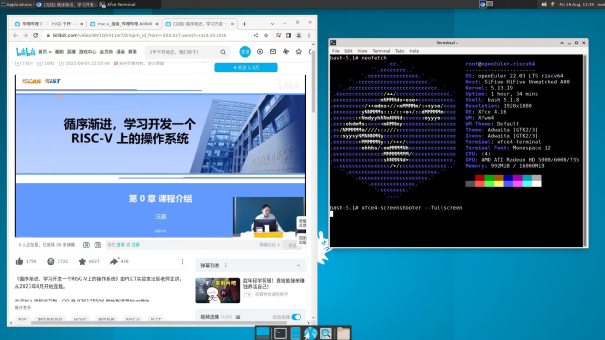
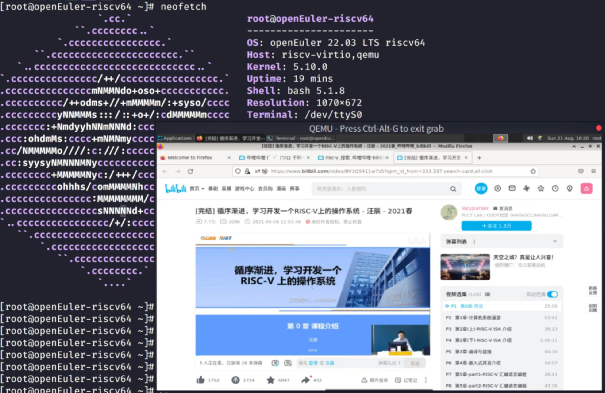
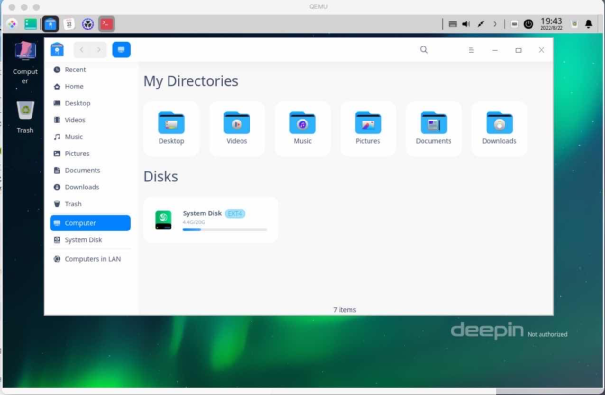
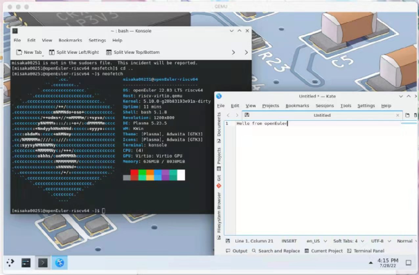
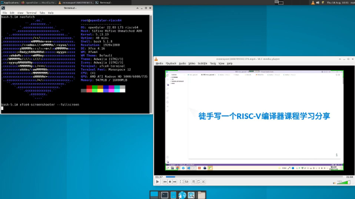

## 概述

​ 近日，RISC-V SIG 成功将 Chromium 等桌面软件适配到 openEuler RISC-V，这是继 openSUSE 之后第二个跑起来 Chromium 的 RISC-V 发行版。
作为桌面应用的核心软件，浏览器决定着一个操作系统整体的用户体验。目前，RISC-V SIG 已经为 openEuler RISC-V 适配完成 Chromium 和 Firefox 两大开源浏览器。
此外，KDE 和 DDE 桌面环境已经初步适配成功，多媒体播放器、邮件客户端等更多的桌面常用软件适配成功，为系统用户带来更丰富的桌面使用体验。

## Chromium 与 Firefox 的适配情况

​RISC-V SIG 于今年六月和八月，先后分别完成 Firefox 和 Chromium 两大主流浏览器的适配工作。目前两大浏览器均已经能完成网页浏览，验证登录，收发邮件，播放视频等基础功能，能够满足用户的基本使用需求。
openEuler RISC-V 支持的 Chromium 版本有 100/103，当前运行的版本为 Chromium103，在 unmatched 的 XFCE 桌面上已经测试运行成功。RISC-V SIG 以 openEuler 主线版本 87 为基础进行跨版本升级，参考 openSUSE，StarFive 等多个社区的工作，结合 openEuler RISC-V 系统环境进行了优化调整。
针对于 openEuler RISC-V 的构建需求，现版本的 Chromium 不仅补充完善了基本的构建系统，还在绘制引擎 angle，Dump 捕获模块 breakpad，解码器 dav1d，多媒体 ffmpeg 等第三方模块中引入了 RISC-V 构建实现，保证图形化界面在 RISC-V 架构上可以稳定运行。

openEuler RISC-V 支持的 Firefox 浏览器版本有 97/100，当前运行的版本为 Firefox100。RISC-V SIG 引入 Arch Linux 和 Zentinal 的 Firefox 打包构建工作，启用了 VA-API A 卡硬解，并且修复了 Rust 开启 level 3 编译优化的问题。目前在主要的测试环境中，Firefox 已经可以流畅地运行。

## 桌面环境及组件的适配情况

​2021 年，RISC-V SIG 就已经适配了 XFCE 桌面。为了提供更多的桌面环境选择，近期又相继适配了 DDE 和 KDE 桌面。
DDE 是统信软件的桌面环境，自统信软件开始逐步增添对 RISC-V 的支持，DDE 的适配成为了 RISC-V SIG 完成个人桌面配套软件的目标之一。目前在 openEuler 的 RISC-V 架构下，DDE、QEMU 和 VisionFive V1 中均已测试成功运行。

KDE 是功能十分丰富的桌面环境，主要由 openSUSE 进行维护。目前，在 openEuler 的 RISC-V 架构下，KDE 已经成功在 QEMU 内运行，部分 KDE 软件如 Kate 和 Konsole 等也已经测试成功运行。由于硬件上的瓶颈，KDE 与 Unmatched 和 VisionFive V1 的适配还需要再等待一些时间。

## 桌面应用程序的适配情况

​RISC-V SIG 还完成了多媒体播放器 VLC ，邮件管理工具 Thunderbird 等桌面应用程序的适配。
VLC 参考 openSUSE 的工作，补充了 libdvbpsi、libmatroska、lirc 和 live555 等解码库的打包构建并且修复了 VLC 的 opencv4 的支持，在 openEuler 操作系统上得以稳定运行。
Thunderbird 是基于 Firefox 适配工作为基础的构建实现，目前可运行版本为 97。

RISC-V SIG 正在对更多桌面应用进行适配，目前办公套件 LibreOffice、开发工具 eclipse 后续会陆续发布，个人桌面软件环境正在不断完善，预计年底为 RISC-V 个人笔记本所准备的桌面应用环境就会组装完成。

为了保证 Chromium 等软件的稳定运行，加速 openEuler 桌面软件生态的完善，我们需要更多的小伙伴一起来加入众测，同样欢迎大家下载体验 openEuler for RISC-V 镜像，在 openEuler 上进行更多未适配（未验证）常用软件的安装验证，来跟 samuel yuan 一起玩转 openEuler：<https://gitee.com/samuel_yuan/riscv-openeuler-visionfive>。不论是已适配软件的测试，还是未适配软件的验证，只要你有兴趣，就有你的位置，快点加入我们吧！

## 联系我们

​ 在离线混合部署作为提升数据中心资源利用率的重要手段，得到学术界和工业界的关注，成为了研究的热点领域，但目前也面临着诸多技术挑战，尚有许多亟待解决的问题，如黑盒业务混部、异构资源混部等，需要在作业感知调度、性能干扰建模、资源隔离抢占等领域逐个突破。为了达成泛型混部及融合部署的目标，节点管理层面对关键业务进行性能干扰建模，提供精确的 QoS 量化模型，指导干扰实时检测与定位，并基于干扰检测与定位实现更精确的动态资源配比控制以及探索更精准普适的动态监测指标数据对应用画像以指导感知调度，这些方面具有着至关重要的作用，也是 rubik 后续研究的重点所在。

​ 本文简要介绍 rubik 混部引擎的愿景、目标、设计原则及特性机制，后续计划对其中涉及的性能调优技术，资源隔离抢占技术，干扰检测及控制技术等进行详细介绍，敬请期待！

## 加入我们

如果您对 RISC-V 感兴趣，欢迎加入 RISC-V SIG 交流群，讨论更多关于 RISC-V 的更多内容，为推动 openEuler & RISC-V 生态贡献力量！

中科院软件所吴伟微信，添加请备注 oerv

## 关于作者

杨延玲，中科院软件所 PLCT 实验室实习生，欧拉开源社区 RISC-V SIG 成员，目前在温州大学读研一，负责协助 RISC-V SIG 的日常运营。
